# Trade Vision ARCHITECTURE

> **Fable-level living architecture** — contracts first, implementation second.  
> **Last verified against code:** 2026-07-24 · **Latest completed:** **v1.94**  
> **Monorepo Stock App surface:** absorbed into § A-SA · § G-SA · §6 (verified vs `server.py` + tree; chart canvas deep-dives remain root `STOCK_APP_ARCHITECTURE.md` §5–8).  
> **Companion docs:** `docs/context.md` (domain/invariants) · `docs/graph.md` (structure) · `docs/graph/project_graph.json` (machine)  
> **Ship log + latest tip:** `docs/IMPLEMENTATION_STATUS.md` (tip at top; full version log below)  
> **One entry map (read order · purpose · version→files · plan audit):** scroll to **MASTER GUIDE** at the bottom of this file (same section also in `TRADE_VISION_README.md`).  
> **Negative space (global):** no live broker orders, no hidden routing, no future-bar leakage into decision features.

---

## Diff summary (this revision)

| Marker | Change |
|--------|--------|
| **+** | **Monorepo Stock App architecture absorbed** (verified 2026-07-24 from root `STOCK_APP_ARCHITECTURE.md` + `server.py`): topology, RA invariants, Stock App operator map, paper-sim fill path, root file tree, research/API surface — placed under OPERATOR MAP § A-SA, PAPER TRADE § G-SA, and §6 |
| **+** | v1.88-v1.94 snapshot-bound guidance, ORB research/playbook, Jarvis ticket, explicit simulated record, and lifecycle feedback architecture |
| **+** | ADR index, system component contracts, failure taxonomy, negative design space |
| **+** | v1.87 Paper Guidance D1/D2 architecture and deterministic snapshot contract |
| **+** | v1.86 TrendForge intake architecture |
| **+** | Cross-links to `docs/graph.md` / `docs/context.md` |
| **+** | **Operator map (2-minute)** — screen → button → API + brain workflow |
| **~** | Version log below remains historical detail (v0.72+); treat as appendix after system contracts |
| **~** | Root deep-dives (canvas z-index JS, per-indicator detector code) stay **pointer-only** → root STOCK_APP_ARCHITECTURE §5–8; not duplicated here |
| **-** | Implicit “latest = v1.87” assumption (superseded by v1.94) |
| **-** | Root stale claims **not** absorbed: `WS /ws/{symbol}` (actual: `/ws/price/{symbol}` · `/ws/realtime/{symbol}`); sim field is `initial_cash` not `initial_balance`; root MASTER GUIDE tip “TV v1.86” is obsolete |

## Current Production Boundary: v1.94

The completed research/paper-guidance path is:

```text
D1 fail-closed safety gate
  -> D2 immutable closed-candle snapshot + SHA-256 snapshot_hash
  -> D3-D5 snapshot-bound setup, MTF, memory, structure, liquidity, and optional reduce-only scenario evidence
  -> D6 sole final-band authority
  -> D7 Jarvis ORB guidance ticket
  -> explicit human approval
  -> local simulated paper record
  -> explicit replay/downloaded-bar lifecycle observation
  -> deterministic cost-aware outcome + reduce-only reliability
```

No stage creates a broker order, OpenAlgo route, automatic paper fill, or live
trading authority. A missing playbook, low evidence, incomplete MTF, poor data,
liquidity/risk failure, or conflicting evidence remains `WAIT`/`WATCH`.

The current operational bottleneck is the frontend root refresh: it requests
nearly every workspace evidence endpoint every 30 seconds even when those
workspaces and Jarvis subtabs are not visible. Bounded concurrency prevents an
unbounded browser wave, but it does not prevent unnecessary backend work. The
next proposed hardening milestone is active-workspace and active-subtab loading
with a small safety-critical fast lane.

## v1.87 Paper Guidance Spine P0 Architecture

```text
PaperGuidanceRequest
  -> D1 Safety Gate
       mode + kill switch + identity + bounded/finite OHLCV
       + data quality + point-in-time + no broker/routing authority
  -> [fail] WAIT, no D2 snapshot, no snapshot_hash
  -> [pass] D2 Closed-Candle Snapshot
       close_time <= decision_time
       canonical JSON -> SHA-256 snapshot_hash
  -> PaperTradeGuidance
       WATCH only in P0
       no entry plan, no paper fill, no routing, no live order
```

### Boundary

P0 does not call D3a setup, D3b memory, D4 structure/risk, D5 Kronos, D6
arbiter, D7 Jarvis, D8 human approval, ORB playbook, OpenAlgo, or any broker.
Requested Kronos/ORB enrichment is reported as skipped, not fabricated.

### Determinism

- D2 uses candle close time, never candle start time, for availability.
- Data-quality `checked_at` is bound to `decision_time_ns`, not wall-clock time.
- Snapshot hash includes schema version, symbol, timeframe, decision time,
  timezone offset, and every frozen OHLCV bar.
- Guidance id is UUID5 from immutable snapshot identity and evidence count.

### Next Dependency

v1.88 P1 may connect existing D3a/D3b/D4/D5/D6 engines only through the D2
snapshot identity. D6 remains the sole final-band producer, and low evidence
must cap the post-aggregation result at `WATCH`.

---

# OPERATOR MAP (read in ~2 minutes)

> **Audience:** operator / new engineer / AI handoff.  
> **Shell:** `apps/web` (workspace tabs) + `apps/api` (~391 unique routes).  
> **Mode always:** MOCK · `live_trading_blocked=true` · `order_routing_enabled=false`.  
> **Outcomes allowed:** WAIT · WATCH · PAPER-CANDIDATE · NO TRADE (never LIVE BUY/SELL).  
> **Stock App (chart/sim/backtest) map:** **§ A-SA below** (absorbed + verified). Deep chart canvas/detector detail still: repo root `STOCK_APP_ARCHITECTURE.md` §5–8.  
> **Full paper-trade chain (symbol → calc → paper):** this file § **PAPER TRADE FULL FLOW** (below).  
> **Monorepo root path:** `D:\Projects\trading-platforms\stock-app` · Stock App server **:8014** (`python server.py 8014`).

## A-SA. Monorepo topology + Stock App sibling map (verified)

> **Why here:** Trade Vision sits *inside* the Stock App monorepo. Operators and AIs must not confuse chart/sim authority with TV decision authority.  
> **Source of truth for TV contracts:** this file. **Source of truth for root chart canvas/indicator detectors:** root `STOCK_APP_ARCHITECTURE.md` §5–8.  
> **Verified against:** monorepo layout, `server.py` route decorators, `indicators/self_indc/*.py` count = **48** (2026-07-24).

### A-SA.1 Topology

```text
stock-app/                              MONOREPO ROOT
├── server.py + static/*.html           Stock App chart / sim / backtest / portfolio / research UI+API (:8014)
├── indicators/ + indicators/self_indc/ Chart + 48 custom indicator modules
├── research/                           Strategy Discovery Engine (/api/research) — separate surface
├── backtest/ hmm/ portfolio/ alerts/ validation/ config/ shared/
├── sim_trading.db                      Stock App paper sim ledger (SQLite next to server.py)
├── research.db                         Research engine jobs DB
└── trade-vision-app/                   THIS product (research / mock / paper-review; no live routing)
    ├── apps/api | web | kronos-service | openalgo-adapter
    ├── ARCHITECTURE.md (this file) · docs/graph.md · docs/context.md
    └── docs/graph/project_graph.json
```

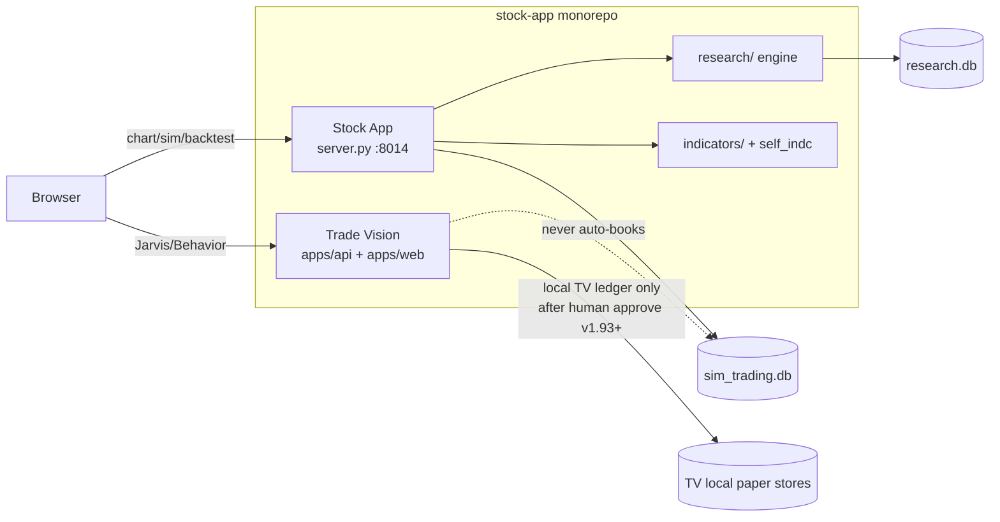

**Authority boundary (falsifiable):**

| Product | May do | Must not do |
|---------|--------|-------------|
| **Stock App** | Chart, ML BUY/SELL/HOLD, backtest, research jobs, **manual** sim fills into `sim_trading.db` | Claim live broker authority; auto-run TV arbiter |
| **Trade Vision** | WAIT/WATCH/PAPER-CANDIDATE, paper-guidance, local simulated paper **record** after explicit human approve (v1.93+), OpenAlgo **preview** | Live broker orders; hidden routing; auto-POST into Stock App `sim_trading.db` |
| **Neither** | — | Live autonomous trading bot |

TV safety invariants do **not** automatically govern every root `server.py` route. Unifying fill authority requires an explicit ADR.

### A-SA.2 Which product to open

| Goal | Product | Entry |
|------|---------|-------|
| Draw charts & classic/pattern indicators | Stock App | `python server.py 8014` → `http://localhost:8014/` |
| Manual paper sim / backtest / discovery jobs | Stock App | `/`, `/backtest`, `/research` |
| Decision intelligence, WAIT/WATCH, ORB paper guidance | Trade Vision | `trade-vision-app` web + API |
| Live broker orders | **Neither** | Blocked in TV; root sim is SQLite paper only |

### A-SA.3 Stock App pages — screen → API (verified routes)

| Screen (URL) | What you do | Main APIs (from `server.py`) |
|--------------|-------------|------------------------------|
| **Chart** `GET /` → `static/index.html` | Symbol/interval, indicators, pan chart | `GET /api/stock/{symbol}` · pattern endpoints · `WS /ws/price/{symbol}` |
| **Research** `GET /research` | Strategy discovery jobs | `POST /api/research/discover` · `GET /api/research/jobs*` · chart-data |
| **Backtest** `GET /backtest` | Run / compare strategies | `POST /api/backtest` · `/walk-forward` · `GET /api/backtest/strategies` · `/compare` |
| **Portfolio** `GET /portfolio` | Holdings analysis | `POST /api/portfolio/analyze` · `GET /api/portfolio/summary` |
| **Compare** `GET /compare` | Side-by-side backtest results | `GET /api/backtest/compare` |

`static/realtime.html` exists on disk; live quote strip uses **WebSocket** `WS /ws/price/{symbol}` and alias `WS /ws/realtime/{symbol}` (plus `GET /api/ws/status`). There is **no** dedicated `GET /realtime` page route in current `server.py`.

### A-SA.4 Chart workspace — control → API

| Button / action | Behavior | API |
|-----------------|----------|-----|
| Load symbol / change dates | OHLCV + inline indicators | `GET /api/stock/{symbol}?interval&start&end` |
| Toggle MA/EMA/RSI/… | Re-render from loaded payload | Mostly client; data from stock payload |
| Toggle Harmonics / Curves / Trendlines / HSR / Elliott | Background fetch + canvas | `GET /api/harmonics|curves|trendlines|horizontal-sr|elliott-wave/{symbol}` |
| ML predict | BUY/SELL/HOLD | `GET /api/predict/catboost|xgboost|lightgbm|ensemble/{symbol}` · `/api/stock/{symbol}/predict` |
| Verified trade signal (narrow) | Strict candidate gate | `GET /api/verified-trade-signal/{symbol}` (e.g. INFY 5m; often NO_VERIFIED_DATA elsewhere) |
| Paper: create account / trade | Persist SQLite | `POST /api/sim/accounts` `{name, initial_cash}` · `POST .../trade` |
| Monitor / alerts | Scheduler checks | `GET /api/monitor/check` · `/alert-log` · `/scheduler-status` |
| Live price strip | WS push | `WS /ws/price/{symbol}` (alias `/ws/realtime/{symbol}`) |

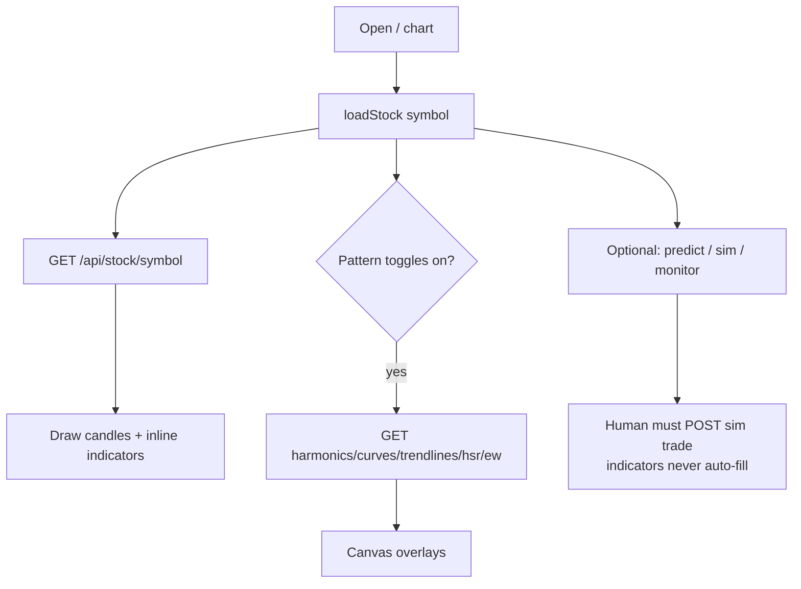

```text
Open page → load symbol → toggle indicators → (optional) human paper trade / backtest / research job
```

### A-SA.5 Stock App one-liners (research / backtest / paper)

| I want to… | Page | Call |
|------------|------|------|
| Discover strategies | `/research` | `POST /api/research/discover` then poll `GET /api/research/jobs/{id}/status` |
| Walk-forward / CPCV / HMM validate | `/backtest` or API | `POST /api/backtest/walk-forward` · `/api/validate/cpcv` · `/api/validate/hmm` |
| Book paper fill | Chart sim UI | `/api/sim/*` → **`sim_trading.db`** (not TV local ledger) |
| Portfolio heat-check | `/portfolio` | `/api/portfolio/*` |

**Deep chart implementation (not duplicated here):** canvas z-stack, viewport subscriptions, per-detector pipelines → root `STOCK_APP_ARCHITECTURE.md` §5–8. Adding a new chart indicator checklist → root §17.

---

## A. Big picture — how a day of research flows

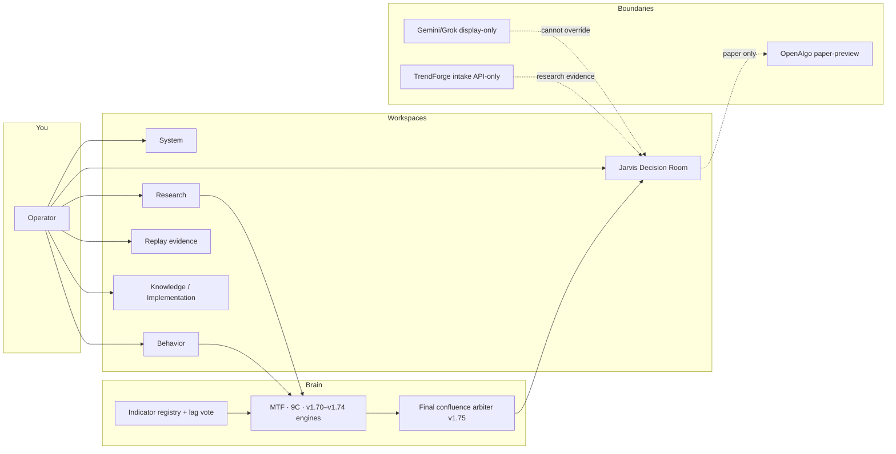

**One sentence:** Research/Behavior feed the brain → Final arbiter **only reduces** confidence → Jarvis shows WAIT/WATCH/PAPER-CANDIDATE → OpenAlgo/AI/TrendForge never unlock live trading.

---

## B. Workspaces — what you see, what you click, what API runs

### B1. Workspace switcher (all tabs)

| Screen | Purpose | Typical load APIs (on enter / refresh) |
|--------|---------|----------------------------------------|
| **System** | Mode watermark, health, kill switch, AI keys | `GET /api/system/mode`, `/features`, `/pipeline`, `/killswitch`, `/api/storage/status`, `/api/observability/status`, `/api/v1/ai/credentials/status` |
| **Research** | Chart, indicators, replay workbench | `GET /api/replay/session`, `/api/data/snapshots`, behavior chart/indicator routes as panels need |
| **Behavior** | Intelligence report cards (MTF, 9C, reliability, …) | `GET /api/v1/behavior/frontend/panel-map` + each panel’s `/current` route |
| **Jarvis Decision Room** | One place for evidence + blockers + AI + paper OpenAlgo | `GET /api/v1/jarvis/decision-room/*`, production-blockers, preflight, openalgo handoff, reliability drilldown |
| **Replay evidence** | Deterministic archive / golden / sim evidence (display) | `GET /api/replay/archive`, golden-fixture routes, lifecycle evidence (display-only components) |
| **Knowledge / Implementation** | Graph + status text (no trading) | `GET /api/knowledge/graph` → `docs/graph/project_graph.json` |

```mermaid
flowchart TB
  TAB[Workspace tabs in App.tsx]
  TAB --> SYS2[System]
  TAB --> RES2[Research]
  TAB --> BEH2[Behavior]
  TAB --> JAR2[Jarvis]
  TAB --> REP2[Replay evidence]
  TAB --> KNO2[Knowledge / Implementation]
  SYS2 -->|health / keys / kill| API1[/api/system/* · /api/v1/ai/*]
  RES2 -->|chart + replay| API2[/api/replay/* · behavior chart routes]
  BEH2 -->|panel cards| API3[/api/v1/behavior/*/current]
  JAR2 -->|assemble decision| API4[/api/v1/jarvis/* · reliability · openalgo]
  REP2 -->|evidence cards| API5[/api/replay/archive · golden fixtures]
  KNO2 -->|read-only| API6[/api/knowledge/graph]
```

---

### B2. Jarvis Decision Room — screen → button → API

**Behaves as:** the **operator desk**. Pulls multi-source evidence into one narrative. Can show PAPER-CANDIDATE for research; **cannot** place live orders.

| UI control / card | What happens | API (representative) |
|-------------------|--------------|----------------------|
| Open Decision Room for symbol | Load fused state / master panel | `GET /api/v1/jarvis/decision-room/state/{symbol}` · `.../fusion/{symbol}` · `.../master-panel/{symbol}` |
| Production blockers | List why not “ready” | `GET /api/v1/jarvis/production-blockers/{symbol}` |
| Preflight evidence | Pack evidence for review | `GET /api/v1/jarvis/preflight-evidence/{symbol}` |
| Indicator Reliability Drilldown | Show samples / lag / history source | `GET .../indicators/{id}/reliability-drilldown/{symbol}` |
| **Ingest Current Signals** | Write **pending** history only | `POST /api/v1/behavior/indicators/reliability/ingest-current` |
| Cache: Reload / Save / Force Recompute / Clear row | Speed artifacts only | `GET/POST/DELETE /api/v1/behavior/indicator-cache/*` |
| Gemini / Grok review | External critique, display-only | `POST /api/v1/jarvis/gemini/live-review/{symbol}` · Grok review routes · `.../ai-review/compare/{symbol}` |
| OpenAlgo paper preview / handoff gate | Paper package, not broker | `GET /api/v1/jarvis/openalgo/handoff-gate/{symbol}` · `.../paper-bridge/{symbol}` · `/api/v1/openalgo/preview-intent` |
| Final production audit / readiness | Release evidence | `GET /api/v1/jarvis/final-production-audit/{symbol}` · `/api/v1/release/readiness-evidence` |

**How it behaves under conflict:** blockers and safety flags win → WAIT/AVOID; external AI cannot clear a hard block.

---

### B3. Research workbench — screen → button → API

**Behaves as:** chart + indicator + replay **lab**. Computes and visualizes; does not own final trade authority (Jarvis/arbiter do).

| UI control | What happens | API |
|------------|--------------|-----|
| Load / import OHLCV (research) | Point-in-time candles | `POST /api/v1/behavior/data/import/ohlcv` · `GET .../data/snapshots` |
| Replay Start / Seek / Play / Pause / Step | Deterministic session | `POST /api/replay/start` · `/seek` · `/play` · `/pause` · `/step` · `GET /api/replay/session` |
| Indicator / chart analysis panels | Feature matrices, expansion | `GET/POST .../behavior/features/seven-timeframe*` · indicator matrix / chart-replay routes |
| Twin / Kronos research (if shown) | Forecast prior only | `GET /api/v1/kronos/status` · `POST /api/v1/kronos/forecast` · `POST /api/v1/twin/analyze` |

---

### B4. Behavior workspace — screen → button → API

**Behaves as:** catalog of **intelligence cards**. Each card = one engine report. Most actions are **refresh current** (GET) or **analyze** (POST with payload).

| Panel / brain piece | Operator intent | API |
|---------------------|-----------------|-----|
| Real MTF Pullback v1.63 | Pullback vs HTF conflict | `GET/POST /api/v1/behavior/timeframes/pullback*` |
| Multi-timeframe conflict | Direction matrix | `GET/POST /api/v1/behavior/timeframes/conflict*` |
| Chart reasoning + volatility v1.70 | Candle/vol regime | `GET/POST /api/v1/behavior/chart/reasoning*` |
| Market regime feedback v1.71 | Breadth / RS / Bayesian cap | `GET/POST /api/v1/behavior/market-regime/feedback*` |
| Market structure / liquidity v1.72 | Auction / trap / liquidity | `GET/POST /api/v1/behavior/market-structure/liquidity*` |
| Execution event OI risk v1.73 | Event/OI constraints | `GET/POST /api/v1/behavior/execution-event-oi/risk*` |
| Post-entry lifecycle v1.74 | Thesis after entry (sim) | `GET/POST /api/v1/behavior/post-entry/lifecycle*` |
| Final confluence arbiter v1.75 | Merge all → final band | `GET/POST /api/v1/behavior/final-confluence/arbiter*` |
| Indicator ontology / lag vote v1.80 | Why indicator counts late | `GET .../indicators/{id}/ontology` · `POST .../indicators/lag-vote` |
| Reliability + history v1.81–v1.85 | Memory of indicator outcomes | `POST .../reliability/label-signal` · `save-history` · `ingest-current` · `complete-pending` · GET reliability/history |
| 9C DNA / analogs | “Seen this shape before?” | 9C / analog-research behavior routes |
| Indicator cache controls | Faster re-display | `.../indicator-cache/*` |

**Rule of thumb:** Behavior cards **explain and demote**; they never “arm” live trading.

---

### B5. Replay evidence — screen → button → API

**Behaves as:** **proof drawer**. Shows what a replay/golden run produced. Extracted UI is **display-only** (no order buttons).

| UI | What happens | API |
|----|--------------|-----|
| Session / archive list | Past deterministic runs | `GET /api/replay/session` · `GET /api/replay/archive` |
| Golden fixture verify | 16 seeded scenarios | `GET /api/v1/behavior/replay/golden-fixtures` · `.../{id}/verify` |
| Scenario coverage | Family coverage report | `GET /api/v1/behavior/benchmark/scenario-coverage/current` |

---

### B6. System — screen → button → API

**Behaves as:** **safety + credentials cockpit**.

| UI control | What happens | API |
|------------|--------------|-----|
| Mode watermark | Always MOCK / no real money | `GET /api/system/mode` |
| Features / pipeline | Capability manifest | `GET /api/system/features` · `/pipeline` |
| Kill switch trigger / reset | Block order-paths further | `POST /api/system/killswitch/trigger` · `/reset` · `GET .../killswitch` |
| Save / test Gemini or Grok key | Encrypted vault (not broker) | `POST /api/v1/ai/credentials/gemini` · `/grok` · `/test-gemini` · `/test-grok` |
| Storage / observability | Ops health | `GET /api/storage/status` · `/api/observability/status` · `/requests` |

---

### B7. Knowledge / Implementation — screen → button → API

**Behaves as:** **map & changelog viewer**. No trading actions.

| UI | What happens | API / file |
|----|--------------|------------|
| Knowledge graph panel | Orientation map | `GET /api/knowledge/graph` ← `docs/graph/project_graph.json` |
| Implementation status text | What shipped | docs / status surfaces (display) |

---

## C. Core brain — how engines behave together

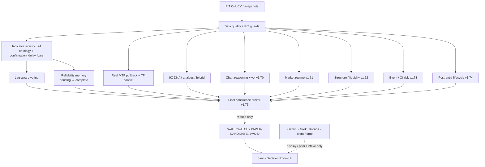

| Brain piece | Behavior in one line | Can promote live trade? |
|-------------|----------------------|-------------------------|
| Behavior intelligence (~142 modules) | Quality, memory, patterns, guards | **No** |
| Indicator registry + ontology | What each indicator is for / when it lies | **No** |
| Lag-aware voting | Late MACD/MA cannot alone lift WAIT→WATCH | **No** |
| Reliability + history | Pending until future bars complete | **No** (research counts only) |
| 9C / analogs | Historical shape memory | **No** |
| Real MTF pullback | Lower TF pullback vs HTF opposition | **No** (WAIT/WATCH/AVOID) |
| v1.70–v1.74 engines | Extra context that **caps** confidence | **No** |
| Final confluence v1.75 | Merges hierarchy; **reduce only** | **No** |

**Indicator history mini-flow (buttons):**

```text
[Ingest Current Signals] → pending rows (not counted)
        ↓ later, API only
[complete-pending + future bars] → completed labels → reliability research
        ↓ never
live order / probability authority
```

---

## D. Operator cheat-sheet (print this)

| I want to… | Go to | Click / call |
|------------|-------|--------------|
| See if trading is live | System | Mode watermark → always MOCK |
| Understand one stock now | Jarvis | Decision room for symbol |
| Deep-dive one engine | Behavior | Open that panel’s `/current` |
| Move the chart in time | Research | Replay play/seek/step |
| Prove a past scenario | Replay evidence | Golden fixture / archive |
| Save Gemini/Grok key | System | AI credentials panel |
| Paper-preview OpenAlgo | Jarvis | OpenAlgo handoff / preview-intent |
| Pull TrendForge | **API only** (no casual button) | `POST /api/v1/integrations/trendforge/pull-latest` |
| See architecture map | Knowledge | Knowledge graph |

---

# PAPER TRADE FULL FLOW (stock name → calc → result → paper)

> **Three different “paper” meanings in this monorepo — do not mix them up.**  
> (Verified 2026-07-24 against TV v1.93–v1.94 + root `server.py` sim routes.)

| Kind | Where | What actually happens |
|------|--------|------------------------|
| **A. Trade Vision decision label** | This app (arbiter / Jarvis) | Research decision → **WAIT / WATCH / PAPER-CANDIDATE** (or guidance band). Explains; does not debit cash. |
| **B. Trade Vision local simulated paper ledger** | This app (v1.93–v1.94) | **Explicit human approval** of a server-stored guidance ticket → local simulated paper **record** + optional replay lifecycle / cost-aware outcome. **No broker. No OpenAlgo live route. Does not write Stock App `sim_trading.db`.** |
| **C. Stock App sim paper trade** | Root `server.py` + **`sim_trading.db`** | Operator **manually** books buy/sell into SQLite cash/positions/history. Real money never moves. Full API map in § G-SA below. |
| **D. OpenAlgo paper-preview (boundary)** | TV → adapter simulator | Preview/export/dry-run package for external review. **Not** live broker authority. |

Trade Vision **never** auto-fires a Stock App `sim_trading.db` trade. An operator may still copy a candidate idea into the chart app sim by hand. Live broker = **neither product**.

---

## E. End-to-end Trade Vision flow (after you type a stock name)

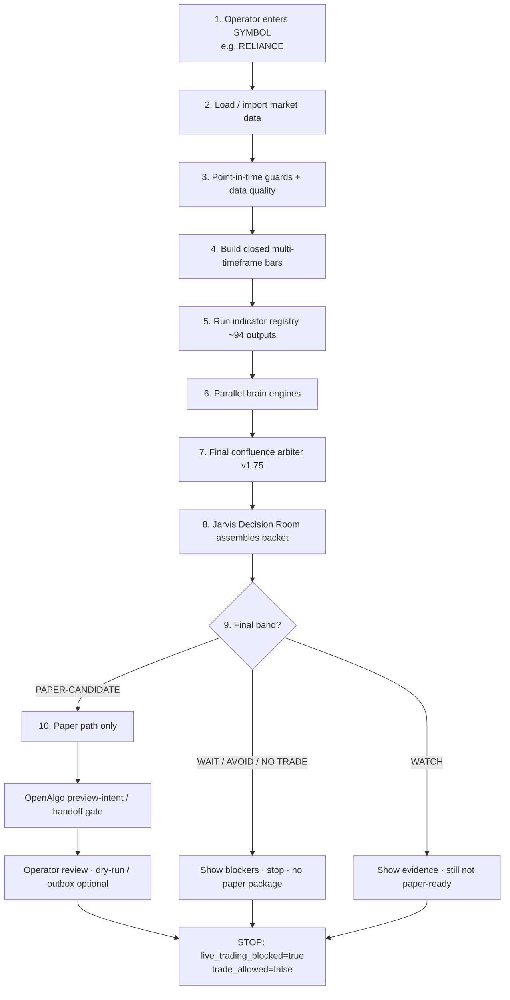

---

## F. Step-by-step: what is calculated and **why**

### Step 1–2 · Receive symbol → data

| What | Why | Who / API |
|------|-----|-----------|
| Accept `symbol` (and timeframe, often `1m`) | Anchor every report to one instrument | UI / Jarvis routes with `{symbol}` |
| Load PIT snapshots or import OHLCV | Need real/mock candles without future leak | `POST .../behavior/data/import/ohlcv`, `GET .../data/snapshots`, data adapter |
| Optional replay session | Deterministic “what if” time cursor | `POST /api/replay/start` … |

**Output:** candle series + snapshot id/hash for audit.

### Step 3 · Quality + point-in-time

| Calculation | Why | Module family |
|-------------|-----|----------------|
| Missing bars, bad prints, gaps | Bad data must not look like a signal | `data_quality`, quality reports |
| No future timestamps in features | Prevent lookahead bias | `point_in_time_guard` |
| Incomplete HTF bars marked not decision-safe | Don’t treat forming 1H/day as closed truth | timeframe builders |

**If fail:** engines return WAIT/AVOID / unavailable — paper path blocked early.

### Step 4 · Multi-timeframe closed bars

| Calculation | Why |
|-------------|-----|
| Aggregate 1m → 3m,5m,15m,30m,1H,4H,daily,weekly (closed only) | Align structure across horizons |
| Direction / slope per TF | Context for pullback vs conflict |

**API:** `.../features/seven-timeframe*`, `.../timeframes/conflict*`, `.../timeframes/pullback*`

### Step 5 · Indicator registry (~94) + intelligence

| Calculation | Why |
|-------------|-----|
| Compute locked indicator set from registry | Consistent feature bank |
| Ontology: purpose, regime fit, failure modes | Know when an indicator lies |
| `confirmation_delay_bars` → lag weight `1/(1+delay)` | Late MACD/MA must not fake confidence |
| Lag vote: can_promote_watch / can_promote_paper flags | Blocks WAIT→WATCH or WATCH→PAPER alone from lagging confirms |

**API:** `GET .../indicators/{id}/ontology`, `POST .../indicators/lag-vote`, intelligence-summary

### Step 6 · Reliability memory + history (optional operator actions)

| Calculation | Why |
|-------------|-----|
| **Ingest current** → pending rows | Snapshot “what signal was live” without knowing outcome yet |
| **Complete-pending** + explicit future bars → win/loss labels | Learn only after horizon completes (stop-first if same-bar collision) |
| Bayesian shrink / low-sample quarantine | Don’t trust thin history |

**API:** `POST .../reliability/ingest-current` · `complete-pending` · GET reliability / history / drilldown  

**Does not place paper trades** — only research memory.

### Step 7 · Parallel “brain” engines (all research-only)

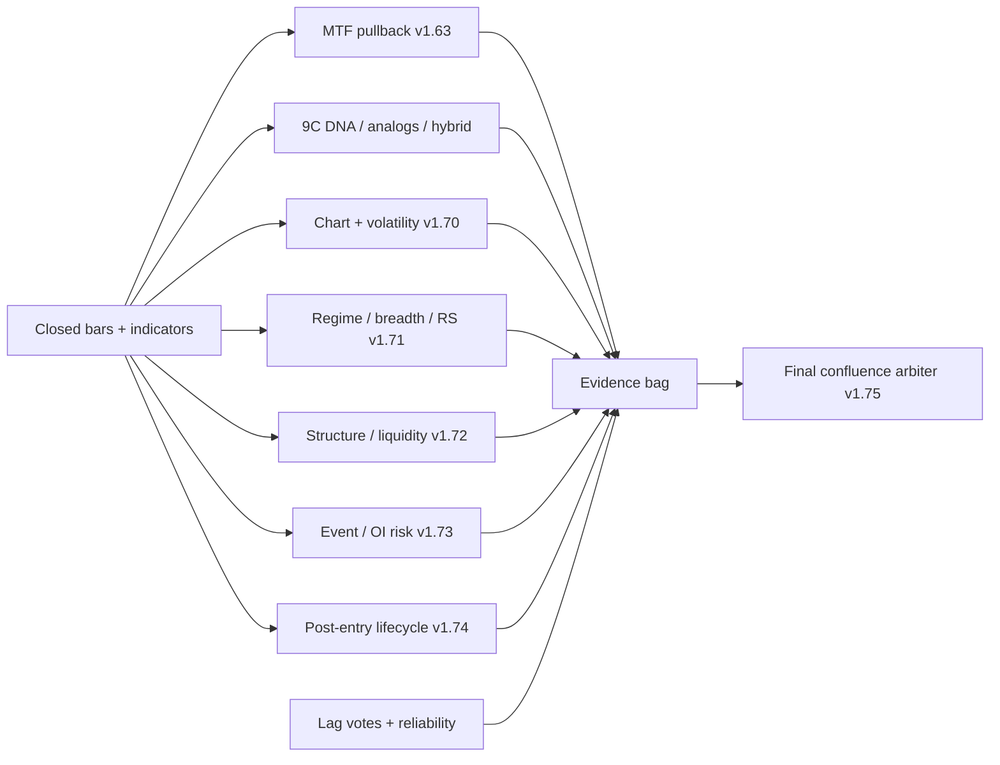

| Engine | What it computes | Why it runs before paper |
|--------|------------------|---------------------------|
| **Real MTF pullback** | pullback_in_trend vs htf_opposition vs mixed | Avoid buying a “dip” that is actually HTF reverse |
| **9C DNA / analogs** | Similar past windows + outcomes | “Has this shape paid before?” (explanation / prior only) |
| **v1.70 chart/vol** | rejection, ATR/HV percentiles, vol-OOD, VCP, etc. | Extreme vol → demote confidence |
| **v1.71 regime** | breadth, RS, Bayesian feedback, cooldown | Weak sector/market → cap to WAIT/WATCH |
| **v1.72 liquidity/structure** | liquidity grade, traps, auction | Grade C → block PAPER-CANDIDATE |
| **v1.73 event/OI risk** | event risk, spread, OI-style guards | High event/spread → block or WATCH |
| **v1.74 post-entry** | thesis invalidate / manage (sim guidance) | After a paper idea, manage risk narrative — still not live |
| **Kronos twin (optional)** | Forecast prior | Prior only; Behavior safety wins |
| **TrendForge intake (optional)** | Signed scanner evidence | Research intake; cannot force paper handoff |

Each engine returns **typed report + safety flags** (`used_for_probability=false`, `trade_allowed=false`, …).

### Step 8 · Final confluence arbiter (v1.75)

| Calculation | Why |
|-------------|-----|
| Rank evidence: safety > data quality > liquidity > regime > structure > indicators > external AI | Prevent weak indicators from overriding risk |
| Conflicts (e.g. bullish indicators at resistance) | Force demotion |
| Output `final_decision` + reason tree | Single band for the operator |

**Possible bands:** `PAPER-CANDIDATE` · `WATCH` · `WAIT` · `AVOID` (and short paper variant)  

**Critical property:** arbiter **reduces only** — never enables live routing.

**API:** `POST/GET /api/v1/behavior/final-confluence/arbiter/*`

### Step 9 · Jarvis assembles “decision room”

| What Jarvis does | Why |
|------------------|-----|
| Merge fusion / master panel / blockers / preflight | One screen for humans |
| Attach reliability drilldown, cache status | Evidence transparency |
| Optional Gemini/Grok review | Second opinion **display-only** (cannot clear hard blocks) |
| Build OpenAlgo handoff **gate** | Structural check: is paper package even allowed? |

**APIs:** `/api/v1/jarvis/decision-room/*`, `production-blockers`, `preflight-evidence`, `openalgo/handoff-gate`, `openalgo/paper-bridge`, AI review routes.

---

## G. How “paper trade” happens in Trade Vision (and what it is **not**)

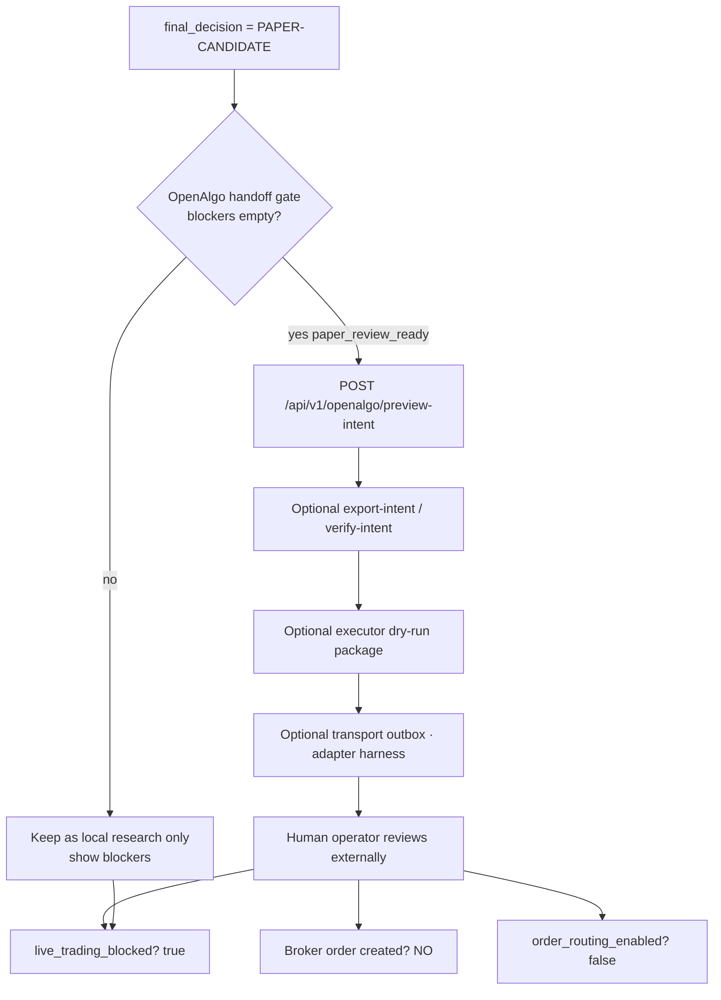

| Stage | Performs | Does **not** perform |
|-------|----------|----------------------|
| PAPER-CANDIDATE band | Marks idea as research-eligible for paper **review** | Does not debit cash or open a position in TV |
| `preview-intent` / export / verify | Builds a **safe package** for external paper/sim systems | Does not call a live broker API as authority |
| Paper bridge report | Confirms Gemini cannot boost into executable order | Does not set `trade_allowed=true` for live |
| Transport outbox | Dry-run delivery simulation to adapter | Not live execution authority inside TV |
| Stock App sim (separate product) | If operator **manually** trades there | Not auto-triggered by TV |

**Bottom line:** In Trade Vision, “paper” means **decision + optional human-approved local simulated record (v1.93+) + OpenAlgo preview package**. Cash-book style multi-account fills still live in **Stock App** `sim_trading.db` only if a human books them there. Live broker = never from these paths.

---

## G-SA. Stock App paper sim fill path (real SQLite book — sibling product)

> Absorbed from root STOCK_APP_ARCHITECTURE § Paper trade; **re-verified** against `server.py` (`SIM_TRADING_DB`, `/api/sim/*`).  
> This is **Kind C** above — not the TV local ledger (Kind B).

### G-SA.1 Symbol → calc → manual paper fill

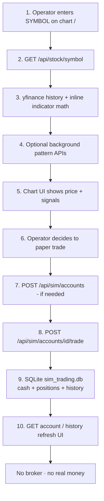

| Step | Calculation | Why | Where |
|------|-------------|-----|--------|
| 1 | Resolve symbol + interval + date range | Which bars to pull | UI → query params |
| 2 | Download OHLCV (`yfinance`) | Price/volume for chart | `GET /api/stock/{symbol}` |
| 3 | Inline indicators (MA, EMA, RSI, MACD, BB, Supertrend, …) | Visual + discretionary signals | Same response payload |
| 4 | Optional: harmonics, curves, trendlines, HSR, Elliott | Pattern context | `/api/harmonics` · `/curves` · `/trendlines` · `/horizontal-sr` · `/elliott-wave` |
| 5 | Optional: ML predict | Extra BUY/SELL/HOLD score | `/api/predict/*` |
| 6 | Optional: monitor/alerts | Background signal checks | `/api/monitor/*` |
| 7 | **Paper trade math** | Cash − notional, qty, avg, PnL | `POST .../sim/.../trade` + `sim_trading.db` |

**Important:** Chart indicators **do not auto-submit** sim trades. A human (or an explicit UI click) must call the sim trade API.

### G-SA.2 Sim API → DB effect (verified field names)

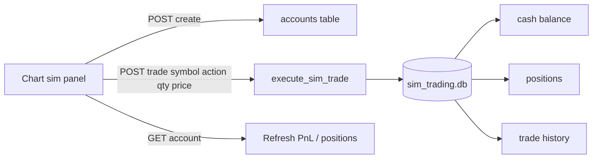

| Action | API | DB effect |
|--------|-----|-----------|
| Create paper account | `POST /api/sim/accounts` `{name, initial_cash}` | Insert `accounts` (`initial_cash` / `cash`) |
| List accounts | `GET /api/sim/accounts` | Read |
| Account detail + positions | `GET /api/sim/accounts/{id}` | Join cash/positions |
| **Execute paper trade** | `POST /api/sim/accounts/{id}/trade` `{symbol, action, quantity, price}` | Debit/credit cash, upsert position, append history |
| History | `GET /api/sim/accounts/{id}/history` | Read trades |
| Delete account | `DELETE /api/sim/accounts/{id}` | Remove |

Persistence: **`sim_trading.db`** next to `server.py` (`SIM_TRADING_DB` + `init_sim_trading_db()`). Survives restart. **Not** broker-linked. **Not** TV local paper stores.

### G-SA.3 Combined monorepo paper story (both products)

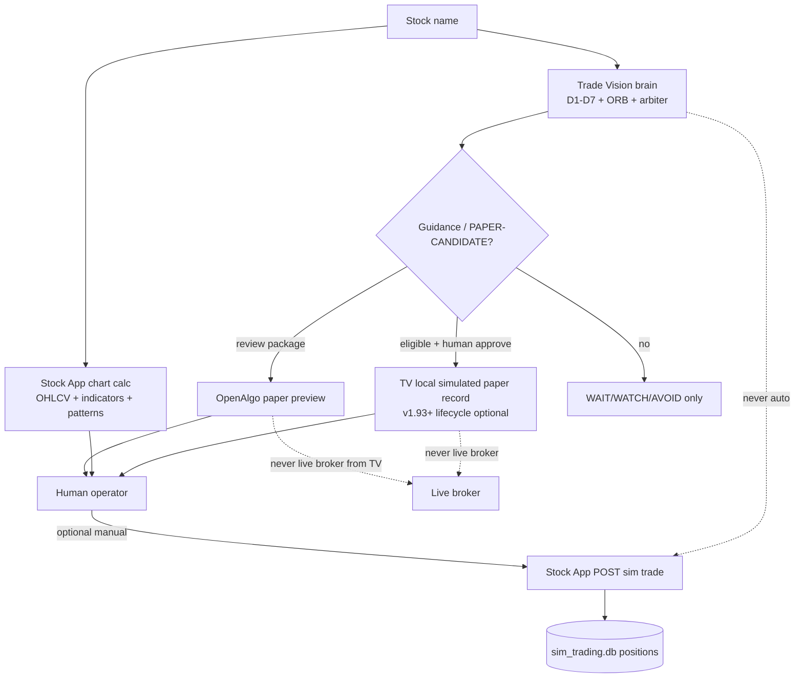

```text
Trade Vision  = decide + explain + local sim record after approve + OpenAlgo preview
Stock App sim = book multi-account fills in SQLite when YOU click trade
Neither       = live broker order from these paths
```

### G-SA.4 Assessment (keep / improve / do not break)

| Question | Answer |
|----------|--------|
| Will Stock App paper sim work? | **Yes** — manual trade → `sim_trading.db` |
| Will TV auto-fill Stock App sim? | **No** — not wired; human must book there (or use TV local ledger after approve) |
| Is product split best? | **Best for safety** (research brain ≠ root fill ledger). **Weaker for UX** until a draft handoff exists |
| Best next UX improvement | “Guidance → open Stock App sim draft” pre-fill (still human confirm) — see § J5 |

**Keep:** explicit human action before any durable paper book; SQLite honesty; no live broker.  
**Do not break:** live trading remains out of scope until a dedicated ADR; TV safety flags stay blocked for live routing.

---

## H. How all major functions connect (wiring map)

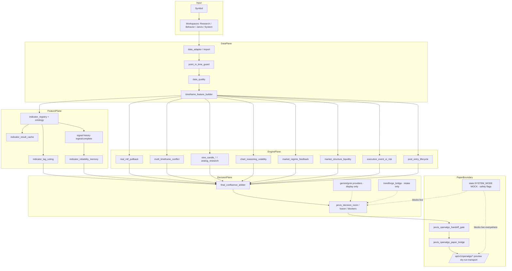

| Connection | Direction | Meaning |
|------------|-----------|---------|
| Data → Features | forward | No engine runs without PIT-safe bars |
| Features → Engines | forward | Indicators feed structure/9C/regime context |
| Engines → Arbiter | forward | Many reports, one reduce-only decision |
| Arbiter → Jarvis | forward | Human-readable packet |
| Jarvis → OpenAlgo | paper boundary | Preview only; flags stay blocked |
| AI / TrendForge → Jarvis | side | Cannot override safety |
| Cache / history | side loops | Speed + learning; not execution |

---

## I. Operator walkthrough (copy-paste mental model)

```text
1. Type SYMBOL in Jarvis / Research
2. System loads candles (import or snapshot) → quality + PIT checks
3. Build closed MTF bars
4. Compute indicator bank + lag weights (+ optional ingest pending history)
5. Run MTF, 9C, v1.70–v1.74 engines in parallel (each can only demote)
6. Final arbiter merges → WAIT | WATCH | PAPER-CANDIDATE | AVOID
7. Jarvis shows reason tree + blockers
8. If PAPER-CANDIDATE and gate open → preview OpenAlgo paper intent
9. Human reviews; optional dry-run / outbox
10. Live broker order: IMPOSSIBLE inside Trade Vision
11. Optional: human books a fill in Stock App sim (separate app, sim_trading.db)
```

---

## J. Flow assessment — will it work? is it best? how to improve?

> **Saved for future agents/operators (2026-07-21).**  
> This is an architecture product assessment of the paper-trade flow above — not a claim that Tier 2–3 are already built.

### J1. Short answers

| Question | Answer |
|----------|--------|
| **Will this flow work?** | **Yes** for research → decide → paper *review*. **Not** as one-click paper *broker fill* from stock name alone. |
| **Is it the best?** | **Best for safety / research honesty.** **Not best** for seamless “paper trade this stock” UX. |
| **Can it be improved?** | **Yes** — connect the two paper paths and reduce operator friction (tiers below). Do **not** weaken live-trading blocks without a new ADR. |

### J2. What works today vs what does not

**Works (built and enforced):**

```text
Stock name
  → data + quality + PIT
  → indicators + MTF + 9C + v1.70–v1.74
  → arbiter (reduce only)
  → WAIT / WATCH / PAPER-CANDIDATE
  → Jarvis shows why
  → OpenAlgo paper preview package (if gate allows)
  → live_trading_blocked remains true
```

Stock App sim path (separate product) also works:

```text
Symbol → chart/indicators → human clicks trade → sim_trading.db
```

**Does not work as a single automatic pipeline:**

| Expectation | Reality |
|-------------|---------|
| Type stock → auto paper fill in Trade Vision | Does not happen |
| PAPER-CANDIDATE → auto Stock App sim trade | **Not wired** (TV ↛ sim) |
| OpenAlgo preview → live/paper broker fill from TV | Blocked by design |
| Pending indicator history auto-completes | Needs explicit future bars (or later warehouse work) |
| External AI “confirms” → trade | Cannot override safety (correct) |

**Conclusion:** Documented flow works as a **research + paper-review** system. It is incomplete as a **one-product paper-trading platform** without human glue between TV and Stock App sim.

### J3. What to keep (strong design)

1. Safety hierarchy — risk / liquidity / data quality beat indicators and AI.  
2. Reduce-only final confluence arbiter — hard to accidentally promote into danger.  
3. Point-in-time / closed candles — research stays trustworthy.  
4. Immutable MOCK mode — no silent live routing.  
5. OpenAlgo as boundary — paper package ≠ TV execution authority.  
6. Separate Stock App sim DB — durable paper fills without coupling to live brokers.

For a **research-first** product, this is sound and often better than “one button = paper order.”

### J4. Product/UX gaps (not safety bugs)

| Gap | Why it hurts |
|-----|----------------|
| Two paper systems (TV candidate vs Stock App sim) | Operator must mentally merge them |
| No auto handoff TV → sim | Friction; easy to drop stop/target from Jarvis |
| Many Jarvis/behavior routes | Hard to know the single next click |
| TrendForge / complete-pending mostly API-only | Advanced steps invisible in UI |
| Word “paper trade” vs PAPER-CANDIDATE | Over-promises a fill that TV never books |

### J5. Improvement tiers (future work — not all implemented)

#### Tier 1 — Low risk, high clarity (docs + UI copy)

1. Rename in UI: PAPER-CANDIDATE → “Research paper idea (no fill)” (or equivalent).  
2. One “Next step” card in Jarvis after arbiter:
   - WAIT/AVOID → top blocker only  
   - PAPER-CANDIDATE → “Preview OpenAlgo package” + “Copy idea to Stock App sim (manual)”  
3. Single checklist on Decision Room: data OK → engines → band → blockers → paper actions.  
4. Footer/copy: “Fills only in Stock App sim or external OpenAlgo — not inside TV live routing.”

**Risk:** none. **Impact:** fewer wrong expectations.

#### Tier 2 — Connect paper paths (highest product ROI)

Guided paper bridge (**still no live trading**):

```text
PAPER-CANDIDATE in TV
  → button "Open paper sim draft"
  → payload: symbol, side bias, suggested stop/target, reason_tree hash
  → Stock App sim pre-fills trade form
  → human confirms size/price
  → sim_trading.db fill
  → optional write-back: sim_fill_id into TV evidence (research only)
```

| Benefit | Safety rule to preserve |
|---------|-------------------------|
| One mental flow | Human confirm still required |
| Audit link idea → fill | TV still `trade_allowed=false` for live |
| Sizing stays operator-owned | No auto size from AI alone |

**Status:** proposed — **not built** as of 2026-07-21.

#### Tier 3 — Smarter brain / simpler operator path

1. Auto-complete pending labels from local/imported candle history (today: caller-supplied bars only).  
2. One “decision packet” API: band + top reasons + invalidation + blockers (instead of many panel GETs).  
3. Align scenario **family** list (15) with golden **fixtures** (16), e.g. `fake_breakout` family token if product wants it.  
4. Always surface fixture-fallback vs real reliability history in UI.  
5. Default path for new users: one “Run full confluence” → Jarvis only (advanced panels collapsed).

#### Tier 4 — Do not “improve” without explicit ADR + approval

- Auto paper fill without human confirm  
- Letting Gemini / Grok / Kronos / TrendForge set PAPER-CANDIDATE alone  
- Enabling live OpenAlgo order routing from Trade Vision  
- Treating indicator cache as probability or order authority  

These would weaken the architecture.

### J6. Recommended target state (still safe)

```text
1. Enter symbol
2. One "Analyze" → PIT data + engines + arbiter
3. Jarvis shows WAIT | WATCH | PAPER-CANDIDATE + top blockers
4. If PAPER-CANDIDATE:
     a) Preview OpenAlgo paper package (external review)
     b) "Send draft to Stock App sim" → human confirms → SQLite fill
5. Optional: post-entry lifecycle card updates on sim position (research)
6. Live trading remains a separate future product with its own ADR
```

That is the **current flow plus glue**, not a rewrite of the brain.

### J7. Implementation priority if building improvements

```text
1. Tier 1 — UI wording + Next-step card
2. Tier 2 — PAPER-CANDIDATE → Stock App sim draft bridge
3. Tier 3 — Single analyze packet + history auto-complete later
```

### J8. Revisit when

| Trigger | Action |
|---------|--------|
| Tier 2/3 implemented | Move items from “proposed” to IMPLEMENTATION_STATUS + update this section |
| Live trading product charter | New ADR; do not silently flip SYSTEM_MODE |
| Operator confusion reports | Prefer Tier 1 before adding engines |

**Stock App sim assessment** (fills in `sim_trading.db`): see root `STOCK_APP_ARCHITECTURE.md` § Paper trade assessment.

---

## ADR Index

| ADR | Decision | Status | Expiration / revisit when |
|-----|----------|--------|---------------------------|
| ADR-TV-001 | System runs in **MOCK** mode; `allows_live_orders=false`, `immutable=true` | Active | Explicit live-trading product ADR + legal |
| ADR-TV-002 | Behavior engine is memory/risk/**no-trade authority**; Kronos/Gemini/Grok/TrendForge cannot override | Active | Authority model redesign |
| ADR-TV-003 | OpenAlgo is **external boundary**, not in-process execution authority | Active | True multi-process live executor charter |
| ADR-TV-004 | Indicator result cache is **reference-only** (speed artifact) | Active | If cache becomes signed decision input |
| ADR-TV-005 | Closed-candle / point-in-time only for decision-time features | Active | Tick-stream redesign |
| ADR-TV-006 | Final confluence arbiter **reduces only** (v1.75) | Active | New resolver with promote rights (forbidden without ADR-TV-001 change) |
| ADR-TV-007 | Indicator intelligence contract + lag voting required for trusted indicators (v1.80+) | Active | Registry unlock |
| ADR-TV-008 | Pending history ≠ reliability sample until explicit completion (v1.84–v1.85) | Active | Auto-complete from warehouse |
| ADR-TV-009 | TV-PROD-RED-001 blocks production research release candidate | Active | Red-team suite expansion |
| ADR-TV-010 | Final audit evidence cache TTL = **2.0s**; must not hide red-team fail | Active | SLO redesign |
| ADR-TV-011 | TrendForge intake: HMAC + loopback-default + safety envelope (v1.86) | Active | Remote allowlist ADR |
| ADR-TV-012 | Knowledge graph is **orientation only**, not implementation SoT | Active | Always |
| ADR-TV-013 | Kronos runs in **isolated process**; API must not import heavy model stack | Active | In-process inference ADR |
| ADR-TV-014 | Context files updated after major version / route / panel / safety change | Active | Always |

Traceability: safety text → `docs/SAFETY_INVARIANTS.md` + `docs/context.md` INV-*; mode → `apps/api/app/state.py`.

---

## 1. System context (interface contracts)

### 1.1 Process boundaries

| Component | Interface contract | Implementation | Prevents |
|-----------|-------------------|----------------|----------|
| **API** (`apps/api`) | HTTP JSON envelopes; capability status; research/mock flags | FastAPI `main.py` (409 route decorators / 405 unique paths), `behavior/*`, `storage.py` SQLite | In-process broker SDKs; silent live flags |
| **Web** (`apps/web`) | Workspace UI; display of reports; operator actions (ingest, cache controls) | React `App.tsx` + extracted components | Broker login storage; autonomous order buttons |
| **Kronos service** | Forecast/backtest HTTP contract; research prior only | `apps/kronos-service` | Coupling TV API process to GPU model import |
| **OpenAlgo adapter** | Dry-run / paper package transport simulation | `apps/openalgo-adapter` | Treating adapter as production broker |
| **Design vault** | Read-only graph JSON for knowledge UI | `docs/graph/project_graph.json` via `KNOWLEDGE_GRAPH_PATH` | Implementing features from graph alone |

### 1.2 Global decision contract

Every evidence-touching route/panel must preserve (tests required):

```text
live_trading_blocked = true
order_routing_enabled = false
trade_allowed = false  (unless explicit research/paper flag only)
no_future_leakage = true where applicable
```

**Allowed outputs:** WAIT | WATCH | PAPER-CANDIDATE | NO TRADE | FAKEOUT WARNING | AVOID CHOP  
**Forbidden outputs:** LIVE BUY/SELL | AUTO EXECUTE | ROUTE ORDER | IGNORE RISK | IGNORE LOW EVIDENCE  

### 1.3 Negative design space (architecture *prevents*)

| Prevented | Mechanism |
|-----------|-----------|
| Live order placement from TV | Immutable MOCK mode; flags on reports; no live order routes |
| External AI as authority | Display-only review schemas; cannot set routing true |
| Lookahead bias | PIT guards; closed aggregates; v1.85 requires *supplied* future bars only for *labels*, not for decision features |
| Cache-as-oracle | Indicator cache reference-only |
| Unsigned/stale TrendForge execution packets | HMAC + age + safety envelope + loopback default |
| Graph-driven feature invention | ADR-TV-012; IMPLEMENTATION_STATUS is ship SoT |

---

## 2. Component catalog (contract → impl → failure)

### 2.1 Behavior Intelligence

| | |
|--|--|
| **Contract** | Consume point-in-time data; emit typed reports that may **only reduce** confidence / force WAIT|AVOID |
| **Impl** | `apps/api/app/behavior/*` (142 modules): registry, MTF, 9C, confluence, reliability, etc. |
| **Failure modes** | Missing data → timeframe unavailable / AVOID; OOD/vol gates → block promotion; module exception → envelope error, no silent trade_allowed |
| **Degrades under load** | Sync CPU-bound reports; no claim of multi-tenant scale **[GAP: load-test]** |

### 2.2 Jarvis Decision Room

| | |
|--|--|
| **Contract** | Assemble multi-source evidence for operator; export hash-bound packets; never enable live routing |
| **Impl** | `jarvis_*` modules + `/api/v1/jarvis/*` routes; web Decision Room workspace |
| **Failure modes** | Provider down → fallback readiness / display absence; disagreement explorer shows conflict without promotion |
| **Degrades** | Evidence cache / latency budget panels; final audit cold path ~7s local |

### 2.3 Indicator intelligence & history (v1.80–v1.85)

| | |
|--|--|
| **Contract** | Ontology + lag weights + reliability rollups; history pending/completed; research-only |
| **Impl** | `indicator_registry`, `indicator_lag_voting`, `indicator_reliability_memory`, `indicator_signal_history_*` |
| **Failure modes** | Low sample → Bayesian shrink / quarantine; incomplete horizon → stay pending; missing bars → no fake complete |
| **Degrades** | Fixture fallback when no persisted labels (noted in v1.86 status) |

### 2.4 Twin Machine + Kronos

| | |
|--|--|
| **Contract** | Kronos = forecast prior; Behavior = safety authority; Twin compares without live enable |
| **Impl** | `kronos_proxy`, `twin_arbiter`, `full_twin_analysis`, isolated `kronos-service` |
| **Failure modes** | Service down → no prior / degraded twin; must not open routing |
| **Degrades** | Research panels show unavailable forecast |

### 2.5 OpenAlgo boundary

| | |
|--|--|
| **Contract** | Paper-review preview, dry-run packages, transport outbox — **not** live broker authority |
| **Impl** | `openalgo_*`, `apps/openalgo-adapter`, Jarvis handoff gates |
| **Failure modes** | Transport failure → dead-letter / recovery plane; never invent broker fills as live |
| **Degrades** | Operator recovery routes; resilience SLOs in runbooks |

### 2.6 TrendForge intake (v1.86)

| | |
|--|--|
| **Contract** | Pull signed research packets; persist immutable intakes; reject execution-enabled payloads |
| **Impl** | `behavior/trendforge_bridge.py`; `POST .../trendforge/pull-latest`; `GET .../trendforge/intakes`; `storage.trendforge_intakes` |
| **Failure modes** | Bad HMAC / stale / non-loopback / unsafe safety block → 422; idempotent store on success |
| **Degrades** | Intakes retained as WAIT; OpenAlgo handoff remains false |

### 2.7 Release governance

| | |
|--|--|
| **Contract** | Final audit + red-team + readiness evidence gate release candidate |
| **Impl** | `final_release_audit.py`, `red_team_final_gate.py`, `release_readiness_evidence.py` |
| **Failure modes** | RED-001 fail → block production_research_release_candidate; cache miss recomputes |
| **Degrades** | Cache 2.0s only; identity-aware key includes dependency identities |

### 2.8 Web workspaces

| Workspace | Contract | Impl files |
|-----------|----------|------------|
| Jarvis | Decision evidence display | `App.tsx` + panels |
| Research | Chart/replay/indicators | research workbench |
| Behavior | Intelligence reports | panel-map driven |
| System | Health, credentials (AI only) | `systemWorkspace.tsx`, `aiCredentialsPanel.tsx` |
| Knowledge / Implementation | Display-only graph & status | `referenceWorkspaces.tsx` |
| Replay evidence | Deterministic evidence cards | `replayEvidencePanels.tsx` |

---

## 3. Failure mode taxonomy

| Class | Trigger | System response | Must not |
|-------|---------|-----------------|----------|
| **DATA** | Missing/partial OHLCV | Mark unavailable; prefer WAIT/AVOID | Fill zeros as evidence |
| **LEAK** | Future bar in decision features | Guard reject / invalid | Use for live promotion |
| **AUTHZ** | Attempt live flags in intake/review | Reject package | Persist as trade_allowed |
| **EXT** | Gemini/Grok/Kronos/TF down | Degrade display/prior | Open routing |
| **CACHE** | Stale indicator artifact | Recompute / quarantine | Authority upgrade |
| **LABEL** | Incomplete horizon | Keep pending | Count in reliability |
| **RELEASE** | Red-team fail | Block release candidate | Ship with ignored gate |
| **LOAD** | Heavy audit/report | Slow sync response | Drop safety checks to go faster |

---

## 4. Data flow (normative)

```text
PIT snapshots / imports
  -> behavior engines (closed candle)
  -> typed reports (reduce-only)
  -> Jarvis assembly + optional external display review
  -> operator: WAIT | WATCH | PAPER-CANDIDATE
  -> optional OpenAlgo paper-preview package
  -> never: broker live order
```

Indicator history side path:

```text
ingest-current (pending) -> complete-pending (explicit future bars) -> reliability research rollup
```

TrendForge side path:

```text
signed packet -> verify HMAC+safety+loopback -> trendforge_intakes -> research evidence
```

See also Mermaid in `docs/graph.md`.

---

## 5. Quantified bounds (no vague “fast”)

| Bound | Value | Source |
|-------|-------|--------|
| API route decorators | 395 | `main.py` `@app.(get|post|put|delete)` |
| Unique API path strings | 391 | same file; count unique path literals |
| Behavior modules | 142 | `behavior/*.py` |
| Final audit TTL | 2.0 s | `FINAL_AUDIT_CACHE_TTL_SECONDS` |
| Final audit cold (local) | ~7242 ms | v1.68 measurements |
| Final audit warm | ~0.3–0.4 ms | v1.68 |
| Full backend regression cited | **715 passed** @ v1.94 (2026-07-24) | `pytest apps/api/tests` |
| Golden replay fixtures seeded | 16 (6+10) | `_ensure_golden_replay_fixtures` |
| Scenario coverage families | 15 | `REQUIRED_SCENARIO_FAMILIES` |
| Graph nodes / edges | 71 / 151 (verify `summary` == array lengths) | `project_graph.json` |
| Concurrent capacity | **[GAP: requires load-test report]** | — |

---

## 6. Root monorepo architecture (constraints + Stock App surface)

> Trade Vision lives under `stock-app/trade-vision-app`. Root chart server (`server.py:8014`), `research/` discovery, and `indicators/self_indc` are **adjacent products/references**, **not** TV live-execution authority.  
> Operator-facing Stock App map: § **A-SA**. Paper sim fills: § **G-SA**.  
> Content below absorbed from root `STOCK_APP_ARCHITECTURE.md` and **verified** against tree + `server.py` (2026-07-24). Detector/canvas deep-dives remain root-only (§5–8 there).

### 6.1 Root-Arch invariants (cross-product, falsifiable)

| ID | Invariant | Rationale | Enforcement | Consequence of violation | Trace |
|----|-----------|-----------|-------------|--------------------------|-------|
| RA-1 | **No silent live broker routing from Trade Vision** | Capital safety | TV `SYSTEM_MODE` + `allows_live_orders=False`; tests assert `live_trading_blocked` | Live risk / release fail | `docs/context.md` INV-1; SAFETY_INVARIANTS |
| RA-2 | **Decision-time features must be point-in-time safe** (no future bars) | Research validity | TV PIT guards; closed-candle builders | Lookahead-biased “alpha” | ADR-TV-005; SAFETY_INVARIANTS |
| RA-3 | **External models (Kronos/Gemini/Grok/TrendForge) are non-authoritative** | Prevent model override of risk | Twin/review/intake schemas; TF safety envelope | Unsafe promotion | ADR-TV-002, ADR-TV-011 |
| RA-4 | **Subsystem boundaries: isolated processes for heavy/external adapters** | Blast radius | `kronos-service`, `openalgo-adapter` separate apps | API OOM / hidden coupling | ADR-TV-013 |
| RA-5 | **Living docs must match latest shipped version in the same change set** | Prevent stale handoff | Context maintenance runbook; graph refresh | Implement from wrong version | `TRADE_VISION_README.md` § AI Handoff (context maintenance) |
| RA-6 | **Root chart indicators load lazily** (import inside compute, not always module top) | Startup reliability | Root compute helpers; code review | Broken boot on optional deps | root STOCK_APP_ARCHITECTURE §18 |
| RA-7 | **Caches are not authority** (TTL chart caches; TV indicator cache reference-only) | Avoid stale-as-truth | TTLCache patterns; TV cache flags | False confidence | Root §7b; ADR-TV-004 |
| RA-8 | **No circular package imports between `research` engine and TV `behavior`** without ADR | Dependency hygiene | Review; import linters **[GAP: no automated import-linter config found]** | Unreleasable tangle | Monorepo topology |
| RA-9 | **Secrets for integrations are not interchangeable** (TrendForge HMAC ≠ OpenAlgo secret) | Blast radius of leak | Separate env vars | Cross-system forgery | TV v1.86 |
| RA-10 | **Recoverable operator state for TV SQLite paths via backup/restore runbook** | Ops continuity | `docs/runbooks/deployment-backup-restore.md` | Data loss | TV runbooks |
| RA-11 | **Root sim accounts persist in SQLite `sim_trading.db` (not process-only memory)** | Honest durability | `SIM_TRADING_DB` + `init_sim_trading_db()` in `server.py` | Operator loses durable paper state unknowingly | § G-SA |
| RA-12 | **Fable docs prefer measured bounds over adjectives** | Precision | Review rejects “fast/scalable” without numbers | False capacity claims | `docs/context.md` §5 |

**Explicit gaps (do not invent SLOs):** import-linter not configured (RA-8 partial); no coded RTO “30s” for disk recovery — use runbook only.

### 6.2 Monorepo file tree (key paths only)

```text
stock-app/
├── server.py                    # Stock App FastAPI monolith :8014
├── sim_trading.db               # Paper sim accounts/trades (SQLite)
├── research.db                  # Strategy discovery engine DB
├── API.md · STOCK_APP_README.md · STOCK_APP_ARCHITECTURE.md   # Root Stock App arch only
├── static/
│   ├── index.html               # main chart SPA
│   ├── research.html · backtest.html · portfolio.html · compare.html
│   ├── realtime.html            # on disk; quotes via WS (no GET /realtime route)
│   └── manifest.json · service-worker.js · icons
├── indicators/                  # Python computation modules (lazy import pattern)
│   ├── adv_trend_* · curve_* · elliott_wave · horizontal_sr · trend_* · …
│   └── self_indc/               # 48 custom modules (not all in chart INDICATORS UI)
├── research/                    # Strategy Discovery Engine → /api/research
│   ├── api.py · engine/ · signals/ · ml/ · data/ · storage/ · validation/ · advanced/
├── backtest/                    # Backtrader + RF/HMM strategies
├── validation/                  # CPCV, purged WF, permutation, ensemble helpers
├── config/                      # cpcv / walk_forward config
├── hmm/ · portfolio/ · alerts/ · cache/ · shared/
├── scheduler.py                 # Monitor / alert scheduling
├── tests/                       # Root pytest suite
└── trade-vision-app/            # THIS product
    ├── apps/api · apps/web · apps/kronos-service · apps/openalgo-adapter
    └── docs/ · ARCHITECTURE.md · SPEC.md · TEST_PLAN.md
```

### 6.3 Stock App startup (high-level)

```text
python server.py 8014
  → FastAPI app + CORS + /static mount
  → init_sim_trading_db()
  → include research_router (/api/research) when import succeeds
  → optional backtest/HMM/RF registration (try/except)
  → APScheduler for monitor alerts (env-dependent)
  → uvicorn 0.0.0.0:8014

Browser GET / → static/index.html
  → init charts / dates / watchlist / indicator panel / sim accounts
  → loadStock(default symbol)
```

### 6.4 Stock App API surface (verified families)

| Family | Representative routes | Role |
|--------|----------------------|------|
| Health / quote | `GET /api/health` · `/api/quote/{symbol}` · `/api/search` | Ops + symbol search |
| Stock OHLCV + inline indicators | `GET /api/stock/{symbol}` · `/base` · `/indicator/{key}` · batch | Chart payload |
| Background patterns (TTL caches) | `/api/harmonics` · `/curves` · `/trendlines` · `/horizontal-sr` · `/elliott-wave` | Canvas overlays |
| ML predict | `/api/predict/catboost|xgboost|lightgbm|ensemble/{symbol}` · `/api/stock/{symbol}/predict` | BUY/SELL/HOLD |
| Verified signal | `GET /api/verified-trade-signal/{symbol}` | Narrow production-style gate |
| Sim paper | `/api/sim/accounts` CRUD + `.../trade` + history | **`sim_trading.db`** |
| Backtest / validate | `POST /api/backtest` · `/walk-forward` · `/api/validate/cpcv|hmm|walk-forward` | Historical sim |
| Portfolio | `/api/portfolio/analyze|summary|info` | Holdings tools |
| Monitor | `/api/monitor/check|alert-log|scheduler-status|signal-check` | Alerts |
| Research discovery | `/api/research/discover|jobs*|signals*|chart-*` | Strategy lab |
| WebSocket | `WS /ws/price/{symbol}` · `WS /ws/realtime/{symbol}` · `GET /api/ws/status` | Live price strip |
| Static pages | `GET /` · `/research` · `/backtest` · `/portfolio` · `/compare` | Multi-page UI |

**Cache non-authority (RA-7):** pattern endpoints use ~60s TTLCache(maxsize=32); hits are speed artifacts only.

### 6.5 Strategy Discovery Engine (`research/`) — authority note

```text
app.include_router(research_router)  # prefix /api/research
GET /research → static/research.html
```

| Method | Path (under `/api/research`) | Role |
|--------|------------------------------|------|
| POST | `/discover` | Run discovery job |
| GET | `/jobs` · `/jobs/{id}/status|results|top` | Job lifecycle |
| POST/DELETE | `/jobs/{id}/cancel` · `/jobs/{id}` | Cancel / delete |
| GET | `/signals` · `/signals/health` | Signal registry |
| GET | `/jobs/{id}/chart-indicator` · `chart-data` | Job chart overlays |

Packages: `research/engine`, `signals`, `ml`, `data`, `storage`, `validation`, `advanced`, `filters`, `selection`, `jobs`.

**Authority:** research/discovery only. **Not** Trade Vision final-band authority. **Not** live routing. **Not** automatic `sim_trading.db` fills.

### 6.6 Alerts modules (root)

| File | Role |
|------|------|
| `alerts/signal_alert.py` | Scheduler-triggered signal checks |
| `alerts/discord_alert.py` | Discord notification path |
| `alerts/regime_monitor.py` | Regime-oriented helpers |

Wired via `scheduler.py` + `/api/monitor/*`. Discord/env secrets are environment-dependent **[GAP: full prod env inventory not encoded here]**.

### 6.7 `indicators/self_indc/` (48 modules) — inventory note

Built custom indicators live under `indicators/self_indc/*.py` (**count verified: 48**). **Not all** appear in the chart SPA `INDICATORS` registry; many are research/self-indicator consumers or lazy server imports.

Examples (non-exhaustive): `opening_range` / ORR-related modules, `rsi_divergence`, `smc_*`, `vwap_bb_*`, `swing_structure`, `harmonic_*`, CPR/pivots, candlestick multi-bar packs.

Full filename list + chart-wiring checklist → root `STOCK_APP_ARCHITECTURE.md` §13d / §17.

### 6.8 Stock App function connection map

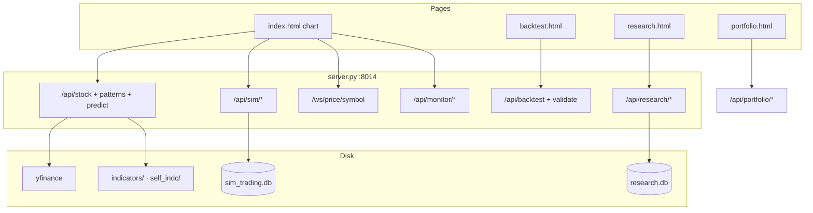

| Flow | Connection |
|------|------------|
| Chart load | `loadStock` → `/api/stock` → indicators → canvas |
| Paper fill | Human trade form → `/api/sim/.../trade` → SQLite |
| Backtest | Separate path; does **not** write sim positions unless new glue is designed |
| Research jobs | `/api/research/*` discovery; not the same as sim fills |
| Trade Vision | **Not auto-wired** to Stock App sim; optional human copy of idea |

### 6.9 What stays only in root STOCK_APP_ARCHITECTURE.md (intentionally not copied)

```text
- Full INDICATORS frontend registry table + canvas z-index stack
- Per-indicator detector deep dives (harmonics, curves, trendlines, HSR, Elliott)
- Viewport subscription JS snippets, y-label collision, ATR pd.NA patterns
- Interval ↔ yfinance mapping tables, replay-mode chart details
- Adding-a-new-indicator 13-step checklist
- Historical single-file test TC tables / old git commit lists
```

Use root `STOCK_APP_ARCHITECTURE.md` when implementing chart SPA or a new canvas indicator. Use **this file** for monorepo authority, TV brain, and paper-guidance spine.

---

## 7. Maintenance rule

After any version that changes routes, panels, safety, or external integrations:

1. Update `docs/IMPLEMENTATION_STATUS.md` (refresh **Latest completed tip** + append version section)
2. Update `docs/NEXT_BUILD_TARGET.md`, `docs/context.md`
3. Refresh `docs/graph/project_graph.json` + `docs/graph.md`
4. Add/adjust ADR row if authority/topology changed
5. Run focused tests named before implementation; full regression when labeling/history changes

---

## Version architecture log (historical detail)

Sections below are **version-scoped design notes** retained for implementers. Prefer §1–7 + `docs/context.md` for current global contracts. Latest additive section: **v1.94**.

---

## v0.72 Real MTF Pullback Architecture

```text
Point-in-time 1m OHLCV snapshot
  -> timeframe_feature_builder source row loader
  -> closed aggregate builder
  -> multi_timeframe_conflict trend reader
  -> pullback/conflict classifier
  -> existing MultiTimeframeConflictReport envelope
```

## Components

### `timeframe_feature_builder.py`

Responsibility:
- Provide deterministic 1m source rows.
- Prefer latest point-in-time snapshots for the requested symbol.
- Fall back to deterministic generated rows only when no source snapshot is available.
- Build closed aggregate bars by timeframe.

Safety:
- No developing aggregate is marked as closed.
- Source rows preserve timestamp and close-time ordering.
- Output remains brokerless and research-only.

### `multi_timeframe_conflict.py`

Responsibility:
- Read aggregate bars from the timeframe builder.
- Compute direction, strength, and compression from aggregate OHLCV.
- Detect lower-timeframe pullback inside higher trend.
- Detect true higher-timeframe conflict.

Decision Authority:
- MTF can reduce confidence to `WAIT` or `NO_TRADE`.
- MTF cannot allow live trading, paper routing, broker execution, or narrative override.

## Data Flow

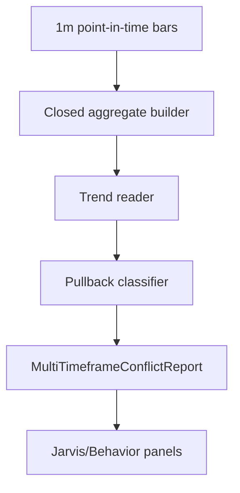

## Failure Behavior

- Missing data: mark timeframe unavailable.
- Incomplete aggregate: visible but not decision-safe.
- Flat/low-variance slope: direction becomes `range`.
- Higher-timeframe conflict: confidence blocked.
- Lower-timeframe pullback inside intact higher trend: `WAIT`, not forced block.

## v0.73 Volatility-OOD Architecture

```text
Closed 9C current descriptor
  -> current ATR
Historical closed 9C windows
  -> historical ATR distribution
  -> ATR p75/p90
  -> volatility bucket and volatility-OOD gate
  -> path analog report and hybrid decision gates
```

### Design Rules

- Volatility-OOD thresholds are data-derived.
- Shape analog search remains useful for explanation, but volatility-OOD can block confidence promotion first.
- Extreme volatility snapshots can still be displayed for research, but they cannot seed probability, paper-candidate promotion, or order routing.

## v0.74 Reasoning Arbiter Architecture

```text
9C analog report
  + path/OOD report
  + model calibration shell
  + subsystem votes
  -> reasoning arbiter
  -> drift monitor
  -> deterministic decision audit
  -> hybrid safety gates 9C-G018 and 9C-G019
  -> WAIT/WATCH only while routing remains blocked
```

### Components

### `nine_candle_reasoning_arbiter.py`

Responsibility:
- Convert dangerous flags and subsystem votes into deterministic safety actions.
- Force `WAIT` for manipulated-looking, fakeout, shape-OOD, volatility-OOD, or hard disagreement.
- Produce a deterministic audit hash for the final decision evidence.
- Produce a calibration drift report that can demote the calibrator to rule-only mode.

Safety:
- The arbiter can only reduce confidence.
- The arbiter cannot allow paper/live execution.
- The audit record is deterministic and contains no credentials or broker state.

### `nine_candle_hybrid.py`

Responsibility:
- Invoke the arbiter and drift monitor during hybrid decision construction.
- Add gates `9C-G018` and `9C-G019`.
- Treat those gates as critical blockers.

Decision Authority:
- `9C-G018=wait` blocks confidence promotion.
- `9C-G019=wait` blocks confidence promotion.
- Live routing remains blocked by `9C-G011` regardless of all other gates.

## v0.75B Indicator Cache Integrity Architecture

```text
Save request
  -> cache context identity
  -> anomaly/quarantine guard
  -> exact identity lookup
  -> artifact SHA validation
  -> stale/version filter
  -> reuse or recompute
  -> reference-only artifact row
```

### Design Rules

- Cache is never authority; it is only an efficiency and audit artifact.
- Hash mismatch, version mismatch, missing artifact, or anomalous snapshot degrades to miss/fail/quarantine.
- Cache rows are reusable only under exact identity match.
- Artifact payload safety is duplicated in both SQLite row and JSON artifact.
- A failed cache read must never crash the user journey; it triggers recompute or safe miss.

### Failure Behavior

- SHA mismatch: report failed integrity and do not reuse.
- Feature manifest mismatch: report stale version and do not reuse.
- Volatility bucket mismatch: report stale volatility context and do not reuse.
- Anomalous snapshot: save no rows and return `anomalous_snapshot_quarantined`.
- Disk failure: return failed row telemetry with trading disabled.

## TV-PROD-RED-001 Red-Team Gate Architecture

```text
Synthetic manipulated-wick fixture
  -> strict volatility-OOD proof
  -> reasoning arbiter proof
  -> cache quarantine proof
  -> WAIT/WATCH decision proof
  -> release-blocking assertion matrix
  -> API envelope
  -> Jarvis red-team safety panel
```

### Design Rules

- The red-team gate is deterministic and does not depend on live market feeds.
- The fixture intentionally models an abnormal `2.4x ATR` shock.
- The proof uses strict volatility bucketing, not relaxed analog fallback.
- Every assertion must pass before this gate can be considered green.
- The report is display/audit only and cannot create orders.
- The frontend does not recompute red-team logic; it renders the backend proof so release evidence stays single-source and deterministic.
- The Jarvis panel is a visual safety proof beside 9C evidence, not an additional decision engine.
- Missing or loading red-team data is represented as a blocked/pending display state. The frontend never infers live-trading readiness from absent data.

## Jarvis Evidence Loader Concurrency

```text
Jarvis/App refresh
  -> refresh in-flight guard
  -> critical safety evidence fetch
  -> ordered bulk API task list
  -> bounded concurrency executor
  -> ordered result array plus per-task errors
  -> AppData mapping
  -> fail-closed panels with partial-evidence warning
```

### Design Rules

- The frontend creates API call functions first, not eager fetch promises.
- A refresh in-flight guard prevents timer-triggered overlapping request waves.
- Critical safety evidence such as TV-PROD-RED-001 is fetched and rendered before lower-priority bulk evidence.
- The bounded executor preserves result ordering.
- The concurrency cap protects the browser/dev-server from resource exhaustion while keeping the current single refresh cycle.
- Individual request failures return `undefined` for that slot, allowing other panels to hydrate.
- Failed slots remain visibly pending/blocked and a partial-evidence banner is shown.
- Endpoint schemas and backend contracts remain unchanged.

## SQLite State Reliability Guard

```text
API storage call
  -> storage.connect()
  -> configured DB path resolution
  -> sqlite connection with bounded timeout
  -> PRAGMA busy_timeout
  -> PRAGMA foreign_keys=ON
  -> schema/read/write operation
```

### Design Rules

- `TRADEVISION_STATE_DB` remains the only runtime DB path override.
- File-backed and shared in-memory connections both apply the same busy-timeout policy.
- Lock contention is handled by bounded waiting, not unbounded blocking.
- If storage still fails after the timeout, the request fails visibly; the app must not silently drop audit or replay writes.
- No storage reliability change can enable trading. Trading authority remains controlled by existing mode, kill-switch, paper/replay, risk, and OpenAlgo gates.

## Indicator Cache Test Continuity Guard

The indicator result cache is a speed and audit layer. It is intentionally separated from decision authority.

```text
indicator cache request
  -> build source identity
  -> exact cache_id derivation
  -> artifact JSON write or verified artifact read
  -> cache row status
  -> frontend display only
  -> no probability authority
  -> no order routing
```

The executable contract is `ICACHE-001` through `ICACHE-020`. Numeric gaps are treated as architecture gaps because a missing test range can hide unsafe assumptions about cache identity, stale artifacts, or force-recompute behavior.

### Design Rules

- Cache identity is derived from symbol, timeframe, source snapshot hash, indicator id, registry version, feature manifest version, and promoted-indicator hash.
- Artifact JSON is verified by SHA-256 before use.
- Force recompute may refresh artifacts but must not create duplicate trading authority.
- Missing, stale, corrupted, or mismatched artifacts degrade to failed, stale, or recompute paths.
- Cache records are always `reference_only`; they cannot seed 9C probability, paper-candidate promotion, live routing, or broker execution.

## Transport Trace Integrity Window Guard

Transport trace verification validates both per-event trace hashes and delivery-chain continuity. Global posture checks are bounded for performance, so the returned rows may contain the tail of a chain without the chain root.

```text
verify_trace_integrity(limit=N)
  -> load bounded trace window
  -> group by delivery_id
  -> sort each delivery by event_time, trace_id
  -> for first returned trace:
       if previous_trace_hash is null -> chain root in window
       else fetch predecessor outside window and compare hash
  -> for later returned traces:
       compare previous_trace_hash to prior returned trace_hash
  -> verify every returned trace_hash against canonical event JSON
```

This prevents false release-readiness failures when old traces exist in the local operator DB, while preserving tamper detection:

- a returned trace with modified canonical fields still fails hash verification.
- a broken in-window previous hash still fails.
- a first returned trace with no matching predecessor still fails.
- no trace result can enable trading; release/readiness checks remain brokerless and live-blocked.

## Pytest Cache Hygiene Guard

The local pytest cache is generated runtime state. It is not part of Trade Vision source, release artifacts, market data, or audit state.

```text
test run
  -> pytest reads trade-vision-app/pytest.ini
  -> cacheprovider writes trade-vision-app/.pytest_cache
  -> source/tests/app state unchanged
```

If `.pytest_cache` becomes malformed or inaccessible, it may create noisy false warnings in every regression run. The safe repair is:

1. remove only the exact generated cache path if the filesystem permits it; otherwise
2. point pytest at `.test_cache/pytest`, a separate project-local generated cache directory.

Safety boundaries:

- Do not delete `data/`, `docs/`, `apps/`, databases, logs, or indicator artifacts.
- Do not change test discovery paths to hide warnings.
- Do not disable pytest cache globally unless the cache cannot be recreated.
- Prefer an explicit writable `cache_dir` over changing tests or suppressing warnings.
- This hygiene action has no trading authority and cannot affect broker/order routing.

## Research Stack Local Verification Tool

The local verifier is an operator smoke tool for the existing brokerless research stack. It does not start services, mutate state, enqueue intents, or call any order-like endpoint.

```text
operator
  -> scripts/verify_research_stack.py
  -> GET API /health
  -> signed GET adapter /health
  -> GET API /api/v1/openalgo/security/posture
  -> GET API /api/v1/deployment/readiness
  -> GET API /api/v1/release/final-audit
  -> aggregate JSON report
  -> exit 0 only if all checks pass and all safety flags remain brokerless/live-blocked
```

Signing model:

- Adapter health uses the same HMAC envelope as transport requests.
- Secret source is `TRADEVISION_ADAPTER_SHARED_SECRET` only.
- The verifier never asks for broker credentials and never accepts broker credentials as service identity.

Safety boundaries:

- Any response that reports broker credentials, broker order creation, order routing, or unblocked live trading fails the verifier.
- Endpoint/network failures produce `passed=false`, not retries that hide the failure.
- The tool is intentionally read-only except for remote service logs that may naturally record health probes.

## One-Command Local Research Stack Verification Wrapper

The PowerShell wrapper composes existing scripts rather than creating a parallel stack manager.

```text
operator
  -> scripts/verify-local-research-stack.ps1
  -> validate service identity secret exists
  -> start-research-stack.ps1
  -> retry verify_research_stack.py until pass or timeout
  -> finally stop-research-stack.ps1 when wrapper started the stack
  -> return verifier exit code
```

Design rules:

- The wrapper must not know any broker credential names or values.
- The wrapper must not call intent export, transport enqueue, adapter review, or any order-like endpoint.
- Verification retries are for startup timing only; failed safety checks remain failed.
- Cleanup is scoped to the PID file written by the existing stack starter.
- A failed startup or failed verification must not be converted to success.

## Idempotent Storage Initialization Runtime Guard

Storage helpers may call `storage.init_db()` before reads or writes so a fresh configured database can recover automatically. The expensive schema/migration/backfill path is guarded by an in-process initialized-target registry.

```text
storage helper
  -> storage.init_db()
  -> derive active target key from DB_PATH
  -> if target initialized and still valid: return immediately
  -> otherwise run DDL, migration guards, audit backfill
  -> mark target initialized
  -> proceed with read/write helper
```

Validity rules:

- A file-backed target is valid only while the database file still exists.
- A changed `DB_PATH` creates a different target key and receives independent initialization.
- `:memory:` remains keyed separately and uses the existing shared-memory connection.
- Explicit audit integrity verification still calls `_backfill_audit_hashes()` because integrity checks must self-heal older rows before verification.

Safety boundaries:

- The guard only skips repeated DDL/backfill in the same process after a successful initialization.
- It does not skip migrations for a fresh DB path.
- It does not change any broker, OpenAlgo, order, kill-switch, mode, or trading authority state.
- It reduces repeated external-AI/Jarvis test and runtime overhead without changing report semantics.

## Bounded Deployment Database Integrity Cache

Deployment readiness uses SQLite `PRAGMA integrity_check`. That is correct but expensive on the growing local operator DB, especially when final-audit paths call deployment readiness and smoke checks in the same request.

```text
deployment_readiness()
  -> _database_integrity(DB_PATH)
  -> build fingerprint:
       DB resolved path + size + mtime
       DB-wal size + mtime when present
       DB-shm size + mtime when present
  -> if fingerprint cache hit: reuse integrity/table_count
  -> otherwise run PRAGMA integrity_check and table count query
  -> cache result in process memory only
```

Invalidation rules:

- Any database file size or modification-time change invalidates the cached integrity result.
- Any WAL/SHM sidecar size or modification-time change invalidates the cached integrity result.
- Cache misses and SQLite errors still fail closed.
- The cache is a speed optimization only; it has no authority over trading, OpenAlgo export, or broker state.

## Review-Only Preflight Fast Path For Correction Packets

Correction-review packets are not deployment-readiness decisions. They exist to send verified evidence to an external reviewer for correction, with no decision authority and no order route. They therefore use a lightweight preflight object instead of invoking final release audit and deployment smoke checks.

```text
correction-review-packet
  -> build Jarvis room
  -> build external AI reliability
  -> build verified evidence certificate
  -> build review-only preflight evidence:
       preflight_version = jarvis-preflight-evidence.v1.01
       paper_review_allowed = false
       openalgo_dry_run_allowed = false
       live_trading_allowed = false
  -> build review preflight verdict
  -> build correction packet
```

Safety boundaries:

- The fast path can allow `gemini_correction_review` only because correction review is display-only.
- It cannot allow `external_ai_decision_display`, OpenAlgo review, paper export, or live trading.
- Full final-release audit remains available through final-audit/readiness endpoints and is not removed.

## Timezone-Safe VWAP Band Grouping

The vendor stock-app indicator bridge treats timezone-aware intraday candle indexes as exchange-clock evidence. VWAP grouping must therefore use timezone-preserving keys.

```text
_vwap_bands(work, freq)
  -> if index is DatetimeIndex and freq == "D":
       group by index.normalize()
  -> if index is DatetimeIndex and freq == "W":
       group by index.normalize() - weekday offset
  -> otherwise:
       use deterministic non-Datetime fallback keys
  -> compute cumulative TPV, volume, variance by group
  -> return frame indexed exactly like input
```

Design rules:

- Do not use `DatetimeIndex.to_period()` for timezone-aware indexes.
- Do not convert candle timestamps to UTC or naive timestamps inside this indicator helper.
- Preserve row-level alignment so chart overlays and indicator-cache artifacts still map to the original candles.
- This indicator output remains subject to existing explanation-only/probability gates.

## Frontend Production Bundle Split

The web app is intentionally panel-heavy. Production builds must keep stable framework dependencies in separate vendor chunks so browser caching and parse work do not depend on every application-code change.

```text
Vite build
  -> main application chunk:
       Trade Vision workspace, Jarvis panels, chart UI, API client calls
  -> react-vendor chunk:
       react, react-dom
  -> validation-vendor chunk:
       zod response validation
```

Design rules:

- Chunk splitting is configured in Vite `manualChunks`.
- Chunk splitting must not alter runtime routing, API paths, workspace state, or safety gate rendering.
- Do not solve large bundles by merely raising the warning limit.
- Further component-level lazy loading is reserved for a later milestone if the application chunk itself grows beyond the warning limit again.

## Shared Frontend UI Primitive Module

The web app keeps complex workspace behavior in `App.tsx`, but common primitive rendering lives in a dedicated module.

```text
src/components/primitives.tsx
  -> Panel
  -> Card
  -> Metric
  -> Status
  -> pct
  -> money

src/App.tsx
  -> imports primitives
  -> owns application state, workspace routing, data loading, Jarvis/chart panels
```

Design rules:

- The primitive module contains no API calls and no application state.
- Primitives preserve existing CSS class names so styling and screenshots stay stable.
- Formatters preserve existing fallback behavior for missing values.
- This is a modularity refactor only; it must not change trading safety, evidence construction, external-AI behavior, or chart calculations.

## Reference Workspace Components

Reference workspaces are display-only panels that render already-loaded app data. They live outside `App.tsx` to reduce workspace coupling without changing data ownership.

```text
src/App.tsx
  -> owns data loading, active workspace routing, refresh behavior
  -> passes AppData-shaped object to reference workspace components

src/components/workspaces/referenceWorkspaces.tsx
  -> Knowledge(data)
       renders documentation graph summary and source metadata
  -> Implementation(data)
       renders capability manifest status counts and rows
```

Design rules:

- Reference workspace components must not call the API client directly.
- Reference workspace components must not mutate global state or safety state.
- Reference workspace components may use local memoization for derived display counts only.
- Trading, Jarvis, chart, credential, and external-AI workspaces remain in `App.tsx` until they receive dedicated risk-reviewed extractions.

## Safety Display Panels

Safety display panels render already-loaded safety and integrity evidence. They do not own any safety action, order action, API call, credential operation, or state transition.

```text
src/App.tsx
  -> owns API loading and passes risk/order/integrity data to display panels

src/components/safetyPanels.tsx
  -> RiskPanel(risk)
       renders mock risk metrics and disclaimer
  -> OrderPathPanel(orderPath)
       renders live-routing, broker-credential, kill-switch, and simulated-order status
  -> IntegrityPanel(data)
       renders simulation-integrity source and assumptions
```

Design rules:

- The module must not import the API client.
- The module must not contain direct `fetch`, broker, OpenAlgo, Gemini, Grok, credential, or kill-switch control calls.
- The module can display `kill_switch_state` text from loaded data but cannot trigger or reset the kill switch.
- Existing labels such as `no real money`, `simulation only`, `blocked`, `disabled`, `absent`, and `mock` are part of the safety UX and must remain stable.

## AI Credential Vault Panel

The AI credential panel is isolated from `App.tsx` but remains a narrow credential-vault control surface. It can call only backend credential-vault methods through the typed API client.

```text
src/App.tsx
  -> loads masked credential status from /api/v1/ai/credentials/status
  -> passes masked status into AiCredentialsPanel

src/components/aiCredentialsPanel.tsx
  -> local secret input state
  -> save/test/clear Gemini API key slots
  -> save/test/clear Grok/xAI API key
  -> clears local secret inputs after successful actions
```

Allowed API calls:

- `api.saveGeminiCredential`
- `api.testGeminiCredential`
- `api.clearGeminiCredential`
- `api.saveGrokCredential`
- `api.testGrokCredential`
- `api.clearGrokCredential`

Forbidden in this module:

- Browser username/password login.
- Cookie/session/token capture.
- Raw `fetch`.
- External-AI live review execution.
- OpenAlgo, broker, order-routing, live-trading, or kill-switch action calls.

Security rules:

- Secret fields remain `type="password"` and `autoComplete="off"`.
- Plain secrets are never rendered from backend status.
- The panel may display backend-reported masked/fingerprint values only.
- The panel may display backend-reported `browser_password_login_supported` as read-only status, but it must not implement browser login or session capture.

## System Workspace Component

The System workspace is an operational evidence surface. It renders data already loaded by `App.tsx`; it does not own data fetching or routing.

```text
src/App.tsx
  -> owns active workspace routing
  -> loads system, storage, observability, layout, audit, and credential status data
  -> passes data and current mode into System

src/components/workspaces/systemWorkspace.tsx
  -> renders AiCredentialsPanel
  -> renders System Pipeline
  -> renders Persistent Storage
  -> renders Operational Observability
  -> renders Workspace Layout
  -> renders Audit Integrity
  -> renders Audit Events
```

Design rules:

- The workspace module must not import the API client.
- The workspace module must not call `fetch`.
- The workspace module may include `AiCredentialsPanel`, but credential API authority remains isolated inside `AiCredentialsPanel`.
- The workspace module must not call external-AI review, OpenAlgo, broker/order, live-trading, or kill-switch action paths.
- `App.tsx` remains the single owner of workspace routing and bulk data loading.

## Replay Evidence Panels

The Replay workspace keeps replay-control state and actions in `App.tsx`. Display-only replay evidence panels are isolated into a dedicated component.

```text
src/App.tsx
  -> owns replay seed state
  -> owns session override state
  -> owns start/play/pause/step/seek handlers
  -> renders Deterministic Replay control panel
  -> passes loaded AppData into ReplayEvidencePanels

src/components/workspaces/replayEvidencePanels.tsx
  -> renders Execution Simulation
  -> renders Replay Archive
  -> renders Point-in-Time Snapshots
  -> renders Feature Version Registry
  -> renders Simulation Integrity
```

Design rules:

- Replay control actions must remain outside the evidence-panel module.
- The evidence-panel module must not import the API client.
- The evidence-panel module must not call `fetch`.
- The evidence-panel module must not call replay control, OpenAlgo, broker/order, live-trading, external-AI review, or kill-switch action paths.
- The evidence-panel module may render already-loaded integrity data through `IntegrityPanel`.

## Replay Evidence Plain-English Layer

The Replay tab is split into control and explanation:

```text
Deterministic Replay panel
  -> user controls seeded replay playback
  -> start/play/pause/step/seek stay in App.tsx

ReplayEvidencePanels
  -> explains what the replay evidence means
  -> execution simulation = simulated fill/risk evidence only
  -> replay archive = repeatable test sessions only
  -> point-in-time snapshots = exact data packets used for audit/replay
  -> feature versions = feature definitions used for that replay context
```

The chart-style candle replay workbench remains in the Research workspace. Replay evidence panels may point users to that distinction in text, but they must not import chart controls or replay APIs.

## v1.62 Context Maintenance, Graph Refresh, And Handoff Compression

Trade Vision now includes a compact context layer so future AI/chat sessions can resume work without loading the whole repository.

```text
TRADE_VISION_README.md § AI / New-Chat Handoff
  -> first file for new AI/chat handoff
  -> summarizes current version, safety state, next target, and latest user requirements

docs/FILE_DOCUMENT_INDEX.md §0.6
  -> token-saving routing table
  -> tells future agents which file to read for each question

docs/IMPLEMENTATION_STATUS.md
  -> compact latest-version pointer

docs/NEXT_BUILD_TARGET.md
  -> immediate next build target and future roadmap pointer

docs/SAFETY_INVARIANTS.md
  -> non-negotiable trading safety boundaries

docs/FILE_DOCUMENT_INDEX.md §7.4
  -> source/doc ownership map

docs/FRONTEND_PANEL_MAP.md
  -> UI panel/workspace ownership map

docs/API_ENDPOINT_INDEX.md
  -> route-family index before opening main.py

docs/TEST_ID_INDEX.md
  -> test-range index before opening test_api.py

TRADE_VISION_README.md § AI Handoff → Fast continuation + context maintenance
  -> update procedure for context files

docs/graph/project_graph.json
  -> machine-readable project graph used by /api/knowledge/graph
```

Design rules:

- Context files are documentation and governance artifacts; they must not change runtime behavior.
- The graph is an orientation map, not an implementation source of truth.
- `IMPLEMENTATION_STATUS.md` remains the source of truth for completed versions.
- `TRADE_VISION_FULL_INDICATOR_MEMORY_PLAN.md` and `TRADE_VISION_MAX_CHART_REASONING_V1_70_TO_V1_79_PLAN.md` remain the source of truth for future indicator/9C reasoning plans.
- Context files must be updated after major version, route, panel, safety, or roadmap changes.
- No existing plan or status content should be deleted during context maintenance; merge or append aligned information.

## v1.75 Final Confluence Conflict Arbiter Architecture

```text
v1.70 chart/volatility context
  + v1.71 market regime / breadth / relative strength feedback
  + v1.72 market structure / liquidity / trap context
  + v1.73 execution / event / OI risk guard
  + v1.74 post-entry lifecycle state
  + indicator and external-AI advisory scores
  -> final_confluence_arbiter.py
  -> FinalConfluenceArbiterReport
```

### Design Rules

- The arbiter is a resolver, not a signal generator.
- Evidence is ranked by safety-first hierarchy.
- Lower-priority indicator or external-AI evidence cannot override higher-priority safety, data-quality, liquidity, trap, event, or thesis-break evidence.
- `/analyze` accepts an explicit compact evidence request.
- `/current` builds a conservative evidence request from existing reports.
- The output is display/research-only and cannot route broker, paper, or OpenAlgo orders.

### Failure Behavior

- Data quality or no-future-leakage failure returns `AVOID`.
- Liquidity grade C blocks `PAPER-CANDIDATE`.
- Event risk caps otherwise strong evidence to `WATCH`.
- Trap score can force `AVOID`.
- Post-entry thesis invalidation overrides the original plan.

## v1.80 Indicator Intelligence Architecture

```text
locked 94-indicator registry
  -> ontology metadata on each BehaviorIndicatorRegistryEntry
  -> indicator_lag_voting.py
  -> lag_weight = 1 / (1 + confirmation_delay_bars)
  -> explanation-only delay-adjusted vote report

ontology metadata
  -> feature_redundancy.py category-aware clustering
  -> false_agreement_confluence.py contract-defined false-agreement rules
```

### Design Rules

- Indicator intelligence explains indicator meaning; it does not create a trading route.
- `confirmation_delay_bars` is a voting penalty, not a cosmetic field.
- Lagging confirmation can support explanation and post-entry management, but cannot promote `WATCH` to `PAPER-CANDIDATE` by itself.
- Structural/level/trap evidence can outrank slow momentum confirmation when conflict exists.
- Unknown indicators remain explanation-only until curated.
- v1.80 does not learn reliability from outcomes; that is reserved for v1.81.

### Failure Behavior

- Unknown indicator IDs return `404`.
- Stale confirmation sets `stale_confirmation_warning=true`.
- Unclassified indicators set `used_for_probability=false` and remain explanation-only.
- Registry count drift still fails the v0.60 lock gate.

## v1.81 Indicator Reliability Memory Architecture

```text
indicator signal event
  -> indicator_reliability_memory.py label bridge
  -> completed 3/5/9/12/20-candle outcome label
  -> per-stock / per-regime / per-session reliability buckets
  -> Bayesian shrinkage and reciprocal-warning checks
  -> v1.80 lag-vote preview with reliability multiplier
```

### Design Rules

- Reliability is learned from completed labels, not from live guesses.
- Pending/unresolved horizons are excluded from win counts.
- Same-bar target/stop ambiguity is conservative stop-first unless lower-timeframe sequencing proves otherwise.
- Reliability can reduce confidence; it cannot bypass no-trade, risk, or routing gates.
- OOD or regime-shift conditions quarantine reliability.
- The initial implementation uses deterministic fixture labels until persisted indicator-signal history is connected.

### Failure Behavior

- Unknown indicator IDs return `404`.
- Low sample count returns `reliability_state=low_evidence`.
- Quarantine returns `reliability_state=quarantined`.
- Reciprocal signal ratio above threshold creates a warning and failed reliability gate.

## v1.82 Full Timeframe Contract + Reliability Drilldown Architecture

```text
TimeframeValue
  -> indicator_registry.ALL_TIMEFRAMES
  -> timeframe_feature_builder closed-bar runtime
  -> multi_timeframe_conflict matrix
  -> pattern_by_timeframe memory
  -> feature_store partition writes
  -> indicator_reliability_memory drilldown
  -> frontend_panels panel map
```

### Design Rules

- `30m` and `4H` are canonical backend timeframe values.
- Runtime aggregation is still sourced from immutable `1m` bars and only emits closed aggregate bars.
- The old `/api/v1/behavior/features/seven-timeframe/current` route remains for compatibility, but its payload now contains nine required timeframes.
- `4H`, `daily`, and `weekly` are higher-timeframe context; they are never decision-safe until fully closed.
- Indicator reliability reports include UI-ready purpose/category/lag fields, but remain research-only.

### Failure Behavior

- Missing or incomplete aggregate bars appear as unavailable/developing context and cannot enter decision-safe evidence.
- `30m` or `4H` point-in-time violations fail through the same guard path as older timeframes.
- Panel-map drilldown absence is caught by `test_v182_frontend_panel_map_exposes_indicator_reliability_drilldown`.

## v1.83 Persistent Indicator Signal History Architecture

```text
indicator signal event
  -> IndicatorSignalHistorySaveRequest
  -> label_indicator_signal_outcome
  -> indicator_signal_history SQLite table
  -> build_indicator_reliability_report
  -> persisted labels first, fixture fallback second
  -> React Indicator Reliability Drilldown v1.83 card
```

### Data Model

`indicator_signal_history` stores:

- `history_id`
- `symbol`
- `indicator_id`
- `timeframe`
- `signal_direction`
- `signal_time_ns`
- `decision_time_ns`
- `session_phase`
- `regime_id`
- `source_snapshot_id`
- `source_snapshot_hash`
- `feature_manifest_version`
- `indicator_registry_version`
- `label_status`
- `outcome_label`
- `counted_in_reliability`
- `history_json`

### Design Rules

- Completed labels count only when `counted_in_reliability=true`.
- Pending labels are retained for audit but excluded from reliability.
- Reliability uses persisted rows when present and fixture rows only when no persisted counted rows exist.
- The frontend shows history source, persisted row count, sample count, lag penalty, and recent labels.
- v1.83 remains research-only and cannot approve trades.

### Failure Behavior

- Unknown indicator IDs return `404`.
- Missing history falls back to deterministic fixture labels with `fixture_fallback_used=true`.
- Low persisted sample count remains `low_evidence`.
- Order routing and live trading stay blocked regardless of stored history.

## v1.84 Current Indicator Signal History Ingestion Architecture

```text
Jarvis Ingest Current Signals action
  -> POST /api/v1/behavior/indicators/reliability/ingest-current
  -> build_evidence_packet(symbol, timeframe)
  -> read current last-9 indicator sequences
  -> skip missing and default-neutral rows
  -> save pending IndicatorSignalHistoryRecord rows
  -> refresh reliability drilldown
```

### Design Rules

- The frontend does not write history on page load. Ingestion requires an explicit button action.
- The endpoint consumes closed-candle 9C evidence only.
- The endpoint does not request, infer, or fabricate future candles.
- Current ingested rows have `label_status=pending` and `counted_in_reliability=false`.
- The same symbol/timeframe/indicator/signal_time/horizon maps to the same `history_id`, making repeated ingestion idempotent.

### Failure Behavior

- Missing indicator values are skipped instead of stored as zero-like signals.
- Neutral rows are skipped by default.
- If only pending rows exist, reliability keeps fixture fallback and does not count pending rows.
- The route cannot set probability authority, paper execution permission, broker routing, or live trading.

## v1.85 Pending Indicator Outcome Completion Architecture

```text
pending indicator_signal_history rows
  -> POST /api/v1/behavior/indicators/reliability/complete-pending
  -> caller-supplied future bars only
  -> existing label_indicator_signal_outcome conservative labeler
  -> same history_id upsert
  -> reliability can read completed rows as research evidence
```

### Design Rules

- v1.85 reuses the existing indicator outcome labeler instead of creating a parallel labeling path.
- Future bars must be supplied in the request. The route does not fetch, infer, or fabricate future bars.
- Rows remain pending when the supplied future bars are insufficient for the stored horizon.
- The same history id is preserved through completion.
- Same-bar target/stop ambiguity uses the existing conservative stop-first rule unless lower-timeframe proof is supplied.

### Failure Behavior

- Missing future bars keep rows pending.
- Unknown indicator ids are rejected at the API layer.
- Completed rows become reliability-countable, but reliability remains low-evidence until sample gates pass.
- Completion cannot enable paper execution, broker routing, OpenAlgo export, or live trading.

## v1.86 Signed TrendForge Research Intake Architecture

```text
TrendForge export (signed packet)
  -> loopback-only HTTP pull (default)
  -> HMAC-SHA256 verify (secret ≠ OpenAlgo secret)
  -> safety envelope gate (researchOnly, tradeAllowed=false,
     orderRoutingEnabled=false, brokerOrderCreated=false,
     liveTradingBlocked=true)
  -> packet/content/payload hashes
  -> SQLite trendforge_intakes (idempotent)
  -> GET intakes for audit / research consumers
  -> cannot reach live broker or force OpenAlgo handoff true
```

### Components

#### `behavior/trendforge_bridge.py`

Responsibility:
- Validate schema `trendforge-tradevision-evidence.v1` and signature version `trendforge-tradevision-hmac-sha256.v1`.
- Enforce loopback hosts `{127.0.0.1, localhost, ::1}` by default.
- Reject packets that attempt to cross the no-execution boundary.
- Produce immutable intake records with hashes for audit learning (confirmed, WAIT, rejected).

#### Routes

```text
POST /api/v1/integrations/trendforge/pull-latest
GET  /api/v1/integrations/trendforge/intakes
```

### Design Rules

- ADR-TV-011: intake is research evidence only.
- Stale evidence is stored as WAIT, not promoted.
- Remote TrendForge URL is blocked unless a future host-policy ADR explicitly allows it.
- No TrendForge candidate may set `broker_order_created` or enable live routing inside Trade Vision.

### Failure Behavior

- Invalid signature, missing safety envelope, bad symbol, or remote URL → reject (HTTP 422 path).
- Adapter/OpenAlgo focused tests remain independent; handoff allowed stays false on intake alone.
- Indicator reliability may still fall back to fixture labels when real history is empty (known limitation; see `docs/context.md` KU-6).

### Verification (focused)

```text
TrendForge intake tests: 6 passed
OpenAlgo adapter tests:  6 passed
Status entry date:       2026-07-12
```
 

---

---

# MASTER GUIDE — full reference (read order · purpose · features · signals · build · plans · quality)

> **Last expanded:** 2026-07-24 · **Product tip:** Trade Vision **v1.94** · Stock App port **:8014**  
> **Role:** Single in-file entry map so future humans/AI do **not** need a separate master-guide file.  
> **Rule:** Prefer updating **this section** (+ `IMPLEMENTATION_STATUS` / version pointers) over creating new top-level docs.  
> **Mirror:** Compact twin in `TRADE_VISION_README.md` § MASTER GUIDE; root monorepo copies in repo root `STOCK_APP_ARCHITECTURE.md` / `TRADE_VISION_README.md`.  
> **Required product spine (requirement):** `docs/plans/FINAL_REQUIRED_FLOW.md` — present vs final vs gaps vs how to achieve one paper-guidance flow.  
> **Full doc/folder index:** `docs/FILE_DOCUMENT_INDEX.md` — read order, purpose/function/action/use of each doc, missed details.  
> **See also — Flow map pack:** `docs/FILE_DOCUMENT_INDEX.md` § Flow map pack · **all-in-one** `docs/TV_COMPLETE_FLOW_MAP.html` (Tabs 1–5: process, network, blocks, fit, code-truth/audit/work-log) · plain cards `docs/PROJECT_BRAIN.html`. Flow-map MDs were merged into that HTML and removed.

---

## A. Two products in one monorepo (never mix authority)

| Product | Path | Start | Purpose | Live broker orders |
|---------|------|-------|---------|-------------------|
| **Stock App** | repo root | `python server.py 8014` → `http://localhost:8014/` | Charts, indicators, ML BUY/SELL/HOLD, HMM, backtest, CPCV/WF, research jobs, **manual** paper sim | **No** (SQLite sim only) |
| **Trade Vision** | `trade-vision-app/` | web + API apps | Research cockpit: WAIT / WATCH / PAPER-CANDIDATE / NO TRADE | **Blocked by design** |

```text
Stock App  = analyze + optional human-clicked paper fills → sim_trading.db
Trade Vision = decision intelligence + safety gates; OpenAlgo = external paper-review boundary (adapter is simulator)
Neither product is a live autonomous trading bot.
```

**Authority boundary:** TV safety invariants do **not** auto-govern every root `server.py` route. Root sim may book paper fills; TV must not place live broker orders.

---

## B. Read order (what sequence to open files)

### B1. Short path (minimum tokens)

```text
1. This MASTER GUIDE section
2. docs/IMPLEMENTATION_STATUS.md
3. docs/NEXT_BUILD_TARGET.md
4. docs/SAFETY_INVARIANTS.md
5. Only the exact source file needed for the change
```

### B2. Full path (domain + flow + implement)

```text
1. This MASTER GUIDE section
2. docs/context.md
3. docs/IMPLEMENTATION_STATUS.md  ← tip at top; one version section if needed
4. docs/graph.md
5. ARCHITECTURE.md  (§ OPERATOR MAP + PAPER TRADE FULL FLOW above)
6. docs/SAFETY_INVARIANTS.md
7. docs/NEXT_BUILD_TARGET.md
8. docs/FILE_DOCUMENT_INDEX.md §7.4
9. docs/API_ENDPOINT_INDEX.md  and/or docs/FRONTEND_PANEL_MAP.md
10. docs/plans/...  only if coding that roadmap slice
```

### B3. Stock App–only path

```text
this file § A-SA + § G-SA + §6  (monorepo + sim + root surface)
  → root STOCK_APP_ARCHITECTURE.md §5–8 only if chart canvas/detector deep work
  → root API.md + :8014/docs → server.py / static/* / backtest|research|validation
```

### B4. Avoid opening first (too large / noisy)

```text
apps/api/app/main.py
apps/web/src/App.tsx
apps/api/tests/test_api.py  (whole file)
docs/IMPLEMENTATION_STATUS.md  (whole file — use one version section)
docs/plans/TRADE_VISION_FULL_INDICATOR_MEMORY_PLAN.md  (mega-spec; slice only)
```

---

## C. Purpose table — which existing file answers what

| Need | Open this (existing only) |
|------|---------------------------|
| Latest version tip + full completed log | `docs/IMPLEMENTATION_STATUS.md` (tip at top) |
| What to build next | `docs/NEXT_BUILD_TARGET.md` |
| Full ship log v0.1→v1.94 | `docs/IMPLEMENTATION_STATUS.md` |
| Domain + INV policies | `docs/context.md` |
| Safety non-negotiables | `docs/SAFETY_INVARIANTS.md` |
| Screen → button → API | this file § **OPERATOR MAP** (TV) + § **A-SA** (Stock App) |
| TV paper path assessment | this file § **PAPER TRADE FULL FLOW** |
| Stock App paper sim path | this file § **G-SA** (root deep chart still root STOCK_APP_ARCHITECTURE §5–8) |
| Monorepo tree / RA invariants / root APIs | this file § **6** |
| Structure / Mermaid | `docs/graph.md` |
| Machine graph | `docs/graph/project_graph.json` |
| Compact AI handoff | `TRADE_VISION_README.md § AI / New-Chat Handoff` |
| Question → file index | `docs/FILE_DOCUMENT_INDEX.md §0.6` |
| Code ownership | `docs/FILE_DOCUMENT_INDEX.md §7.4` |
| Flow map pack (visual + code-true path) | `docs/FILE_DOCUMENT_INDEX.md` § Flow map pack · `docs/TV_COMPLETE_FLOW_MAP.html` Tabs 1–5 · `docs/PROJECT_BRAIN.html` |
| UI panels | `docs/FRONTEND_PANEL_MAP.md` |
| API families | `docs/API_ENDPOINT_INDEX.md` |
| Tests index | `docs/TEST_ID_INDEX.md` |
| Requirements | `SPEC.md` |
| Test strategy | `TEST_PLAN.md` |
| Chart reasoning plan | `docs/plans/TRADE_VISION_MAX_CHART_REASONING_V1_70_TO_V1_79_PLAN.md` |
| Memory / Kronos mega plan | `docs/plans/TRADE_VISION_FULL_INDICATOR_MEMORY_PLAN.md` |
| OpenAlgo paper→live remaining | `docs/plans/OPENALGO_PAPER_TO_LIVE_REMAINING_BUILD_PLAN.md` |
| Gemini/Grok vault runbook | `docs/runbooks/EXTERNAL_AI_CREDENTIALS_RUNBOOK.md` |
| Stock App API | root `API.md` + `http://localhost:8014/docs` |
| Stock App features / install | root `STOCK_APP_README.md` |
| Handoff maintenance | `TRADE_VISION_README.md § AI Handoff → Fast continuation + context maintenance` |

---

## D. Stock App — features catalog (root product)

> Full operator map + paper path + monorepo tree: § **A-SA**, § **G-SA**, § **6**.  
> Chart canvas / detector deep-dives: root `STOCK_APP_ARCHITECTURE.md` §5–8 only.

| Area | What exists | Main locations |
|------|-------------|----------------|
| Charts | K-line, ranges, Lightweight Charts, PWA | `static/index.html`, `server.py` |
| Classic indicators | MA, EMA, RSI, MACD, BB, Supertrend, Keltner, VWAP… | inline in `/api/stock` payload |
| Pattern canvases | Harmonics, curves, adv trendlines, HSR, Elliott, SMC | `/api/harmonics|curves|trendlines|horizontal-sr|elliott-wave` + canvas overlays |
| Custom library | **48** `self_indc` modules (not all chart-wired) | `indicators/self_indc/` |
| ML | RF, CatBoost, XGBoost, LightGBM, majority ensemble | `/api/predict/*`, `cache/model_cache.py` |
| HMM regime | Bull / Sideways / Bear | `hmm/market_hmm.py`, `/api/validate/hmm` |
| Backtest | Backtrader: MA, RF, HMM filter + cost model | `backtest/`, `/api/backtest*` |
| Validation | Purged walk-forward, CPCV | `validation/`, `config/`, `/api/validate/*` |
| Paper sim | Multi-account cash/positions/history (`initial_cash`) | `/api/sim/*` → **`sim_trading.db`** |
| Portfolio | Analyze / summary | `portfolio/`, `/api/portfolio/*` |
| Research engine | Discovery jobs, signals, scorers | `research/` → `research.db`, `/api/research/*` |
| Alerts | Regime + signal → Discord optional | `alerts/`, `scheduler.py`, `/api/monitor/*` |
| Realtime | WebSocket quote push (yfinance poll) | `WS /ws/price/{symbol}` · alias `/ws/realtime/{symbol}` |
| Pages | `/` · `/research` · `/backtest` · `/portfolio` · `/compare` | `static/*.html` (no `GET /realtime` page route) |

**How to run Stock App:**

```text
cd repo root   # D:\Projects\trading-platforms\stock-app
.\.venv\Scripts\python.exe server.py 8014
# or start_server.bat
```

| URL | Use |
|-----|-----|
| `http://localhost:8014/` | Chart |
| `/research` | Strategy discovery UI |
| `/backtest` | Strategy backtest UI |
| `/portfolio` | Holdings analysis |
| `/compare` | Side-by-side models/backtests |
| `/docs` | Swagger |

---

## E. How BUY/SELL (and TV decisions) are produced

There is **no single “the signal.”** Multiple independent paths:

### E1. Stock App — rule technical predictor

```text
Votes: MA stack, price vs MA20, RSI oversold/overbought, MACD vs signal
Average → BUY if >0.3, SELL if <-0.3, else HOLD
API: GET /api/stock/{symbol}/predict
```

### E2. Stock App — ML models

```text
Features: RSI, MACD, MA crosses, BB %B, volume ratio, 5/10/20d momentum, vol
Label: next N-day up/down · threshold → HOLD if low conf
APIs: /api/predict/catboost|xgboost|lightgbm|ensemble/{symbol}
```

### E3. Stock App — pattern / custom indicators

```text
Overlays and event markers only; most do not auto-submit trades
```

### E4. Stock App — verified trade signal (strict, limited)

```text
GET /api/verified-trade-signal/{symbol}
Currently meaningful for INFY 5m verified local history; others often NO_VERIFIED_DATA
TRADE only if candidate passed train/val/holdout gates AND active on last bars
Does NOT book a paper trade
```

### E5. Stock App — backtest strategies

```text
MA / RF / HMM-filter historical entries with costs → equity metrics only
```

### E6. Trade Vision — confluence decision language

```text
Evidence stack (MTF, 9C, v1.70–v1.74 engines, reliability, risk…)
→ Final confluence arbiter v1.75 (reduce-only)
→ WAIT | WATCH | PAPER-CANDIDATE | NO TRADE | AVOID
Forbidden: LIVE BUY, LIVE SELL, AUTO EXECUTE, ROUTE ORDER
```

### E7. Paper trade results (two durable paper books — still no live)

```text
Stock App multi-account book (Kind C):
  Human POST /api/sim/accounts {name, initial_cash} → POST .../trade
  → sim_trading.db cash/positions/history
  Chart indicators do NOT auto-submit sim trades.
  Detail: this file § G-SA

Trade Vision local simulated ledger (Kind B, v1.93+):
  Explicit human approve of server-stored guidance ticket
  → local TV paper record + optional lifecycle outcome
  → does NOT write sim_trading.db; does NOT open broker
  Detail: § Current Production Boundary v1.94 + PAPER TRADE FULL FLOW
```

### E8. One-click “all calc + live paper fill + results”?

```text
NOT built as a single monorepo action.
Today: multi-step load → calc/toggles → human decide
  → optional TV local paper record (approve) and/or optional Stock App sim trade.
Building full one-click would be new glue + explicit risk rules; still not a real broker.
```

---

## F. Trade Vision — feature / version map (what was built)

Authoritative detail: `docs/IMPLEMENTATION_STATUS.md`.

### F1. Build sequence (actual coding order)

```text
v0.x   Safe stack: storage, PIT, replay, order-path guard, behavior skeleton, risk/sim, golden fixtures
v1.x   Jarvis room, Gemini/Grok review (display-only), OpenAlgo intent preview/binding
v1.47  Final paper-ready safety audit → paper_review_ready_live_blocked
v1.48–61  Hardening / panel extraction / transport / vault UI
v1.62  Context + graph maintenance
v1.63  Real MTF pullback engine
v1.64–65  Indicator result cache + FE controls
v1.66–69  Golden fixtures, red-team, latency, release evidence
v1.70–75  Max chart reasoning stack (see plan audit)
v1.80–81  Indicator intelligence contract + reliability bridge
v1.82    Nine timeframes (1m…weekly)
v1.83–85 Indicator signal history persist / ingest / complete-pending
v1.86    Signed TrendForge research intake
v1.87    Paper Guidance D1/D2 + deterministic snapshot
v1.88–93 Snapshot evidence + ORB + Jarvis + simulated paper ledger
v1.94    Explicit replay lifecycle + reliability + atomic local stores (current tip)
```

## v1.88-v1.93 ORB Paper Guidance Architecture

```text
downloaded point-in-time OHLCV
  -> D1 safety
  -> D2 immutable closed-candle snapshot
  -> D3-D5 evidence receipts
  -> NSE-session ORB candidate
  -> promoted proof-backed playbook lookup
  -> D6 final confluence arbiter
  -> Jarvis ORB guidance ticket
  -> explicit human approval
  -> local simulated paper record
```

Authority boundaries:

- ORB proposes the primary setup; it is not the final decision authority.
- D6 may reduce or block the ORB candidate and remains the sole final-band
  authority.
- Discovery/proof code is absent from the runtime guidance path.
- The runtime accepts only a server-side promoted playbook for the exact
  symbol/timeframe.
- The simulated ledger copies entry, stop, and target from the server-stored
  ticket and rejects client tampering or snapshot mismatch.
- JSON persistence uses atomic replacement; no database migration was performed.
- No module imports broker execution, OpenAlgo routing, or live-order code.

Main modules:

```text
apps/api/app/orb/core.py
apps/api/app/orb/discovery.py
apps/api/app/orb/proof.py
apps/api/app/behavior/orb_guidance.py
apps/api/app/behavior/simulated_paper_ledger.py
apps/web/src/App.tsx
```

The v1.94 architecture milestone adds outcome/lifecycle feedback and
operational hardening. Live trading remains outside this authority graph.

## v1.94 ORB Paper Lifecycle And Feedback Architecture

```text
eligible server-stored ORB guidance ticket
  -> explicit human-approved simulated paper record
  -> explicit replay/downloaded-bar observation
  -> point-in-time bar validation
  -> deterministic cost-aware simulated fill
  -> TARGET_HIT / STOP_HIT / TIME_EXIT / NO_FILL / PENDING
  -> immutable outcome identity + integrity hash
  -> completed-outcome-only ORB reliability report
  -> Jarvis lifecycle, reliability, and storage-health display
```

Authority and failure boundaries:

- No observation runs automatically and no broker fill is claimed.
- The guidance ticket, playbook proof, snapshot hash, symbol, and timeframe
  must remain identical through the record and outcome.
- Same-bar target/stop ambiguity resolves conservatively to `STOP_HIT`.
- Costs include configured spread, slippage, impact, and brokerage.
- Only completed, non-orphaned, hash-valid outcomes affect the separate
  reliability report; feedback can quarantine or reduce trust but cannot
  promote a setup, retrain weights, or change a playbook.
- Ticket, ledger, and outcome JSON stores use lock-protected atomic replacement
  and fail closed on corruption or write contention.
- Retention is preview-only. v1.94 performs no automatic deletion.
- Every new contract keeps `trade_allowed=false`,
  `order_routing_enabled=false`, and `live_trading_blocked=true`.

Main modules:

```text
apps/api/app/behavior/atomic_json_store.py
apps/api/app/behavior/orb_paper_lifecycle.py
apps/api/app/behavior/orb_paper_feedback.py
apps/api/app/behavior/paper_guidance_config.py
apps/api/app/behavior/orb_guidance.py
apps/api/app/behavior/simulated_paper_ledger.py
apps/web/src/App.tsx
```

## v1.96 Indicator Intelligence Catalog Architecture

```text
live registry (94 entries, TV-V060 lock)
  -> scripts/build_indicator_intelligence_catalog.py (deterministic dump + audited enrichment)
  -> data/indicator-intelligence/indicator_contracts.v1.json (94 contracts x ~60 fields)
  -> data/indicator-intelligence/indicator_coverage_report.json (buckets reconcile to 94)
  -> docs/INDICATOR_INTELLIGENCE_CATALOG.md + docs/INDICATOR_GROUP_AND_USE_MAP.md
  -> docs/generated/INDICATOR_CATALOG_TABLE.md
  -> gates CAT-V196-001..009 (test_indicator_intelligence_catalog.py)
```

Authority and safety boundaries:

- Vendor copy (`apps/api/app/vendor/stock_app/shared/indicators/self_indc.py`) is
  code authority; it is ahead of `shared/indicators/` (tz fix not backported).
- Only 13 of 94 indicators are computed at runtime (`REAL_RUNTIME_PROMOTED_INDICATORS`);
  the rest are documented as registered-only / probe-only.
- Six future-outcome-leak indicators (si_delta_vp, si_hybrid_ml_cpr,
  si_sweep_inside_rr, si_opening_range_rev, si_hyb_opening_range_rev,
  si_problty_grid) are forced `explanation_only_forced`,
  `usable_for_probability=false`, `usable_for_trade_action=false`.
- `lag_weight = 1/(1+confirmation_delay_bars)` on every record; 13 redundancy
  families forbid independent full votes inside a family.
- Unverifiable formulas stay `UNKNOWN`; nothing is invented. JSON is generated,
  never hand-edited.

Main modules:

```text
scripts/build_indicator_intelligence_catalog.py
data/indicator-intelligence/indicator_contracts.v1.json
data/indicator-intelligence/indicator_coverage_report.json
docs/INDICATOR_INTELLIGENCE_CATALOG.md
docs/INDICATOR_GROUP_AND_USE_MAP.md
docs/generated/INDICATOR_CATALOG_TABLE.md
apps/api/tests/test_indicator_intelligence_catalog.py
```

## v1.98 Real 9C Candles + Wave 1a Indicator Promotions

```text
9C evidence path:  _real_closed_candles() -> HSTRY real closed bars (v1.97 loader)
                   -> fallback synthetic ONLY when no local history, labelled
                      source_mode="synthetic_fallback" (models Literal extended)
Wave 1a:           9 clean in-file validated indicators promoted
                   (bahai, inside_out, outside_rev, three_inside, nbar,
                    mp_va, lrb, trendln, cm_strg_pivt)
                   runtime coverage 13 -> 22 of 94
```

Authority and boundaries:

- Promotion membership is read live from `REAL_RUNTIME_PROMOTED_INDICATORS`
  by the catalog generator (single source of truth, drift-proof).
- All 9 new promotions verified computing on real RELIANCE bars
  (latency `slow_warn` band, below the 800 ms block threshold).
- Full backend regression after change: 734 passed, 0 failed (2026-08-25).
- Repaint-risk and proxy indicators remain unpromoted pending audits;
  the 6 future-leak indicators stay explanation-only forever.

## v1.99 Complete Safe Indicator Coverage (Waves 1b + 2 + 3)

```text
Audit-first: 67 indicators swept on real HSTRY bars + deterministic sample
Wave 1b: 17 ext-dep promotions (latency-blocked 2 excluded)
Wave 2:  10 repaint-risk promotions (evidence-only, probability stays False)
Wave 3:  PTA circular-import defect FIXED (vendored signals __init__ imported
         6 never-vendored modules -> all 23 markers silently dead since v1.86);
         22 PTA validated (pta_entropy proxy: 14.5s latency);
         5 self proxies validated via REAL_DATA_VERIFIED_EMPTY_SAMPLE;
         si_flowscope blocked (constant-output stub)
Result:  runtime 49/94 - registry 86 validated / 7 proxy / 1 blocked
```

Boundaries: the 6 future-leak indicators remain permanently explanation-only;
`usable_for_probability` is False for every entry; promotion membership is read
live by the catalog generator; full backend regression 734 passed / 0 failed.

## v1.99.1-v1.99.2 Flow Re-Audit on Real Data (session-aware quality + compute window)

```text
scripts/flow_reaudit.py: full D1-D8 spine on real RELIANCE 5m HSTRY bars
Runbook: docs/runbooks/flow-reaudit.md (the first check for flow issues)

Defect 1 (v1.99.1): data quality scorer counted overnight/weekend/holiday
  closures as gap warnings (66 x 0.035 -> score 0.0 -> D1-007 block).
  Real exchange history could never pass. Fix: session-closure gaps are
  classified info-level (session_closure_gap_count) using the NSE 09:15-15:30
  IST boundary rule; intraday gaps remain warnings.

Defect 2 (v1.99.2): snapshot indicator evidence computed over FULL snapshot
  history - every promoted indicator blew the 800ms latency guard at 5000 bars
  (2.3-6s each) -> 44/49 degraded. Fix: bounded recent window
  (SNAPSHOT_INDICATOR_WINDOW_BARS=400; 9C needs last-9 + warmup), disclosed
  as compute_window_bars in the receipt summary. D2 hash unchanged.

Result: D1 9/9 PASS -> snapshot -> 8/9 receipts completed -> final_band=WATCH.
PERSISTED_INDICATOR_MEMORY stays degraded until 30 completed paper outcomes
exist (honest evidence threshold, resolves via usage).
```

### F2. Version → key files (high-signal)

Paths under `apps/api/app/behavior/` unless noted.

| Version | Key modules / notes |
|---------|---------------------|
| v1.63 | `real_mtf_pullback.py` |
| v1.70 | `chart_reasoning_volatility.py` — morphology, Hurst, VCP, ATR% (prior closed) |
| v1.71 | `market_regime_feedback.py` — breadth/RS/Bayes (caller supplies index context; no silent fabricate) |
| v1.72 | `market_structure_liquidity.py` — VP/TPO/VSA/SMC-style structure (chart-only) |
| v1.73 | `execution_event_oi_risk.py` — liquidity grade, event/OI caps; missing → unavailable/proxy |
| v1.74 | `post_entry_lifecycle.py` — sim lifecycle only, no routing |
| v1.75 | `final_confluence_arbiter.py` — reduce-only final band |
| v1.80 | `indicator_registry.py`, `indicator_lag_voting.py` — lag cannot alone promote WATCH→PAPER |
| v1.81 | `indicator_reliability_memory.py` — outcome labeling bridge |
| v1.83–85 | signal history store + `indicator_signal_history_ingestion.py` + `indicator_signal_history_completion.py` |
| v1.86 | `trendforge_bridge.py`; tests `apps/api/tests/test_trendforge_bridge.py` |
| v1.94 | `atomic_json_store.py`, `orb_paper_lifecycle.py`, `orb_paper_feedback.py`; tests `test_orb_feedback_hardening_v194.py` |
| v1.96 | `scripts/build_indicator_intelligence_catalog.py`; artifacts `data/indicator-intelligence/*.json`; gates `test_indicator_intelligence_catalog.py` (CAT-V196) |
| v1.97 | `apps/api/app/orb/hstry_csv.py`, `apps/api/app/orb/timing_research.py`; routes `/api/v1/orb/timing-research*`; storage `orb_timing_runs`/`orb_timing_rows`; exports `data/orb_research/`; gates `test_orb_timing_v197.py` (ORB-T197-001..010) |
| v1.98 | `nine_candle_hybrid.py` real-candles-first (`_real_closed_candles`); `real_indicator_adapter.py` promoted set 13→22; count locks updated in `test_api.py` icache block |
| v1.99 | `real_indicator_adapter.py` promoted set 22→49; `runtime_readiness.py` audit sets (`REAL_DATA_VERIFIED_EMPTY_SAMPLE`, `BLOCKED_INDICATORS`); `indicator_registry.py` status logic + PTA validation; vendored `research/signals/__init__.py` circular-import fix; spec `docs/plans/INDICATOR_COVERAGE_V199.md` |
| v1.99.1-2 | `data_quality.py` session-closure classification; `paper_guidance_spine.py` `SNAPSHOT_INDICATOR_WINDOW_BARS=400`; tool `scripts/flow_reaudit.py`; runbook `docs/runbooks/flow-reaudit.md` |
| OpenAlgo lane | `jarvis_openalgo_*`, `jarvis_paper_ready_safety_audit.py`, `openalgo_transport.py`, `apps/openalgo-adapter/` (**simulator**) |
| Twin / Kronos | `shared_snapshot.py`, `twin_arbiter.py`, `full_twin_analysis.py`, `kronos_proxy.py`; service `apps/kronos-service/` |
| Shells | `apps/api/app/main.py` routes · `apps/web/src/App.tsx` UI |

### F3. TV workspaces (operator orientation)

| Workspace | Behaves as |
|-----------|------------|
| Jarvis Decision Room | Combined evidence, blockers, AI review, OpenAlgo paper-preview |
| Research | Chart / indicators / replay lab |
| Behavior | MTF, 9C, reliability, v1.70–v1.75 cards |
| Replay evidence | Golden / archive proof (display) |
| System | MOCK watermark, kill switch, Gemini/Grok vault |
| Knowledge / Implementation | Graph + status (no trading) |

---

## G. Plan audit (three plans — verified findings)

Plans folder: `docs/plans/`. **Three layers**, not three equal “main” plans.

### G1. `TRADE_VISION_MAX_CHART_REASONING_V1_70_TO_V1_79_PLAN.md`

| | |
|--|--|
| **Intent** | Research analyst → safer paper-**decision** engine; no live execution |
| **Design correct?** | **Yes** — clear merge of overlapping v1.70–79 into shippable stack |
| **Implemented?** | **Mostly yes** |
| **Shipped** | v1.70, 1.71, 1.72, 1.73, 1.74, 1.75 full-backend-regression verified; v1.76/77 heritage → v1.80/81 |
| **Caveats** | Evidence-only (`trade_allowed=false`); breadth/OI often caller-supplied or unavailable; some FE cards lag backend; not a broker |
| **Use for** | Decision evidence layers |

### G2. `TRADE_VISION_FULL_INDICATOR_MEMORY_PLAN.md`

| | |
|--|--|
| **Intent** | PIT historical behavior: “when this happened before, what next, does Kronos agree?” |
| **Design correct?** | **Yes as long-range architecture / mega-spec** |
| **Implemented?** | **Partial** |
| **Present pieces** | registry, feature_store, combination_similarity, outcome_labeler, twin paths, walk_forward, signal history v1.83–85, 9 TF in v1.82 |
| **Not complete vs DoD** | All ~94 groups fully `validated` (proxies remain historically); FAISS/HNSW ANN tier as specified; full `kronos_barrier_adapter` contract; full walk-forward promotion across stocks/TFs |
| **Use for** | Memory / analogs / Kronos depth backlog |

### G3. `OPENALGO_PAPER_TO_LIVE_REMAINING_BUILD_PLAN.md`

| | |
|--|--|
| **Intent** | After v1.47: real OpenAlgo **paper fills** → tracking → recon → risk governor → paper proof → live preflight → tiny pilot → bot gate |
| **Design correct?** | **Yes** as remaining roadmap |
| **Starting baseline** | Correct: paper_review_ready possible, `live_ready=false`, live blocked |
| **Implemented remaining 4.1–4.9?** | **Mostly no** |
| **Done instead** | v1.46 intent binding, v1.47 paper-ready audit, transport/security/dry-run/report import; adapter title **Simulator**; always broker_order_created=false |
| **Use for** | Future paper execution loop / live gates only |

```text
MOST IMPLEMENTED AS WRITTEN  →  MAX_CHART_REASONING
HALF-BUILT MEGA VISION       →  FULL_INDICATOR_MEMORY
MOSTLY FUTURE                →  OPENALGO_PAPER_TO_LIVE
```

### G4. OpenAlgo remaining milestones checklist

| Milestone | Status |
|-----------|--------|
| 4.1 Paper execution loop (intent → OA paper → fill back) | Not real fills (simulator + gate reports) |
| 4.2 Paper result tracking vs expected | Partial / simulated lifecycle only |
| 4.3 Reconciliation gates | Language/gates partial; not full broker recon |
| 4.4 Paper risk governor pre-send | Partial via risk engine; not full OA governor config |
| 4.5 Paper-to-live readiness report (100–500 trades) | Not done |
| 4.6 Live broker preflight read-only | Not done |
| 4.7 Tiny live manual pilot | Not done (blocked) |
| 4.8 Live recon + kill audit on live orders | Not done |
| 4.9 Autonomous bot gate | Not done |

---

## H. Quality rating (honest — for future build choices)

| Layer | Rating | Why |
|-------|--------|-----|
| Educational / research lab | **Strong** | Validation (WF/CPCV), safety design, broad tools, tests |
| Unified “best signal” product | **Moderate** | Many signal sources; no single Stock App arbiter |
| One-click live paper / live trade | **Weak by design** | Intentional; OpenAlgo path unfinished |
| Chart reasoning stack v1.70–75 | **Good (implemented evidence)** | APIs + regression; needs live context feeds for full power |
| Indicator memory mega plan | **Partial** | Architecture started; DoD open |
| Doc system | **Good if you use this MASTER GUIDE** | Else easy to drown in plans |

**Design issues (not always bugs):** signal soup without one arbiter on chart app; BUY/SELL language vs TV WAIT/WATCH; huge `server.py` monolith; yfinance ≠ exchange-grade PIT; verified TRADE limited (e.g. INFY 5m); version renames between plan text and status (v1.68/69 titles drifted).

---

## I. End-to-end flows (remember these)

### I1. Stock App chart → optional paper (Kind C · § G-SA)

```text
Open / → enter symbol → GET /api/stock/{symbol}
→ optional pattern APIs / ML predict / verified signal
→ human decides
→ POST /api/sim/accounts {initial_cash} (+ trade)
→ sim_trading.db → GET history/account
→ no broker · indicators never auto-fill
```

### I2. Trade Vision decision → paper review + optional local ledger

```text
PIT data → D1/D2 snapshot → evidence (ORB/MTF/v1.70–v1.74/…)
→ D6 Final confluence arbiter (reduce only)
→ WAIT / WATCH / PAPER-CANDIDATE (or guidance band)
→ optional: explicit human approve → TV local simulated paper record (v1.93+)
→ optional: OpenAlgo package = preview/dry-run boundary
→ never live broker · never auto-write Stock App sim_trading.db
```

### I3. How to ship next work (keep docs few)

```text
1. Lock NEXT_BUILD_TARGET.md
2. Extend existing docs/plans/* only if needed (do not spawn parallel masters)
3. Name tests; implement under apps/api/app/behavior/ or root modules
4. Append IMPLEMENTATION_STATUS.md
5. Bump IMPLEMENTATION_STATUS.md
6. Refresh context.md / graph.md / this MASTER GUIDE if structure changed
```

---

## J. Where to code (default paths)

| Task | Default place |
|------|----------------|
| Chart / sim / classic backtest / research jobs | root `server.py`, `static/`, `backtest/`, `research/` |
| Decision engines / Jarvis / safety / memory | `trade-vision-app/apps/api/app/behavior/` |
| Contracts / routes | `apps/api/app/models.py`, `main.py` |
| UI cockpit | `trade-vision-app/apps/web/` |
| Kronos | `apps/kronos-service/` (+ do not import heavy stack into API process) |
| OpenAlgo boundary | `apps/openalgo-adapter/` (simulator) |
| Legacy reference only | `trade-vision-app/legacy/stock_app` |

---

## K. Safety invariants (never “fix” by feature request)

```text
Trade Vision: live_trading_blocked=true · order_routing_enabled=false
No broker credentials created by TV
No future candle in decision features
Incomplete HTF candle ≠ closed evidence
External AI cannot override risk / NO_TRADE / kill switch
Kronos cannot execute or override NO_TRADE
OpenAlgo is external boundary, not TV execution authority
Allowed bands: WAIT · WATCH · PAPER-CANDIDATE · NO TRADE · AVOID…
Forbidden: LIVE BUY/SELL · AUTO EXECUTE · ROUTE ORDER
```

Full list: `docs/SAFETY_INVARIANTS.md`.

---

## L. Maintenance rule (stop confusion)

- **Update this MASTER GUIDE** when product tip, plan status, or major paths change.
- Do **not** create another parallel “master guide” markdown file.
- Plans stay only under `docs/plans/` (three roadmaps + any future *single-purpose* plan).
- After each version: `IMPLEMENTATION_STATUS` (tip + full log) + safety still true.
