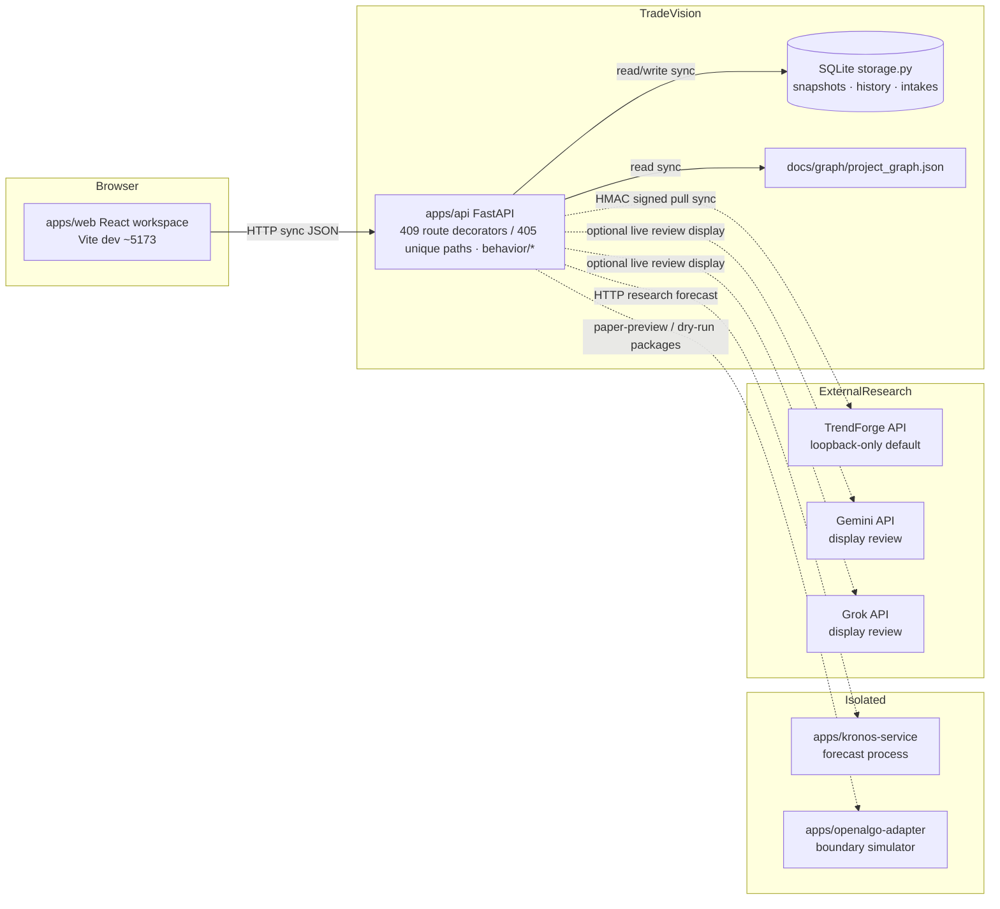
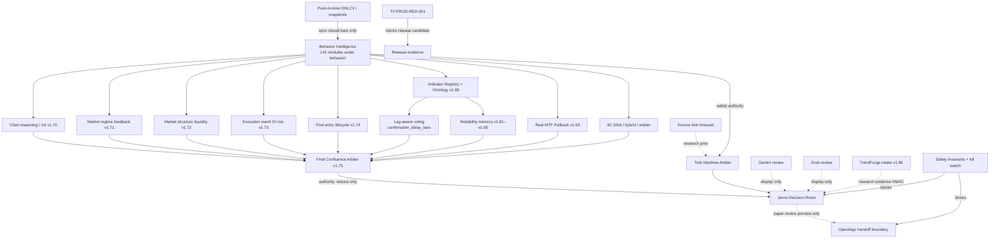
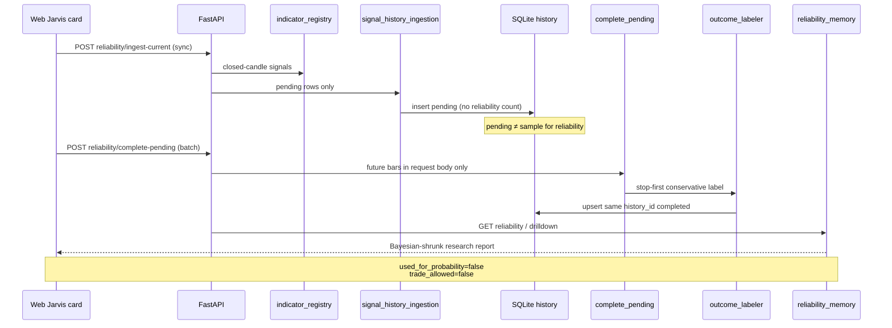
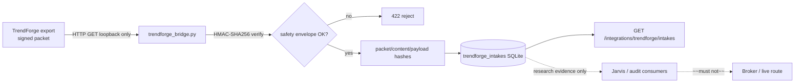
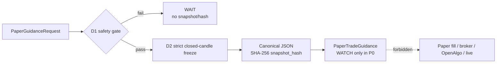
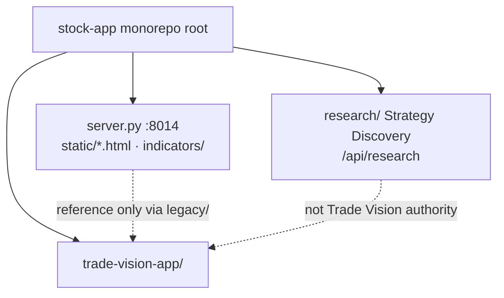

# Trade Vision — System Graph

> **Purpose:** Actual (not aspirational) structural map of modules, data flows, and authority boundaries.  
> **Machine-readable twin:** `docs/graph/project_graph.json` (served by `GET /api/knowledge/graph`)  
> **Last verified against code:** 2026-09-07  
> **Latest completed version:** v2.02-derivatives (ORB Derivatives Intelligence, OFF by default)  
> **Source of truth for ??what shipped??:** `docs/IMPLEMENTATION_STATUS.md`  
> **Merged 2026-07-24:** former `docs/README_GRAPH.md` (how-to + update rule) into **A0 below** ?? **do not recreate** that file.  
> **Graph JSON refresh 2026-09-07:** v2.02-derivatives subsystem node/edges (94 nodes / 213 edges, zero dangling).  
> **Product spine requirement (not this file):** `docs/plans/FINAL_REQUIRED_FLOW.md`  
> **Living contracts / operator map:** `ARCHITECTURE.md`

---

## 0a. Recent additions (v1.96 - v2.02, 2026-08-25 - 2026-09-07)

```text
v1.96  Indicator Intelligence Catalog
       scripts/build_indicator_intelligence_catalog.py
       -> data/indicator-intelligence/indicator_contracts.v1.json (94 contracts)
       -> docs/INDICATOR_INTELLIGENCE_CATALOG.md + group/use map + generated table
       gates: CAT-V196-001..009 (test_indicator_intelligence_catalog.py)

v1.97  ORB Timing Research (per-stock clock-window study: 09:20/09:30/09:35/09:40)
       apps/api/app/orb/hstry_csv.py        HSTRY CSV loader (IST -> epoch ns)
       apps/api/app/orb/timing_research.py  batch engine + leaderboard + resume
       routes /api/v1/orb/timing-research*  storage orb_timing_runs/orb_timing_rows
       exports data/orb_research/           panel: Research tab "ORB Timing Lab"
       gates: ORB-T197-001..010 (test_orb_timing_v197.py)

v1.98  Real 9C candles + Wave 1a promotions
       nine_candle_hybrid._real_closed_candles() -> HSTRY real bars first,
       synthetic fallback labelled source_mode="synthetic_fallback"
       promoted set 13 -> 22

v1.99  Complete safe indicator coverage
       promoted set 22 -> 49; registry 86 validated / 7 proxy / 1 blocked
       FIXED: vendored research/signals/__init__ circular import had silently
       disabled all 23 PTA markers since v1.86; 20/23 now emit on real bars
       spec: docs/plans/INDICATOR_COVERAGE_V199.md

v1.99.1-2  Flow re-audit on real data (scripts/flow_reaudit.py +
       docs/runbooks/flow-reaudit.md)
       FIX 1: data_quality.py session-closure classification (overnight/
       weekend gaps were quality warnings; real history could never pass D1)
       FIX 2: snapshot indicator compute bounded to last 400 bars
       (SNAPSHOT_INDICATOR_WINDOW_BARS; full history blew latency guard)
       Result: real RELIANCE 5000 bars -> D1 9/9 -> 8/9 receipts completed
       -> WATCH; persisted-memory receipt honest until 30 paper outcomes

v1.99.3-4  BEL proven + promoted (scripts/prove_bel.py, GATES.md 7/7 met,
       proof ab7b3163: holdout PF 1.271, walk-forward 4/4; scripts/promote_bel.py:
       playbook a1c78a28 active BEL 5m, matched by v1.92 guidance on real bars)

v2.00-repair  Engine damage rebuild (03-09 wipe of grok_provider +
       decision-quality-gate): reconstructed from twin/contracts/tests;
       test_reconstruction_v200.py with 16 dedicated gates; 740/740 green

v2.01  ORB opening scenarios (orb/context.py gap/CPR/zone classifier +
       OrbOpeningScenario model; 6 gates incl. real-data partition invariant
       over 1611 sessions; median width_atr 0.147 finding supports CPR-04/H3)

v2.02-derivatives  ORB Derivatives Intelligence (dormant research subsystem)
       15 modules (provider, chain snapshots, calculators, Greeks, reasoning,
       store, service, API) + 22 tests + docs/derivatives/; ATR parity
       (SMA-seeded Wilder canonical); IV/skew surfacing (warn/info only);
       main.py 3-line mount, OFF default verified (zero routes, no creds)
```

---

## 0. How to use this graph (former README_GRAPH)

> **Alignment (2026-07-24):** Graph files + API path verified. JSON tip may lag prose; **prose tip here is v1.94**. Code: `KNOWLEDGE_GRAPH_PATH` → `docs/graph/project_graph.json`; route `GET /api/knowledge/graph`.  
> **Use the graph for orientation only** — not implementation detail and not the paper-guidance product requirement.

### Graph files

```text
docs/graph.md                   this file — human Mermaid / authority map
docs/graph/project_graph.json   machine-readable (API / Knowledge UI)
```

### What the graph covers (orientation)

- frontend workspace  
- FastAPI backend  
- behavior intelligence  
- Jarvis decision room  
- indicator intelligence / reliability paths  
- full timeframe contract (v1.82+ nine closed TFs)  
- 9C DNA and analog reasoning  
- replay evidence  
- Kronos twin research engine  
- Gemini/Grok external AI review (display-only)  
- OpenAlgo paper-review handoff (boundary, not live broker)  
- safety invariants  
- implementation status / plan pointers  
- paper-guidance / ORB lifecycle v1.87–v1.94  
- doc map: `FILE_DOCUMENT_INDEX`, `FINAL_REQUIRED_FLOW`, `BUILD_AUDIT`  

### 0.1 Doc-map graph refresh (2026-07-24)

```text
REMOVED ghost nodes (files deleted/merged):
  ai-handoff-context
  context-index
  current-version-pointer
  context-maintenance-runbook

ADDED first-class documentation nodes:
  file-document-index  → docs/FILE_DOCUMENT_INDEX.md
  final-required-flow  → docs/plans/FINAL_REQUIRED_FLOW.md
  build-audit          → docs/BUILD_AUDIT.md

Handoff / tip / maintenance live in:
  TRADE_VISION_README.md  +  IMPLEMENTATION_STATUS tip  +  FILE_DOCUMENT_INDEX
```

### Read next for details (not from the graph alone)

```text
TRADE_VISION_README.md § AI / New-Chat Handoff
docs/FILE_DOCUMENT_INDEX.md §0.6
docs/IMPLEMENTATION_STATUS.md          (latest tip + ship log)
docs/plans/FINAL_REQUIRED_FLOW.md      (product paper spine)
ARCHITECTURE.md                        (operator map + contracts)
docs/plans/TRADE_VISION_FULL_INDICATOR_MEMORY_PLAN.md   (mega memory — slice only)
docs/plans/TRADE_VISION_MAX_CHART_REASONING_V1_70_TO_V1_79_PLAN.md  (chart reasoning design)
```

### Update rule (when to refresh JSON + this file)

Update `docs/graph/project_graph.json` **and** this `graph.md` when any of these change:

- new major version completed  
- new frontend workspace/panel added  
- new backend route family added  
- new safety invariant added  
- new external integration added  
- roadmap changes materially  

Do **not** remove old graph concepts unless they are obsolete and preserved elsewhere (e.g. IMPLEMENTATION_STATUS).

**After ship:** also follow `TRADE_VISION_README.md` § AI Handoff → Fast continuation + context maintenance.

---

## Legend

| Symbol / style | Meaning |
|----------------|---------|
| Solid arrow `-->` | Built, active path |
| Dashed arrow `-.->` | Built but **reference-only / research-only** (cannot promote live authority) |
| Strikethrough `~~text~~` | Deprecated or forbidden path (must not be implemented) |
| `sync` | Request/response in the same HTTP call |
| `async` | Background / outbox / separate process |
| `batch` | Offline, operator-triggered, or multi-bar labeling |
| `rt` | Near-real-time polling (seconds), not market-data multicast |
| Authority badge | Who may change decision confidence: **reduce only** vs **display only** |

### Authority classes (edge semantics)

| Class | May do | Must not do |
|-------|--------|-------------|
| `authority` | Reduce confidence to WAIT / NO_TRADE / AVOID | Enable live orders |
| `research` | Forecast, analog, explain | Override safety gates |
| `display` | Show external review | Mutate Trade Vision decision |
| `boundary` | Paper-preview / dry-run export packaging | Broker execution |
| `storage` | Persist evidence hashes / history | Become probability authority alone |

---

## 1. Runtime process graph (deployed apps)



**Frequency notes**

| Edge | Mode | Typical latency bound (local, observed/documented) |
|------|------|-----------------------------------------------------|
| Web → API | sync | UI interactive; not hard-SLA’d in product config |
| Final release audit (cold) | sync | ~7242 ms uncached (v1.68 measurement) |
| Final release audit (warm) | sync | ~0.3–0.4 ms; TTL = **2.0 s** (`FINAL_AUDIT_CACHE_TTL_SECONDS`) |
| TrendForge pull | sync | Operator/API call; rejects non-loopback by default |
| Kronos forecast | sync to service | Isolated process; failure → no forecast prior |
| Indicator history complete-pending | batch | Requires explicit future bars in body |

**[GAP: requires load-test report]** Concurrent user capacity (10k vs 100k) is **not** measured in-repo. Do not claim horizontal scale numbers without a new benchmark ADR.

---

## 2. Decision authority graph (who can reduce vs only display)



---

## 3. Indicator intelligence pipeline (v1.80–v1.85) — data types



| Step | Payload types | Frequency |
|------|---------------|-----------|
| Ingest current | closed-candle signal rows → pending history | Operator click (not auto on load) |
| Complete pending | future OHLCV bars array → completed labels | Explicit API; horizon-gated |
| Reliability read | indicator_id, symbol, timeframe → report | On-demand sync |
| Lag vote | votes + `confirmation_delay_bars` → lag_weight | On-demand sync |

---

## 4. TrendForge intake (v1.86) — actual path



| Rule | Code |
|------|------|
| Loopback hosts only by default | `LOCAL_HOSTS` in `behavior/trendforge_bridge.py` |
| Safety envelope required | `_verify_safety`: `researchOnly`, `tradeAllowed=false`, `orderRoutingEnabled=false`, `brokerOrderCreated=false`, `liveTradingBlocked=true` |
| Separate secret from OpenAlgo | env `TRENDFORGE_TRADEVISION_SHARED_SECRET` (see README) |
| Schema | `trendforge-tradevision-evidence.v1` |

---

## 4a. Paper Guidance Spine P0 (v1.87) - actual path



| Rule | Enforcement |
|------|-------------|
| Candle availability | `timestamp_ns + timeframe_duration_ns <= decision_time_ns` |
| Determinism | decision-time quality stamp + canonical hash + UUID5 identity |
| Low evidence | explicit flag; P0 never permits `ENTER_PAPER` |
| Execution boundary | literal false flags and no execution module imports |
| Sibling hardening | Kronos/Twin shared snapshot now uses the same close-time rule |

---

## 5. Monorepo adjacency (legacy stock-app)



Trade Vision must treat root chart app and research engine as **migration/reference**, not execution authority (`docs/SAFETY_INVARIANTS.md`, graph edge `legacy-stock-app → research-workbench : reference_only`).

---

## 6. Module inventory vs graph density

| Layer | Count (code) | Graph nodes (orientation) |
|-------|--------------|---------------------------|
| `behavior/*.py` modules | **142** | Collapsed into domain nodes (~106 not named individually) |
| FastAPI route decorators in `main.py` | **396** | Family index in `API_ENDPOINT_INDEX.md` |
| Unique route path strings | **~392** | Decorator count can exceed unique paths if duplicates |
| Graph JSON nodes / edges | **77 / 168** (re-count after edits; `summary` must match arrays) | Orientation, not 1:1 file map |
| Golden **replay fixtures** seeded in API | **16** (6 legacy + 10 `golden_9c_*`) | `main.py` `_ensure_golden_replay_fixtures` |
| Scenario **coverage families** (`REQUIRED_SCENARIO_FAMILIES`) | **15** | `release_control.py` — see note below |

**Fixture vs family reconciliation (15 ≠ 16 is intentional, not a count bug):**

- **16 fixtures:** `golden_opening_drive` … `golden_expiry_pin` (6) + `golden_9c_clean_breakout` … `golden_9c_ood_unknown` (10), including `golden_9c_fake_breakout`.
- **15 families:** legacy six + nine named families; there is **no** separate family token `fake_breakout` — the 9C fake-breakout **fixture** exists while family list uses `fakeout_reversal` for the legacy regime and `clean_breakout` for clean breakouts.

**Collapsed-but-built domains** (modules exist; not every file is a graph node — expand graph when ownership/API changes):

```text
feature_store, event_sequence_mining, corporate_action_abnormal_market,
walk_forward_validation, paper_executor_permission, transport_security,
deployment_recovery, hypothesis_engine, level_memory_extended / level_proximity,
jarvis_paper_execution_loop, real_indicator_adapter, packages/contracts,
external/kronos tree, most jarvis_* specialists
```

**v1.88-v1.94 authority path:**

```text
closed-candle Paper Guidance
  -> NSE ORB core
  -> offline discovery
  -> OOS/WF proof and playbook promotion
  -> Jarvis ORB guidance
  -> D6 final arbiter
  -> explicit human approval
  -> local simulated paper ledger
  -> explicit replay/downloaded-bar observation
  -> deterministic cost-aware paper outcome
  -> completed-only ORB reliability + storage monitor
```

The lifecycle/reliability node has no edge to OpenAlgo or a broker. Feedback is
reduce-only: it may report low evidence or recommend quarantine, but cannot
promote a playbook, alter weights, or approve a trade.

**Design trade-off:** Graph completeness ≠ file completeness. Adding a node is required when ownership, API family, panel, or safety boundary changes (`TRADE_VISION_README.md § AI Handoff → Fast continuation + context maintenance`).

---

## 7. Deprecated / forbidden paths

| Path | Status | Enforcement |
|------|--------|-------------|
| ~~Trade Vision → live broker order~~ | Forbidden | `SYSTEM_MODE.allows_live_orders=False`, `immutable=True` in `state.py`; route tests assert `live_trading_blocked=true` |
| ~~External AI overrides risk gate~~ | Forbidden | Review packages schema-checked; cannot set routing flags |
| ~~Incomplete HTF candle as closed evidence~~ | Forbidden | PIT guards + closed-aggregate builders |
| ~~Cached indicators as probability authority~~ | Forbidden | Cache reports set `used_for_probability=false` |
| ~~TrendForge remote URL (default)~~ | Blocked | Loopback policy in `trendforge_bridge` |
| [dashed] Auto-complete pending labels from local candle DB | Proposed next work | Not built; still caller-supplied bars only (v1.85) |

---

## 8. Cross-references

| Need | File |
|------|------|
| Component contracts & ADRs | `ARCHITECTURE.md` |
| Domain rules & known unknowns | `docs/context.md` |
| Machine graph API | `docs/graph/project_graph.json` |
| Version log | `docs/IMPLEMENTATION_STATUS.md` |
| Root monorepo constraints | `../STOCK_APP_ARCHITECTURE.md` (repo root) |

### Expiration

Revisit this graph when: new app process is added, a safety flag flips, v1.xx completes with new route family, or measured latency/SLO changes by >2×.
