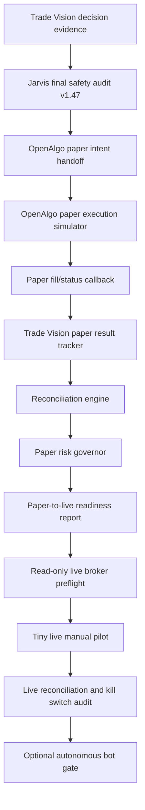

# OpenAlgo Paper To Live Remaining Build Plan

Date: 2026-06-24

## 1. Current State

Trade Vision v1.47 is complete for the Jarvis / Gemini / Grok / OpenAlgo intent safety lane.

Verified state:

- Backend full test suite: `362 passed`
- Frontend typecheck: passed
- Frontend production build: passed
- Final audit endpoint: `paper_review_ready_live_blocked`
- `paper_review_ready=true`
- `live_ready=false`
- `live_trading_blocked=true`

Trade Vision is currently research and paper-review ready only. It is not live-production trading ready.

## 2. Purpose Of Next Build

The next build moves from internal Trade Vision intent review into external OpenAlgo paper simulation.

The goal is to prove that:

- Trade Vision can create a safe, non-executable intent.
- OpenAlgo can receive that intent in paper mode.
- OpenAlgo paper fills can return to Trade Vision.
- Trade Vision can compare expected outcome versus paper outcome.
- Live broker execution remains blocked until separate gates pass.

## 3. Remaining Build Flow



## 4. Remaining Milestones

### 4.1 Paper Execution Loop

Build:

- Send Trade Vision intent to OpenAlgo paper mode.
- Confirm OpenAlgo receives the intent.
- Confirm no live broker order is created.
- Return paper fill/status back to Trade Vision.

Required outputs:

- `intent_id`
- `openalgo_paper_request_id`
- `paper_order_id`
- `paper_status`
- `paper_fill_price`
- `paper_fill_quantity`
- `paper_rejected_reason`
- `live_order_created=false`

### 4.2 Paper Result Tracking

Build:

- Store paper entry, stop loss, target, exit, fill price, slippage, MFE, and MAE.
- Compare expected Trade Vision result versus actual paper result.
- Build trust score from paper outcomes.

Required outputs:

- `expected_entry`
- `actual_entry`
- `expected_sl`
- `actual_sl`
- `expected_target`
- `actual_exit`
- `expected_mfe`
- `actual_mfe`
- `expected_mae`
- `actual_mae`
- `paper_result_label`
- `paper_trust_delta`

### 4.3 OpenAlgo Reconciliation

Build:

- Check pending orders, filled orders, cancelled orders, and positions.
- Detect duplicate orders, missing acknowledgements, stale orders, and orphan positions.
- Block next intent if reconciliation fails.

Required gates:

- `no_duplicate_order`
- `no_missing_ack`
- `no_stale_order`
- `no_orphan_position`
- `paper_position_matches_trade_vision`

### 4.4 Paper Risk Governor

Build:

- Enforce max risk per trade.
- Enforce daily loss limit.
- Enforce max sector/index exposure.
- Enforce cooldown after losses.
- Reject intent before OpenAlgo if risk fails.

Required config:

- `max_risk_per_trade_pct`
- `max_daily_loss_pct`
- `max_weekly_loss_pct`
- `max_portfolio_heat`
- `max_sector_exposure`
- `max_correlation_cluster_exposure`
- `cooldown_after_n_losses`
- `cooldown_minutes`
- `min_liquidity_score`
- `max_slippage_risk`

### 4.5 Paper-To-Live Readiness Report

Build a report that proves paper-mode performance before any live pilot.

Minimum report fields:

- `paper_trade_count`
- `minimum_sample_pass`
- `win_rate`
- `profit_factor`
- `expectancy`
- `max_drawdown`
- `average_r`
- `median_r`
- `slippage_avg`
- `fill_quality_score`
- `no_trade_accuracy`
- `confidence_calibration_error`
- `model_drift_score`
- `reconciliation_failure_count`
- `kill_switch_test_passed`
- `live_ready=false`

Suggested minimum sample size:

- `100` paper trades for early review.
- `500` paper trades for stronger live-pilot consideration.

### 4.6 Live Broker Preflight

Build after paper report passes.

Read-only first:

- Verify broker connection.
- Verify account balance.
- Verify existing positions.
- Verify order permissions.
- Verify instrument metadata.
- Verify kill switch blocks every order path.
- Verify manual approval is required.

No live order should be placed in this milestone.

### 4.7 Tiny Live Manual Pilot

Only after read-only preflight passes.

Restrictions:

- Extremely small quantity.
- One-symbol whitelist.
- Market-hours only.
- Manual approval only.
- No autonomous bot.
- Daily loss limit active.
- Kill switch active.
- Reconciliation active.

### 4.8 Live Reconciliation And Kill Switch Audit

Build:

- Every live order requires acknowledgement.
- Every fill updates position.
- Stale order detector works.
- Duplicate order detector works.
- Emergency kill switch cancels/blocks everything.

### 4.9 Autonomous Bot Gate

Only after paper and tiny-live results are stable.

Requirements:

- Strict max-loss limits.
- OpenAlgo reconciliation mandatory.
- Human override always available.
- Live bot starts with reduced size and symbol whitelist.
- Bot is disabled immediately on reconciliation failure, drift, OOD behavior, daily loss breach, stale data, or kill switch.

## 5. Non-Negotiable Safety Rules

- Trade Vision must not store broker credentials unless explicitly designed in a separate secure vault.
- Trade Vision must not create live broker orders directly.
- OpenAlgo is the broker-connected executor.
- Paper mode must pass before live mode.
- Live mode must begin with read-only preflight.
- Tiny live pilot must require manual approval.
- Autonomous trading must be the last gate, not the next gate.

## 6. Simple Remaining Path

```text
OpenAlgo paper integration
-> paper tracking
-> reconciliation
-> risk governor
-> paper proof report
-> read-only live preflight
-> tiny live pilot
-> live safety audit
-> optional bot automation
```

