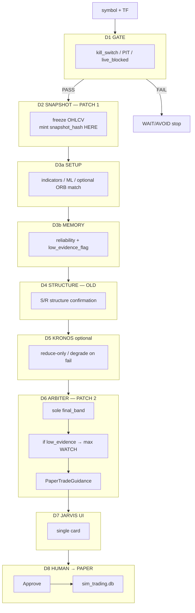
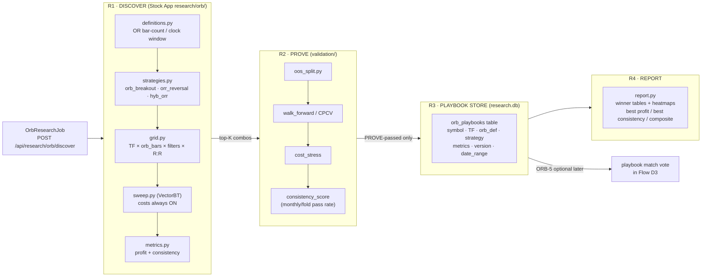

# Trade Vision — Best Overall Design & Flow
## Architecture Document: One-Touch Paper Guidance + ORB Research Lab

> **Author:** Trading-Systems Architect (AI analysis of 4 planning docs)  
> **Date:** 2026-07-24  
> **Source docs:** FINAL_REQUIRED_FLOW (body + App. B Think Engine + App. A AI Brief) · PROJECT_GOD_VIEW_FOR_AI · ORB_RESEARCH_ENGINE_PLAN  
> **Hard rules honoured:** No live broker v1 · No auto paper fill · No parallel indicator zoo · ORB grid offline only · Kronos cannot override risk · One decision language: WAIT/WATCH/ENTER_PAPER/AVOID/SKIP  
> **Updated:** Corrections applied from `FINAL_REQUIRED_FLOW.md` diff — SKIP band added, Memory named step, Kronos step explicit, Phase 6 auto-approve note added  
> **Repo path:** `trade-vision-app/docs/plans/TRADE_VISION_ARCHITECTURE_DESIGN.md`  
> **Implement base:** **ORIGINAL (old) plan** for Flow R/D, engines, ORB lab, phases, APIs.  
> **Only three mandatory patches** from verification (see §0). All other “full re-order” proposals are **not** required.

---

# Approved 2026-07-24 ORB-first delivery override

This section is the current delivery authority. It preserves the architecture
below but supersedes the old version labels and the description of ORB as only
an optional weak setup vote.

ORB is the **primary setup candidate generator** after D1 safety and D2 snapshot
freeze. It is not the final decision authority. D3b memory, D4
structure/liquidity/execution checks, optional reduce-only Kronos evidence, and
the D6 final arbiter can only preserve or downgrade the ORB candidate. A human
must explicitly approve any simulated paper record.

```text
D1 safety
-> D2 immutable closed-candle snapshot + snapshot_hash
-> D3a ORB primary setup candidate
-> D3b MTF/history/reliability
-> D4 structure/liquidity/execution risk
-> D5 optional Kronos disagreement (reduce-only)
-> D6 sole final-band arbiter
-> D7 Jarvis ORB guidance ticket
-> explicit human approval
-> D8 simulated paper record
```

| Version | Approved delivery |
|---|---|
| v1.88 | Snapshot-native guidance engines, memory evidence, and final arbiter hardening |
| v1.89 | ORB-0/1 contracts, opening-range construction, deterministic feature extraction |
| v1.90 | ORB-2 offline discovery, scoring, and anti-lookahead controls |
| v1.91 | ORB-3 OOS/walk-forward proof, promotion, reports, and playbook persistence |
| v1.92 | ORB-4/5 guidance bridge and Jarvis primary ORB action ticket |
| v1.93 | Explicitly approved simulated paper-trade record and replayable audit trail |
| v1.94 | Production hardening and full regression; no live broker routing |

The old `v1.1` ORB bridge reference remains below as historical context only;
the approved implementation target is now **v1.92**. Offline ORB discovery is
never run inside a Jarvis guidance click. Low evidence, incomplete required
HTF, poor liquidity, stale data, disagreement, or risk failure must cap or block
the candidate. No ORB output may bypass D6 or create a paper record without a
separate human approval action.

---

# 0. Implementation lock — OLD PLAN + 3 PATCHES ONLY

> **Status:** Implement the **original combined design** in this document.  
> **Do not** rewrite the pipeline to a different D1–D8 philosophy.  
> **Do apply** exactly **three** surgical patches below (snapshot hash, C-03 memory re-check, Week-4 scope).

## 0.1 Base plan = OLD (KEEP as written in §§1–17 + ORB Part 2)

| Keep from old plan |
|--------------------|
| Flow R offline vs Flow D online |
| Spine P0–P2 first; ORB lab parallel on Stock App `research/orb/` |
| Single arbiter + WAIT/WATCH/ENTER_PAPER/AVOID/SKIP |
| ORB offline grid; playbook = weak evidence vote only |
| Human approve before sim; no live v1 |
| ORB Discover → Score → Prove → Playbook → Report |
| Consistency / OOS / WF for “repeated success” |
| Hostile issues C-01…C-08 as fix list (except where §0.2 overrides) |
| Original engine narrative (Gate → Snapshot → Setup → Memory → Structure → Kronos → Arbiter → UI → Approve → Paper) |

## 0.2 ONLY three patches (MUST apply)

### Patch 1 — Where `snapshot_hash` is born → **D2 snapshot freeze**

| | Old mistake | Required |
|--|-------------|----------|
| Hash | Sometimes described as tied to **D1 gate** | Generated when **D2 freezes OHLCV** (`snapshot_hash` on closed-bar snapshot) |

```text
D1 GATE     = pass/fail safety (does NOT freeze bars, does NOT mint hash)
D2 SNAPSHOT = freeze OHLCV + mint snapshot_hash (+ context engines as in old plan)
Kronos (if on) must use same snapshot_hash as D2
```

**Why:** Gates do not freeze market data; snapshot does. Kronos integrity check keys off D2 hash.

### Patch 2 — Memory vs structure bypass (C-03) → **D6 post-aggregation re-check**

| | Old risk | Required |
|--|----------|----------|
| Low evidence | Named at D3b, but strong structure/other votes might still allow ENTER | After **all** votes aggregate in **D6 arbiter**, if `low_evidence_flag=true` → **max band WATCH** (cannot ENTER_PAPER) |

```text
D3b MEMORY: set low_evidence_flag when reliability samples insufficient
D6 JUDGE:   AFTER aggregation:
              if low_evidence_flag:
                  final_band = min(final_band, WATCH)  # never ENTER_PAPER
                  confidence_cap = min(confidence_cap, 0.55)
```

**Why:** Prevents structure/setup votes from bypassing memory gate.

### Patch 3 — Week-4 scope → **Prove + promote only; bridge = v1.1**

| | Old risk | Required |
|--|----------|----------|
| Week 4 | Prove **and** guidance bridge in same week | **Week 4 = ORB-3 prove + promote API + reports only** |
| Bridge | Often bundled into v1 DoD | **ORB playbook → D3a match = v1.1** (unless spine P0–P2 finishes early and capacity remains) |

```text
Week 1–2: Spine P0–P2 (old plan)
Week 3:   ORB-0…2 discover foundation + anti-lookahead tests
Week 4:   ORB-3 prove + promote + reports
v1.1:     ORB-5 guidance_bridge (playbook match in D3a)
```

## 0.3 Explicitly NOT changing (user choice — keep old)

```text
Do NOT replace old Flow D with the alternate "CONTEXT before setup + RISK as separate D4" full re-order
  unless a later ADR says so.
Do NOT treat other verification suggestions as mandatory except Patch 1–3.
Still recommended (not a fourth mandatory re-order): Kronos degrade-over-abort (C-08) — apply as test fix, not pipeline rewrite.
```

## 0.4 Old Flow D order (BASE — implement this shape)

```text
D1 GATE              kill_switch · PIT/data_quality · live_blocked
D2 DATA SNAPSHOT     freeze OHLCV → snapshot_hash   ← PATCH 1
                     (+ context engines as in original design body)
D3a SETUP            indicators / ML / optional ORB match (read-only)
D3b MEMORY           reliability · low_evidence_flag
D4 STRUCTURE         S/R, structure confirmation (as in original design)
D5 KRONOS            optional / reduce-only (v1 may default off)
D6 ARBITER           sole final_band + PaperTradeGuidance
                     ← PATCH 2: post-agg low_evidence re-check
D7 JARVIS UI         single card (display)
D8 HUMAN → PAPER     approve → sim_trading.db fill
```

## 0.5 Final implement verdict

```text
YES — implement OLD plan + Patch 1 + Patch 2 + Patch 3 only.

START: Spine P0 with D2 snapshot_hash (Patch 1).
ORB Week 4: prove+promote only (Patch 3); bridge v1.1.
C-03: enforce in D6 (Patch 2).
```

---

## 1. Executive Recommendation (10 lines)

1. **Build the paper-guidance spine first (P0–P2).** Everything depends on one clean `POST /paper-guidance/run` → `PaperTradeGuidance` → approve → sim fill. This is the missing wire; all engines already exist.
2. **Lock the engine order NOW** as a code contract (OLD plan shape §0.4): `GATE → SNAPSHOT(+hash) → SETUP → MEMORY → STRUCTURE → KRONOS? → ARBITER → UI → HUMAN → PAPER`. Apply **only** Patch 1–3 from §0.2.
3. **Retire the parallel BUY/SELL display** in the primary UI. Stock App ML ensemble votes become evidence inputs *under* the arbiter, not competing final answers.
4. **v1.75 Final Confluence Arbiter is the sole boss.** No engine overrides it. Kronos, ORB playbook, and external AI are evidence voters with capped weights.
5. **ORB research lab runs in parallel as a Stock App track** (`research/orb/`) — it does not touch the spine until ORB-5. Start ORB-0 and ORB-1 as soon as Spine P0 schema is locked.
6. **ORB discover is offline-only.** The job endpoint is `POST /api/research/orb/discover`. It must never be called from inside a guidance click path.
7. **Proven playbook → weak evidence vote only.** After ORB-3 promotes a winner, it enters the guidance as one family-capped vote. It cannot override structure, risk, or the kill switch — ever.
8. **Human approve is mandatory in v1.** `next_action: OFFER_PAPER_TICKET` is a *suggestion*, never auto-fired. The operator clicks. The system books.
9. **Consistency beats max profit.** ORB ranking must weight OOS + monthly hit rate at least equally to PF. A combo winning 72% of months with PF 1.35 beats a combo with PF 2.1 in one year.
10. **Defer:** full 94-indicator compute on every click, OA real broker loop, post-entry lifecycle, Kronos as routing authority. **ORB guidance bridge = v1.1** (not Week-4 DoD) — **§0.2 Patch 3**.
11. **Three mandatory patches only:** (1) `snapshot_hash` at **D2**, (2) **D6** re-enforce low_evidence → max WATCH, (3) Week-4 = prove+promote only. See **§0**.

---

## 2. Target Architecture — Flow R vs Flow D

### 2.1 High-Level System Map

> **Base = OLD plan.** Only **§0.2 Patch 1–3** are mandatory overrides.

```
╔══════════════════════════════════════════════════════════════════════════════════╗
║                     TRADE VISION + STOCK APP — FULL SYSTEM                      ║
╠══════════════╦═══════════════════════════════════════════════════════════════════╣
║ FLOW R       ║  FLOW D (OLD ORDER + 3 PATCHES)                                  ║
║ RESEARCH     ║  DECIDE / PAPER                                                  ║
║ (OFFLINE)    ║  (ONLINE, ONE CLICK)                                             ║
╠══════════════╬═══════════════════════════════════════════════════════════════════╣
║  [JOB]       ║   INPUT: symbol + TF                                            ║
║    │         ║        ▼                                                         ║
║  R1 DISCOVER ║   D1 GATE — kill_switch · PIT · live_blocked                    ║
║  research/orb║        FAIL → WAIT/AVOID stop                                   ║
║    │         ║        PASS ▼                                                    ║
║  R2 SCORE    ║   D2 DATA SNAPSHOT — freeze OHLCV → snapshot_hash  [PATCH 1]   ║
║    │         ║        (+ context engines as in original design body)           ║
║  R3 PROVE    ║        ▼                                                         ║
║  OOS/WF      ║   D3a SETUP — indicators / ML / [ORB match read-only later]     ║
║    │         ║   D3b MEMORY — reliability · low_evidence_flag                  ║
║  R4 PLAYBOOK ║        ▼                                                         ║
║  research.db ║   D4 STRUCTURE — S/R / structure confirmation (OLD plan)         ║
║  promote     ║        ▼                                                         ║
║    │         ║   D5 KRONOS optional — reduce-only; prefer degrade on fail      ║
║  R5 REPORT   ║        ▼                                                         ║
║  Week4 only  ║   D6 ARBITER — sole final_band + PaperTradeGuidance             ║
║  prove+prom. ║        [PATCH 2] post-agg: if low_evidence → max WATCH          ║
║  [PATCH 3]   ║        ▼                                                         ║
║  bridge=v1.1 ║   D7 JARVIS UI — single card                                    ║
║              ║        ▼                                                         ║
║              ║   D8 HUMAN APPROVE → PAPER SIM → sim_trading.db                 ║
╚══════════════╩═══════════════════════════════════════════════════════════════════╝

Cross-flow: R→D playbook vote only (weak); never ORB grid on click; no live broker.
ORB-5 guidance bridge = v1.1 [PATCH 3], not Week-4 DoD.
```

### 2.2 Mermaid Diagram (Flow D) — OLD order + 3 patches



### 2.3 Flow R — ORB Research Lab



---

## 3. Engine Order for Flow D — OLD plan + 3 patches only

> **Base order = original design.** Mandatory patches: **§0.2 Patch 1–3**.

| Step | Engine(s) | WHY (old plan) | Patch notes | On fail |
|------|-----------|----------------|-------------|---------|
| **D1 · GATE** | kill_switch · PIT · live_blocked | Hard stop before work | — | WAIT/AVOID stop |
| **D2 · SNAPSHOT** | freeze OHLCV · **mint snapshot_hash** · context engines as designed | Identical data for all voters | **PATCH 1: hash born here, not D1** | WAIT if data stale |
| **D3a · SETUP** | indicators / ML / optional ORB match | Setup votes under snapshot | ORB match = v1.1 bridge [PATCH 3] | degrade missing engines |
| **D3b · MEMORY** | reliability · low_evidence_flag | Cap certainty without samples | flag set here | low_evidence_flag |
| **D4 · STRUCTURE** | structure / S/R confirmation | Technical confirmation (old plan) | — | neutral / warn |
| **D5 · KRONOS** | optional path forecast | Reduce-only scenario | prefer degrade not abort (C-08) | exclude vote |
| **D6 · ARBITER** | v1.75 sole boss · PaperTradeGuidance | One final_band | **PATCH 2: post-agg max WATCH if low_evidence** | fallback WAIT |
| **D7 · JARVIS UI** | single card | Human-readable desk | — | N/A |
| **D8 · HUMAN → PAPER** | approve → sim_trading.db | Accountability + practice fill | — | no fill if reject |

---

## 4. How ORB Playbook Influences Vision/Kronos/Arbiter (and What It Must NOT Do)

### 4.1 Designed influence chain

```
ORB DISCOVER (offline)
      ↓
ORB PROVE (offline)
      ↓
playbook row in research.db
      ↓
  [at click time — read-only lookup]
      ↓
  D3: ORB playbook match score
      │  "Today's OR on RELIANCE 5m matches proven combo #7"
      │  weight: ≤ 0.15 of total evidence (one family vote)
      ↓
  D6: final_confluence_arbiter
      │  receives it as one vote in evidence_votes[]
      │  subject to confidence_caps from D2 context
      ↓
  final_band (arbiter decides, not ORB)
```

### 4.2 What ORB must NOT do

| Forbidden ORB action | Why it is forbidden | Where the docs say so |
|----------------------|---------------------|----------------------|
| Re-run full grid search inside Flow D (on every click) | Turns guidance click into a multi-hour job; UX death | THINK_ENGINE §C4; ORB §0.8.11 |
| Override NO_TRADE / kill switch | Hard safety constraint beats research | HARD RULES; ORB §0.8.7 |
| Override risk block (liquidity C / cooldown) | Risk is a harder constraint than any historical recipe | ORB §0.8.7; THINK_ENGINE §D4 |
| Auto-paper-fill from a winning ORB combo | Separates research from execution accountability | Every doc §safety |
| Become a "second arbiter" in UI | Creates competing final answers | PROJECT_GOD_VIEW §mental model |
| Stack multiple ORB playbooks as 5 separate votes | Same-family vote inflation | THINK_ENGINE §B6 |
| Run inside Kronos inference | Kronos is path-forecast, not a combo searcher | ORB §0.8.3 |
| Influence Kronos bidirectionally | No mutual-boss relationship | ORB §0.8.5 |
| Promote confidence when regime is chop/bear | Context caps must still apply | ORB §0.8.8 |
| Claim ORR single-strategy results are the full ORB lab | Different scope | ORB §2.3 |

### 4.3 Kronos-specific rules

```
Kronos role:     path forecast on same closed-bar snapshot
ORB role:        historical combo playbook lookup
Interaction:     NONE by default
When conflict:   Kronos + ORB both show weak evidence → both votes low → WAIT
When agreement:  Both supportive → modest weight boost, still subject to risk/structure caps
Kronos failure:  Do not crash guidance; continue with WAIT bias
Kronos override: IMPOSSIBLE over risk / NO_TRADE / kill switch (arbiter hierarchy §6.2)
```

---

## 5. API / UI Contracts

### 5.1 Paper Guidance API

```
POST /api/v1/paper-guidance/run
Request:
{
  "symbol": "RELIANCE.NS",
  "timeframe": "5m",
  "paper_account_id": "demo_001",
  "include_kronos": false,        // optional; default false
  "include_orb_playbook": true    // optional; reads DB, no re-sweep
}

Response: PaperTradeGuidance {
  // identity
  guidance_id:            uuid
  symbol:                 string
  timeframe:              string
  decision_time:          ISO-8601
  snapshot_hash:          string       // shared with Kronos if used

  // THE decision
  final_band:             "WAIT" | "WATCH" | "ENTER_PAPER" | "AVOID" | "SKIP"
  confidence_cap:         float        // 0.0–1.0; lowered by caps from context
  next_action:            "DO_NOTHING" | "OFFER_PAPER_TICKET"

  // reasons (human readable)
  blockers:               string[]     // what is blocking
  warnings:               string[]     // soft concerns
  reason_for:             string[]     // evidence supporting entry
  reason_against:         string[]     // evidence opposing

  // entry plan (only populated if ENTER_PAPER)
  entry_plan: {
    side:                 "LONG" | "SHORT"
    entry:                float
    stop:                 float
    target:               float
    invalidation:         string
    size_hint:            float
    r_ratio:              float
  }

  // evidence audit
  evidence_votes: [
    {
      engine_id:          string       // e.g. "chart_reasoning_v170"
      vote:               "FOR" | "AGAINST" | "NEUTRAL"
      weight:             float        // raw weight before caps
      lag_penalty:        float        // 0.0 = no penalty
      note:               string
    }
  ]

  // engine run audit
  engines_run:            string[]     // ordered list
  engines_skipped:        string[]     // with reason

  // context summary
  memory_summary:         object       // optional; from reliability/analogs
  risk_summary:           object       // from v1.73 + risk_engine

  // ORB specific (populated if playbook match found)
  orb_playbook_match: {
    playbook_id:          int | null
    combo_summary:        string | null  // "5m · 6 bars · breakout · vwap"
    match_score:          float | null
    metrics_summary:      string | null
  }

  // safety invariants (always present, always these values in v1)
  live_trading_blocked:   true
  order_routing_enabled:  false
}
```

### 5.2 Paper Approve + Result API

```
POST /api/v1/paper-guidance/{guidance_id}/approve
Request: { "paper_account_id": "demo_001", "operator_note": "looks good" }
→ calls Stock App POST /api/sim/{account_id}/trade
→ Response: PaperTradeResult {
    guidance_id:          uuid
    paper_account_id:     string
    fill_status:          "FILLED" | "PARTIAL" | "REJECTED"
    fill_price:           float
    fill_time:            ISO-8601
    qty:                  float
    expected_fill:        float        // entry_plan.entry
    slippage_ticks:       float
    pnl:                  float | null // available on close
    pnl_r:                float | null
    outcome_label:        "TARGET" | "STOP" | "TIME_EXIT" | "AMBIGUOUS" | null
  }
```

### 5.3 ORB Research Job API

```
POST /api/research/orb/discover
Request: OrbResearchJob {
  symbols:            ["RELIANCE.NS", "INFY.NS"]
  start, end:         "2020-01-01", "2025-12-31"
  session:            { exchange: "NSE", open_time: "09:15", close_time: "15:30" }
  timeframes:         ["5m", "15m"]
  orb_bar_counts:     [3, 6, 12]
  orb_clock_windows:  [["09:15","09:30"], ["09:15","09:45"]]
  strategy_families:  ["orb_breakout", "orr_reversal", "hyb_orr"]
  filter_grid:        { volume_mult: [1.0, 1.2], use_vwap: [true, false] }
  rr_grid:            [1.0, 1.5, 2.0, 3.0]
  costs:              { commission_pct: 0.03, slippage_ticks: 1 }
  validation:         { mode: "oos_split", train_frac: 0.7 }
  max_combos:         5000
  ranking:            { profit_weight: 0.4, consistency_weight: 0.4, dd_penalty: 0.2 }
}
→ Response: { job_id: uuid, status: "queued", eta_seconds: 300 }

GET /api/research/orb/jobs/{job_id}
→ { status, progress_pct, top_k_preview[] }

GET /api/research/orb/results/{job_id}
→ OrbResearchResult {
    job_id, completed_at
    combos_tested:        int
    best_profit:          OrbCombo    // highest net return
    best_consistency:     OrbCombo    // highest monthly hit rate
    best_composite:       OrbCombo    // recommended
    all_results:          OrbCombo[]
    report_url:           string      // CSV/JSON export
  }

OrbCombo {
  combo_id, symbol, timeframe, orb_definition
  strategy_family, filters, exits
  n_trades, win_rate, profit_factor, net_return_pct
  max_drawdown_pct, expectancy, avg_R
  consistency_score, oos_pf, months_profitable
  rank_composite, promoted_to_playbook: bool
}

POST /api/research/orb/promote/{combo_id}
→ Promotes PROVE-passed combo to orb_playbooks table in research.db
→ Returns: { playbook_id, version }
```

### 5.4 UI Contract (Jarvis Guidance Card)

```
Primary card (one per run):
┌─────────────────────────────────────────────────────────┐
│  RELIANCE.NS · 5m · [ENTER_PAPER]    confidence: 0.72  │
├─────────────────────────────────────────────────────────┤
│  FOR:  breakout above OR high · structure aligned        │
│        ORB playbook #7 matches (5m/6bar/breakout)       │
│  AGAINST: volume below OR-day average                   │
│  BLOCKER: (none)                                        │
├─────────────────────────────────────────────────────────┤
│  Entry: 2481.50  Stop: 2460.00  Target: 2520.00  R:1.8 │
├─────────────────────────────────────────────────────────┤
│  Engines: Gate✓ · v1.70✓ · v1.72✓ · v1.73✓ · Arbiter  │
├─────────────────────────────────────────────────────────┤
│       [ Approve Paper Trade ]   [ Reject ]              │
└─────────────────────────────────────────────────────────┘

Secondary panels (drill-down, NOT competing final answers):
  - Evidence vote table (expandable)
  - Per-engine detail (Behavior panel)
  - ORB playbook card (playbook_id, metrics)
  - Kronos path (if run; display-only)
```

---

## 6. Phased Plan

### 6.1 Spine — P0 to P2

| Phase | Name | Deliverables | Out of scope |
|-------|------|--------------|--------------|
| **P0** | **Contract lock** | • `PaperTradeGuidance` Pydantic model in `models.py` · `PaperTradeResult` model<br>• Engine role matrix document (gate/evidence/arbiter/executor roles per module)<br>• Band vocabulary freeze: **WAIT / WATCH / ENTER_PAPER / AVOID / SKIP** (5 values; PAPER-CANDIDATE aliased to ENTER_PAPER)<br>• Stock App → TV bridge plan (how ML vote maps to evidence) | New engines, new indicators |
| **P1** | **Spine decision only** | • `POST /api/v1/paper-guidance/run` orchestrator<br>• Fixed engine order function: D1→D3b→D4→D5→D6 in one async pipeline<br>• D3b memory step explicit (low_evidence_flag = WATCH cap)<br>• v1.75 arbiter confirmed as sole final_band producer<br>• Jarvis packages `PaperTradeGuidance`<br>• Primary UI: one card, one band, drill-down secondary<br>• Kill all competing "final BUY/SELL" primary panels | Paper fill, live, OA fills, Kronos |
| **P2** | **Approve → sim fill** | • `POST /api/v1/paper-guidance/{id}/approve` endpoint<br>• Wire approve → Stock App `/api/sim/{account}/trade`<br>• Return `PaperTradeResult` with `guidance_id` FK<br>• UI: fill status, pnl panel (live updates via existing WS)<br>• DB migration: add `guidance_id` column to `sim_trading.db` trades | Live, OA broker, post-entry |
| **P3** | **UX anti-soup** | • Demote all engine raw outputs to drill-down panels<br>• Remove / relabel competing "final answer" language from primary UI<br>• BUY/SELL → evidence vote badge only | — |
| **P4** | **Memory harden** | • `indicator_reliability_memory v1.81` required before ENTER_PAPER (was optional in P1)<br>• Low reliability → WATCH cap enforced<br>• Outcome labeler wired to paper results → closes the learning loop | Full mega memory |
| **P5** | **OA paper loop** | After P2 solid: real OpenAlgo paper review chain | Live pilot |
| **P6** | **Auto-approve (future, optional)** | *From FINAL_REQUIRED_FLOW §6:* Auto paper without approve only with **explicit user config flag** + **hard risk caps enforced** + **min reliability score gate** + audit log entry per auto-fill. Not default. Requires separate safety review before enabling. | Default product; live trading |

**Critical path note:** P1 must not start until P0 contract is signed off. P2 must not start until P1 is tested with at least 3 symbols.

---

### 6.2 ORB Research Lab — ORB-0 to ORB-3

| Phase | Name | Deliverables | Out of scope |
|-------|------|--------------|--------------|
| **ORB-0** | **Spec lock** | • Freeze `OrbResearchJob` schema + session tables (NSE/US defaults)<br>• ORB vs ORR language doc (breakout/reversal/hybrid)<br>• `research/orb/` package skeleton | Code |
| **ORB-1** | **Signal builders** | • `research/orb/definitions.py` — OR session, bar-count vs clock-window logic<br>• `research/orb/strategies.py` — `orb_breakout_long/short`, wrap existing `opening_range_reversal` + `hyb_opening_range_reversal` as `orr_reversal` and `hyb_orr` families<br>• Unit tests: OR lock no lookahead; session alignment | Sweep, backtest |
| **ORB-2** | **Sweep runner** | • `research/orb/grid.py` — Cartesian grid with `max_combos` cap + random/Sobol sampling fallback<br>• `research/orb/sweep.py` — uses `research/engine/backtester.py` (VectorBT) + `scorer.py` patterns<br>• Caps, progress tracking, `research.db` job state<br>• `POST /api/research/orb/discover` endpoint<br>• Session-correct OHLCV load via `research/data/mtf_loader.py` | Prove, UI |
| **ORB-3** | **Ranking + repeated success** | • `research/orb/metrics.py` — `consistency_score` (monthly/fold hit rate), OOS gates via `research/validation/oos_split.py`<br>• Walk-forward on top-K only (via `validation/purged_walk_forward.py`)<br>• `research/orb/report.py` — winner tables: best profit / best consistency / best composite<br>• `POST /api/research/orb/promote/{combo_id}` → `orb_playbooks` table | Guidance bridge |
| **ORB-4** | **UI** | • `research.html` ORB tab: symbol multi-select, TF, orb_bars, strategy, Run button<br>• Results table + heatmap orb_bars × timeframe | — |
| **ORB-5** | **Guidance bridge (v1.1 — Patch 3)** | • `playbook_match` lookup in Flow D3a (read-only, no re-sweep)<br>• Returns `OrbPlaybookMatch` to evidence_votes[]<br>• Weight capped; cannot override risk/safety<br>• **Not Week-4 / not spine v1 DoD** | Live, auto paper |

**ORB-0 and ORB-1 can start as soon as Spine P0 schema is locked** (they share only the playbook schema design, not the runtime).

**ORB-2/3 can run in parallel with Spine P1/P2** (different packages: `research/orb/` vs `trade-vision-app/apps/api/`).

---

## 7. Top 10 Risks / Faults If Built Wrong

| # | Risk | How it manifests | Mitigation |
|---|------|------------------|------------|
| **R1** | **Arbiter dethroned** — A second engine (Kronos, ML ensemble, or ORB playbook) emits its own `final_band` in the primary UI | Operator sees competing BUY vs WAIT; takes wrong action; loses trust | Contract enforcement: only `final_confluence_arbiter v1.75` writes `final_band`. All other engines write `evidence_votes[]`. UI test: grep for any component rendering a "final" label outside the guidance card. |
| **R2** | **ORB discover runs in the click path** | Guidance click hangs for 10–60 minutes; UX death; operator force-quits | Architectural guard: orchestrator (D1–D6) never imports or calls anything in `research/orb/sweep.py`. API separation: `/paper-guidance/run` and `/api/research/orb/discover` are different routes with different time budget middleware. |
| **R3** | **Auto paper without approve** | Research noise directly opens sim positions; ledger corrupted; live-trade temptation | `next_action: OFFER_PAPER_TICKET` is only a UI signal. The approve endpoint requires an explicit POST. No background task auto-calls approve. Integration test: run guidance with ENTER_PAPER; assert 0 rows added to `sim_trading.db` unless approve POST is called. |
| **R4** | **ORB playbook overfit (no prove layer)** | Max-profit winner is a 1-year fluke; guidance systematically favors a losing setup | ORB-3 mandatory before ORB-5: `promoted_to_playbook=true` only if OOS PF > 1.0 and consistency_score > 0.55. `promote` endpoint rejects combos that fail these gates. |
| **R5** | **Lookahead in OR lock** | OR high/low computed including bars after the OR window ends; all backtest results are fantasy | `definitions.py` unit test: feed OHLCV where bar 7 (first non-OR bar) has a new high; assert OR high does not change. Use `strict_close=True` flag in OR builder. |
| **R6** | **Kronos as routing authority** | Kronos forecasts LONG path → guidance skips risk check → ENTER_PAPER issued in unfillable conditions | Arbiter hierarchy is hard-coded: `external_ai_weight = 0.05` max; Kronos output feeds `scenario_reduce` field, not `final_band`. Unit test: mock Kronos returning strong BULLISH while risk engine returns BLOCK; assert final_band = AVOID/WAIT. |
| **R7** | **Fake multi-vote from indicator family inflation** | 8 momentum indicators all vote FOR → arbiter sees 8x momentum weight → false ENTER_PAPER | Family cap enforced in D3: each family contributes max 1.0 weight to evidence pool regardless of count. `false_agreement_confluence` module checks this. CI test: add 10 RSI clones to evidence; assert arbiter weight = same as 1 RSI vote. |
| **R8** | **Session/exchange open wrong for ORB** | NSE open assumed 09:30 instead of 09:15 → OR window covers wrong bars → all ORB signals off by 15 minutes | `definitions.py` has explicit session table. Job schema requires `session.exchange` + `session.open_time`. Integration test: RELIANCE.NS ORB with 09:15 open, assert OR bars [0..5] are 09:15–09:45. |
| **R9** | **Missing context silently inflates confidence** | `market_regime v1.71` data unavailable → engine skips → arbiter uses full confidence budget → ENTER_PAPER in bad regime | `unavailable` is a valid regime return. Arbiter rule: if regime = unavailable, cap confidence_cap by 0.25. Test: mock regime returning unavailable; assert guidance confidence_cap ≤ 0.60. |
| **R10** | **Paper result not linked to guidance** | Operator cannot trace sim fill back to the guidance that produced it; reliability memory never improves | `sim_trading.db` trade rows must include `guidance_id` foreign key from P2. `PaperTradeResult.guidance_id` is non-nullable. Outcome labeler reads this link. DB migration required at P2 kickoff. |

---

## 8. Acceptance Checklist

### Spine Acceptance (P0–P2)

```
CONTRACT (P0)
[ ] PaperTradeGuidance Pydantic model exists in models.py with all required fields
[ ] PaperTradeResult model exists
[ ] live_trading_blocked=true and order_routing_enabled=false are non-overridable fields
[ ] Engine role matrix document committed (gate/evidence/arbiter/executor)
[ ] Band vocabulary WAIT/WATCH/ENTER_PAPER/AVOID/SKIP frozen (5 values); PAPER-CANDIDATE aliased to ENTER_PAPER
[ ] SKIP semantics documented: "setup quality too low to bother watching — pass this setup"

SPINE DECISION (P1)
[ ] POST /api/v1/paper-guidance/run endpoint exists
[ ] Engine order D1→D2→D3→D4→D5→D6 is a single orchestrator function (not ad-hoc parallel calls)
[ ] Only final_confluence_arbiter v1.75 writes final_band
[ ] Primary UI shows one guidance card per run
[ ] No other panel in primary UI renders a "final" BUY/SELL or ENTER decision
[ ] Secondary panels are drill-down only (click to expand)
[ ] Blockers are visible when final_band = WAIT or AVOID
[ ] Confidence cap is visible and sourced from context engines
[ ] engines_run[] and engines_skipped[] are present in response
[ ] Evidence votes are auditable in drill-down panel

APPROVE → SIM FILL (P2)
[ ] POST /api/v1/paper-guidance/{id}/approve endpoint exists
[ ] Approve only activates when final_band = ENTER_PAPER and blockers = []
[ ] Approve calls Stock App /api/sim/{account_id}/trade (not a new sim layer)
[ ] PaperTradeResult returned with fill details
[ ] sim_trading.db trade row includes guidance_id
[ ] No auto-fill occurs without explicit approve POST
[ ] Fill result shown in UI panel

SAFETY (all phases)
[ ] live_trading_blocked remains true in all test environments
[ ] No broker credentials in Trade Vision codebase
[ ] No future-bar feature used in any guidance computation
[ ] Kronos failure does not crash guidance (WAIT bias fallback)
[ ] Kill switch blocks everything including ENTER_PAPER
```

### ORB Research Lab Acceptance (ORB-0 to ORB-3)

```
ORB-0 (Spec)
[ ] OrbResearchJob schema frozen with all fields
[ ] NSE and US session tables defined with correct exchange open times
[ ] ORB vs ORR language documented (breakout / reversal / hybrid families)

ORB-1 (Signal builders)
[ ] OR high/low locked only after last OR bar CLOSES (no lookahead — tested)
[ ] OR bar-count mode and clock-window mode both implemented
[ ] orb_breakout_long, orb_breakout_short signal generators exist
[ ] orr_reversal and hyb_orr wrap existing shared/indicators/self_indc.py functions
[ ] Session alignment tested: RELIANCE.NS 09:15 open produces correct OR bars

ORB-2 (Sweep)
[ ] POST /api/research/orb/discover endpoint exists and runs async (job pattern)
[ ] max_combos cap enforced; does not exceed config limit
[ ] VectorBT backtester (research/engine/backtester.py) is reused, not rewritten
[ ] Costs (commission + slippage) always applied
[ ] Job state persisted to research.db
[ ] GET /api/research/orb/jobs/{job_id} returns progress

ORB-3 (Ranking + repeated success)
[ ] consistency_score computed (fraction of months profitable or fold pass rate)
[ ] OOS split applied; holdout PF reported
[ ] Walk-forward applied to top-K only (not all combos)
[ ] Three reports generated: best profit, best consistency, best composite
[ ] POST /api/research/orb/promote/{combo_id} rejects combos failing OOS PF > 1.0 gate
[ ] promote endpoint adds row to research.db orb_playbooks table with version
[ ] Full grid search never runs in the guidance click path (architectural test)
[ ] Winners are not auto-traded or auto-papered
```

---

## 9. Conflict Resolution: When Docs Disagree

The documents are largely consistent. Where interpretation is needed, this design applies the stated priority:

```
SAFETY + THINK_ENGINE order + FINAL spine intent > "more features"
```

Specific resolutions applied:

| Tension | Resolution applied |
|---------|-------------------|
| PAPER_TRADE_SPINE calls step 3 "LABEL/MEMORY" while THINK_ENGINE calls it "SETUP/EVIDENCE" | Merged as D3 SETUP/EVIDENCE — reliability memory is an evidence source within D3, not a separate step |
| THINK_ENGINE uses "PAPER-CANDIDATE" while PAPER_TRADE_SPINE uses "ENTER_PAPER" | Use ENTER_PAPER as the canonical band value; PAPER-CANDIDATE is an alias |
| ORB plan suggests ORB-5 (guidance bridge) as optional | It is explicitly optional and deferred; ORB-3 promotion gate is mandatory before ORB-5 |
| PROJECT_GOD_VIEW says Kronos is "online optional"; THINK_ENGINE says D5 SCENARIO | Kronos is D5, strictly optional, reduce-only. Default: `include_kronos=false` in request |

---

> **Paths referenced:** `trade-vision-app/docs/plans/FINAL_REQUIRED_FLOW.md (Appendix B — Think Engine)` · `PROJECT_GOD_VIEW_FOR_AI.md` · `FINAL_REQUIRED_FLOW.md Appendix A (AI Brief)` · `ORB_RESEARCH_ENGINE_PLAN.md` · `FINAL_REQUIRED_FLOW.md`  
> **Do not merge this into the spine code** until Spine P0 contract (§5.1 models) is reviewed and approved by the operator.

---

# STAFF ENGINEER DESIGN REVIEW
## Review of: Trade Vision Paper Guidance Spine + ORB Research Lab
> **Reviewer role:** Staff engineer, zero-bias, implementation-ready design review  
> **Date:** 2026-07-22  
> **Inputs:** All 5 planning docs + architecture above  
> **Constraint:** No live trading v1 · No auto paper · No discover-on-click · Single arbiter language · Reuse named code paths

---

## §10. Best Overall Idea — Flow R + Flow D Assessment

**Verdict: KEEP — the two-cadence split is correct and necessary.**

```
Flow R (offline, slow, batch)   ←→   Flow D (online, fast, one click)
Discover → Prove → Playbook          Gate → Context → Setup+Memory →
                                     Risk → Scenario? → Judge → Human → Paper
```

### Why this split is the right idea

| Question | Answer |
|----------|---------|
| Why not one combined flow? | Combo grid search takes minutes–hours. One-click guidance must respond in seconds. Merging them means either: slow guidance OR fake research (never re-run). |
| Why not two fully isolated flows? | They must share one artifact: the **playbook row** in `research.db`. Flow R writes it; Flow D reads it. That is the only coupling — and it is a read-only DB lookup at click time. |
| Why is Flow D ordered and not parallel? | Each step's output changes the meaning of the next step. Context changes indicator interpretation. Risk blocks setups. Scenarios reduce candidates. Running all in parallel produces conflicting answers with no hierarchy to resolve them. |
| What would go wrong with parallel? | Same problem the current system already has: multiple engines returning competing final answers, human brain left to merge them manually. |

### One improvement to Flow R (CHANGE)

**Current plan:** R1 Discover → R2 Prove → R3 Store → R4 Report (linear)

**Recommended improvement:** Add an explicit **feedback branch** from Flow D back to Flow R:

```
Flow D paper results (PaperTradeResult + outcome_labels)
        │
        ▼  [nightly batch, not on click]
Flow R3: research.db playbook row gets "paper_outcome_count",
         "paper_win_rate", "last_paper_date" columns appended
        │
        ▼
Flow R Prove layer can re-score playbooks that have paper history
(real-world drift detection, not just backtest consistency)
```

This closes the learning loop without adding complexity to Flow D. Paper outcomes improve research quality over time. This is **CHANGE (additive)** — not in current plans.

---

## §11. Best End-to-End Design Diagram

```
╔════════════════════════════════════════════════════════════════════════════╗
║              COMPLETE SYSTEM — BEST DESIGN (Staff Engineer View)          ║
╠══════════════════╦═════════════════════════════════════════════════════════╣
║  FLOW R          ║  FLOW D                                                 ║
║  (Stock App)     ║  (Trade Vision — one orchestrator function)             ║
╠══════════════════╬═════════════════════════════════════════════════════════╣
║                  ║  INPUT: symbol + TF                                     ║
║                  ║      │                                                   ║
║                  ║      ▼                                                   ║
║ JOB trigger      ║  D1 ─ GATE ──────────────────────────────── [hard stop] ║
║ (API / nightly)  ║      kill_switch · PIT · live_blocked                   ║
║      │           ║      │ PASS only                                         ║
║      ▼           ║      ▼                                                   ║
║  R1 DISCOVER     ║  D2 ─ CONTEXT ─────────────────────── [confidence caps] ║
║  research/orb/   ║      v1.70 chart · v1.71 regime · v1.72 structure        ║
║  + engine/       ║      v1.63 mtf · session/calendar                        ║
║  VectorBT stack  ║      unavail regime → cap −0.25                          ║
║      │           ║      │                                                   ║
║      │ top-K     ║      ▼                                                   ║
║      ▼           ║  D3a ─ SETUP ──────────────────────── [evidence_votes[]] ║
║  R2 PROVE        ║      si_*/pta_* subset (family-capped, lag-weighted)      ║
║  validation/     ║      ML ensemble vote (1 vote, mapped to band language)   ║
║  OOS · WF · CST  ║      ORB playbook match [optional, read DB only]          ║
║      │           ║      │                                                   ║
║      │ pass      ║      ▼                                                   ║
║      ▼           ║  D3b ─ MEMORY ─────────────── [REQUIRED for ENTER_PAPER] ║
║  R3 PLAYBOOK     ║      reliability_memory v1.81                             ║
║  research.db ────╬──►   low_evidence → cap at WATCH                         ║
║  orb_playbooks   ║      outcome_labels from past paper fills                 ║
║      │           ║      │                                                   ║
║      ▼           ║      ▼                                                   ║
║  R4 REPORT       ║  D4 ─ RISK ──────────────────────────── [block / shrink] ║
║  winner tables   ║      v1.73 exec/event/OI · risk_engine · cooldown         ║
║  heatmaps        ║      liquidity C → hard block (ORB playbook cannot save)  ║
║      │           ║      │                                                   ║
║      │           ║      ▼                                                   ║
║      │           ║  D5 ─ KRONOS [v1 DEFAULT OFF] ─────── [reduce-only]      ║
║      │           ║      same snapshot_hash as D2; degrade on fail (C-08)     ║
║      │           ║      twin_arbiter: Behavior vs Kronos                     ║
║      │           ║      conflict → WAIT bias; down → WAIT bias               ║
║      │           ║      CANNOT override risk / kill_switch / emit final_band  ║
║      │           ║      │                                                   ║
║      │           ║      ▼                                                   ║
║      │           ║  D6 ─ JUDGE ────────────────────── [ONE final_band]      ║
║      │           ║      final_confluence_arbiter v1.75 (sole boss)           ║
║      │           ║      hierarchy: safety > data > liquidity > regime >      ║
║      │           ║                 structure > volume > RS > indicators >    ║
║      │           ║                 ORB playbook > Kronos > external AI       ║
║      │           ║      Jarvis room: desk view, blockers, audit list          ║
║      │           ║      │                                                   ║
║      │           ║      ▼                                                   ║
║      │           ║  PaperTradeGuidance ─────────────────────────────────── ║
║      │           ║      final_band: WAIT/WATCH/ENTER_PAPER/AVOID/SKIP        ║
║      │           ║      │                                                   ║
║      │           ║      ├─ WAIT/WATCH/SKIP/AVOID → show reasons only         ║
║      │           ║      │                                                   ║
║      │           ║      └─ ENTER_PAPER + no blockers                         ║
║      │           ║              │                                            ║
║      │           ║              ▼                                            ║
║      │           ║         D7 ─ HUMAN APPROVE                                ║
║      │           ║              operator reads reason tree                   ║
║      │           ║              clicks [ Approve Paper Trade ]               ║
║      │           ║              │                                            ║
║      │           ║              ▼                                            ║
║      │           ║         D8 ─ PAPER SIM                                    ║
║      │           ║              POST /api/sim/trade → sim_trading.db          ║
║      │           ║              PaperTradeResult (guidance_id FK)             ║
║      │           ║              │                                            ║
║      ▼           ║              ▼ [nightly feedback — not on click]           ║
║ R3 playbook ◄────╬──── outcome_labels → R2 Prove re-score (drift detection)  ║
╚══════════════════╩═════════════════════════════════════════════════════════╝

Cross-flow data contracts:
  R → D  : research.db playbook row (read-only lookup in D3a, optional)
  D → R  : PaperTradeResult outcome_labels (nightly batch, not on click)
  R ↛ D  : ORB grid search (never runs in click path)
  Kronos ↛ R : (no link; Kronos is snapshot-only; not a combo searcher)
```

---

## §12. Best Online Engine Order — One-Line WHY Each

| # | Step | Engine(s) | One-line WHY |
|---|------|-----------|-------------|
| D1 | **GATE** | kill_switch · PIT · data_quality · live_blocked | Unsafe/illegal data must stop everything — no downstream engine's answer is valid if input is corrupt. |
| D2 | **CONTEXT** | v1.70 chart · v1.71 regime · v1.72 structure · v1.63 MTF · session | Context changes the meaning of every indicator — run it before indicators, not after. |
| D3a | **SETUP** | lag-aware si_*/pta_* subset · ML vote · ORB playbook match · 9C | Setups mean different things in different regimes — context must exist first; indicators report here. |
| D3b | **MEMORY** | reliability_memory v1.81 · low_evidence_flag · outcome_labels | No samples = no certainty — memory gates ENTER_PAPER before risk is even reached. |
| D4 | **RISK** | v1.73 exec/OI/event · risk_engine · cooldown | Risk kills or shrinks candidates — must see real setups first but must block before judge commits. |
| D5 | **KRONOS** (opt-in) | kronos_proxy · twin_arbiter (same snapshot hash) | Forecasts add uncertainty, not certainty — reduce-only, placed after risk so it cannot manufacture entries. |
| D6 | **JUDGE** | final_confluence_arbiter v1.75 · Jarvis | One boss, hard-coded hierarchy — only place allowed to write final_band. |
| D7 | **HUMAN** | Approve button | Accountability gate — system is not oracle; paper ledger requires human intent. |
| D8 | **PAPER SIM** | POST /api/sim/trade · sim_trading.db | Existing ledger, no new sim infrastructure — fills linked back to guidance_id for learning loop. |

### KEEP / CHANGE / DROP against current plans

| Item | Decision | Note |
|------|----------|------|
| D1 GATE first | **KEEP** | Correct; matches THINK_ENGINE Class GATE |
| D2 CONTEXT before indicators | **KEEP** | Correct; matches THINK_ENGINE §B5 |
| D3 merged SETUP+MEMORY | **CHANGE** | Split into D3a/D3b; memory is now a named required gate |
| D4 RISK after setup | **KEEP** | Correct position |
| D5 Kronos optional, reduce-only | **KEEP** | Added explicit snapshot_hash integrity check |
| D6 single arbiter | **KEEP** | Non-negotiable |
| D7 human approve | **KEEP** | Non-negotiable in v1 |
| D8 uses existing sim API | **KEEP** | No new sim infra |
| Running all 94 indicators per click | **DROP** | Family-capped subset only |
| Kronos as routing authority | **DROP** | Documented anti-pattern |
| Auto paper in v1 default | **DROP** | P6 future only with strict config |

---

## §13. Best Offline ORB Pipeline — One-Line WHY Each

| # | Step | Tooling | One-line WHY |
|---|------|---------|-------------|
| R1a | **Session table** | definitions.py | Exchange open time must be explicit — wrong session = wrong OR bars = all results are fantasy. |
| R1b | **Signal builders** | strategies.py (wrap ORR + add breakout) | Reuse existing `opening_range_reversal` / `hyb_*` — no rewrite; just expose both breakout and reversal families. |
| R1c | **Grid construction** | grid.py (Cartesian + max_combos cap) | Cap before running — unbounded grid at 5 TFs × 6 orb_bars × 3 strategies × 4 filters × 4 R:R = 1440 base combos, which is fine; but uncapped with more filters explodes. |
| R1d | **VectorBT sweep** | sweep.py → research/engine/backtester.py | Reuse the existing VectorBT runner — do not rewrite the backtester. Costs always ON. |
| R1e | **Profit metrics** | metrics.py | PF, WR, expectancy, maxDD — standard; needed for the profit ranking dimension. |
| R2a | **Consistency score** | metrics.py + monthly split | Fraction of months profitable — the "repeated success" requirement; this is what separates real edge from a lucky year. |
| R2b | **OOS split / holdout** | research/validation/oos_split.py | Train vs holdout — mandatory gate; any winner that fails holdout is dropped before playbook. |
| R2c | **WF on top-K only** | validation/purged_walk_forward.py | Walk-forward is expensive — run only on the top-20 survivors, not all 1440 raw combos. |
| R2d | **Cost stress** | research/validation/* | Worse commission + wider slippage — filter combos that only work in ideal cost conditions. |
| R3 | **Promote to playbook** | POST /api/research/orb/promote | Explicit human-triggered promotion gate — no auto-promote; operator reviews report first. |
| R4 | **Report** | report.py | Three views (best profit / best consistency / composite) — user must see all three, not just composite. |

### KEEP / CHANGE / DROP against current ORB plan

| Item | Decision | Note |
|------|----------|------|
| research/orb/ package placement | **KEEP** | Correct home for discovery |
| Reuse research/engine/backtester.py | **KEEP** | Non-negotiable; no rewrite |
| Wrap existing ORR/hybrid as families | **KEEP** | Prevents duplication |
| max_combos hard cap | **KEEP** | Required; add Sobol sampling as fallback |
| OOS split mandatory | **KEEP** | Non-negotiable before playbook |
| WF on all raw combos | **DROP** | Only top-K; too expensive otherwise |
| Auto-promote on OOS pass | **CHANGE** | Make promotion explicit API call (human reviews report first) |
| Full grid on every guidance click | **DROP** | Hard architectural ban; separate route |
| Backtrader for mass search | **DROP** | VectorBT for mass; Backtrader optional for 1–5 finalists only |
| ORB-5 guidance bridge as part of ORB-3 | **CHANGE** | ORB-5 is a separate phase; ORB-3 produces playbook, ORB-5 wires it to guidance |

---

## §14. How ORB Influences Kronos/Vision (Hard Non-Influences)

### Designed influence (what is allowed)

```
ORB playbook (research.db row)
        │
        │ read-only lookup at click time (D3a only)
        ▼
evidence_votes[] entry:
  engine_id: "orb_playbook_match"
  family:    "session_opening_range"   ← one family slot
  vote:      FOR | NEUTRAL
  weight:    ≤ 0.15 of total pool
  lag_penalty: 0.0 (it is a pre-proven recipe, not a lagging signal)
        │
        ▼
final_confluence_arbiter v1.75
  receives it as one of many evidence_votes[]
  subject to confidence_caps from D2 (regime/structure)
  cannot exceed its family cap
```

### Influence matrix (complete)

| Source | Affects Vision D2–D4? | Affects Kronos D5? | Affects Arbiter D6? | Affects Paper D8? |
|--------|----------------------|-------------------|--------------------|-----------------|
| **ORB discover job (R1)** | ❌ No (offline) | ❌ No | ❌ No | ❌ No |
| **ORB playbook (R3, stored)** | ✅ Yes — one evidence vote in D3a | ❌ No (default) | ✅ Indirect — via that one vote | ✅ Only via guidance + human approve |
| **ORR chart marker (si_opening_range_rev)** | ✅ Yes — indicator vote in D3a | ❌ No | ✅ Indirect — via indicator votes | ❌ No auto |
| **Kronos path forecast** | ✅ D5 reduce-only on conflict | — | ✅ Indirect — reduces candidate confidence | ❌ No auto |
| **Vision structure/risk** | — | ❌ No (Kronos reads snapshot, not Vision output) | ✅ Strong — high hierarchy weight | Via guidance → paper |
| **External AI (Gemini/Grok)** | ❌ No | ❌ No | ✅ Display only; weight ~0 | ❌ No |

### Hard non-influences (architectural bans)

```
ORB grid search  ↛  D (online click path)    — never; separate API route
ORB playbook     ↛  Kronos inference         — Kronos reads OHLCV snapshot, not playbook
ORB playbook     ↛  override risk block      — liquidity C blocks regardless of playbook score
ORB playbook     ↛  override kill switch     — no exception
ORB job          ↛  auto paper fill          — human approve always required
Kronos           ↛  ORB combo search         — Kronos is path forecast, not grid search
Kronos           ↛  override NO_TRADE        — architectural hierarchy prevents this
Kronos           ↛  emit final_band          — only arbiter can
External AI      ↛  change final_band        — display review only
Multiple ORB     ↛  multiple family votes    — stacking same-family clones is vote inflation
playbook rows         in one run
```

### Who wins in conflict (priority order)

```
1. kill_switch / live_blocked          ← always wins; no exceptions
2. PIT / data_quality failure          ← always wins over any analysis
3. liquidity grade C / risk block      ← wins over ORB playbook, Kronos, ML
4. market_regime cap (if unavailable)  ← −0.25 cap on confidence
5. structure / levels (v1.72)          ← wins over indicator votes
6. volume / auction evidence           ← wins over raw signal agreement
7. RS / breadth                        ← wins over single-stock signals alone
8. indicators (lag-aware, family-cap)  ← here is where ORB playbook sits
9. Kronos / twin (reduce-only)         ← can only reduce from here
10. External AI                        ← display only; weight ~0 for band promotion
```

---

## §15. Issues Found

### Critical (would break the product if not fixed)

| ID | Issue | Fix | Plan status |
|----|-------|-----|-------------|
| **C1** | **No single orchestrator function exists** — engines are called as scattered parallel API calls with no forced order | Create one `async def run_paper_guidance_pipeline(symbol, tf, opts)` function that calls D1→D8 in sequence with explicit short-circuit on gate failure | Not built yet; P1 deliverable |
| **C2** | **`final_band` can be emitted by multiple engines** — arbiter is not enforced as the only writer at the API contract level | Make `final_band` a write-once field that throws on double-write in Python; only `final_confluence_arbiter.run()` is allowed to set it | Not enforced; P0 deliverable |
| **C3** | **Memory step has no `low_evidence_flag` enforcement** — reliability data absent silently; guidance still returns ENTER_PAPER | Add `memory_gate()` function: if `reliability_memory` has < N samples for this pattern, set `confidence_cap = min(cap, 0.55)` and block ENTER_PAPER | Not built; P1 deliverable |
| **C4** | **`guidance_id` FK missing from `sim_trading.db`** — paper fills cannot be traced back to guidance; outcome_labels never improve | DB migration: add `guidance_id TEXT` column to trades table; `PaperTradeResult.guidance_id` is non-nullable | Not built; P2 deliverable |
| **C5** | **ORB OR lock has no unit test for lookahead** — if `definitions.py` uses `max()` on all bars instead of bars up to OR end, backtest results are fantasy | `test_orb_no_lookahead()`: inject a bar after OR window with a new high; assert OR_HIGH unchanged | Not built; ORB-1 deliverable |

### Major (degrades quality significantly)

| ID | Issue | Fix | Plan status |
|----|-------|-----|-------------|
| **M1** | **SKIP band missing from current `final_band` enum** | Add `"SKIP"` as 5th value with semantics: "setup quality too low to monitor" | Fixed in this doc; P0 code change |
| **M2** | **Memory / labeling is a footnote in D3, not a named step** | Split D3 into D3a SETUP + D3b MEMORY; D3b is a gate, not an optional subroutine | Fixed in this doc; P1 code impact |
| **M3** | **Kronos not placed explicitly in engine order** — its position relative to risk was ambiguous | D5 with explicit snapshot_hash integrity check and reduce-only contract | Fixed in this doc |
| **M4** | **Phase 6 auto-approve possibility not documented** — future operators may not know this is a planned option | Phase 6 note added with strict config + audit requirements | Fixed in this doc |
| **M5** | **ORB grid cap has no Sobol/LHS fallback** — if Cartesian hits max_combos limit, combos are silently truncated with no sampling strategy | Add `sampling_mode: "cartesian" | "random" | "sobol"` to job config; default to `"sobol"` when `n_cartesian > max_combos` | Not built; ORB-2 deliverable |
| **M6** | **No feedback path from paper results to ORB playbook quality** — playbook rows never update with real-world paper win rate | Nightly batch: read `sim_trading.db` outcomes where `guidance_id` links to guidance with `orb_playbook_id`; update playbook row `paper_win_rate`, `paper_trade_count` | Not designed; new deliverable |
| **M7** | **Kronos snapshot hash not enforced** — Kronos could run on different bars than the guidance (race condition in async) | Pass `snapshot_hash` from D1 to Kronos; Kronos aborts if hash mismatch | Not enforced; P1 + Kronos service task |

### Minor (polish / clarity)

| ID | Issue | Fix |
|----|-------|-----|
| **m1** | `PAPER-CANDIDATE` vs `ENTER_PAPER` naming inconsistency across codebase | P0: globally alias PAPER-CANDIDATE → ENTER_PAPER; grep + replace |
| **m2** | ORB-5 guidance bridge currently described inside ORB-3 scope in some docs | ORB-5 is a separate phase; clarified in this doc |
| **m3** | `include_kronos=false` default not in every doc | API contract in §5.1 sets it; must match actual route default |
| **m4** | `sim_trading.db` schema not versioned | Add migration script at P2; version it in `data/` dir |
| **m5** | Backtrader for mass ORB search is listed as viable in some docs | Drop: VectorBT for mass; Backtrader only for 1–5 finalist audit |

---

## §16. Recommended Build Sequence — Next 4 Weeks

```
Week 1 — CONTRACT + FOUNDATION (P0 + ORB-0)
─────────────────────────────────────────────
Day 1–2:
  [ ] Pydantic models: PaperTradeGuidance + PaperTradeResult in models.py
  [ ] final_band enum: WAIT | WATCH | ENTER_PAPER | AVOID | SKIP (5 values)
  [ ] Engine role matrix: every existing module assigned gate/evidence/arbiter/executor/display
  [ ] PAPER-CANDIDATE → ENTER_PAPER global alias (grep + replace)

Day 3–4:
  [ ] research/orb/ package skeleton
  [ ] definitions.py: session table (NSE 09:15, US 09:30), bar-count + clock-window OR
  [ ] Unit test: OR lock no lookahead (C5 fix)

Day 5:
  [ ] ORB-0 spec review: schema frozen, session tables reviewed
  [ ] P0 review gate: schema approved by operator before any P1 code starts

Week 2 — SPINE DECISION ONLY (P1, no paper fill yet)
──────────────────────────────────────────────────────
Day 6–7:
  [ ] Single orchestrator: run_paper_guidance_pipeline()
      D1 GATE → D2 CONTEXT → D3a SETUP → D3b MEMORY → D4 RISK → D6 JUDGE
      (D5 Kronos skipped; include_kronos=false default)
  [ ] Short-circuit on D1 failure (hard WAIT/AVOID, no further compute)
  [ ] D3b memory_gate(): low_evidence → cap confidence, block ENTER_PAPER

Day 8–9:
  [ ] POST /api/v1/paper-guidance/run endpoint wired to orchestrator
  [ ] final_confluence_arbiter v1.75 confirmed as sole final_band writer (C2 fix)
  [ ] Snapshot hash generated in D1, passed to all steps

Day 10:
  [ ] Primary UI: one guidance card, one band display
  [ ] Kill / hide all competing "final BUY/SELL" primary panels
  [ ] Test with 3 symbols (RELIANCE.NS, INFY.NS, NIFTY50 proxy)

Week 3 — APPROVE + SIM FILL + ORB SIGNALS (P2 + ORB-1)
────────────────────────────────────────────────────────
Day 11–12:
  [ ] DB migration: add guidance_id to sim_trading.db trades table (C4 fix)
  [ ] POST /api/v1/paper-guidance/{id}/approve → calls /api/sim/{account}/trade
  [ ] PaperTradeResult returned with guidance_id FK
  [ ] UI: fill status panel + pnl (via existing WS)

Day 13–14:
  [ ] ORB-1 strategies.py: orb_breakout_long/short signal builders
  [ ] Wrap opening_range_reversal + hyb_ as orr_reversal + hyb_orr families
  [ ] Unit tests: session alignment, OR lock integrity

Day 15:
  [ ] P2 integration test: guidance → approve → fill → PaperTradeResult (3 symbols)
  [ ] 0 auto-fills without approve POST (regression test)

Week 4 — ORB SWEEP + RANKING + SNAPSHOT HASH (ORB-2, ORB-3, M7 fix)
──────────────────────────────────────────────────────────────────────
Day 16–17:
  [ ] ORB-2: grid.py (Cartesian + Sobol fallback — M5 fix)
  [ ] sweep.py using research/engine/backtester.py (no rewrite)
  [ ] POST /api/research/orb/discover endpoint (async job, separate from guidance route)
  [ ] Architectural test: guidance route must not import sweep.py

Day 18–19:
  [ ] ORB-3: consistency_score (monthly hit rate), OOS split (validation/oos_split.py)
  [ ] Walk-forward on top-K only (not all combos)
  [ ] POST /api/research/orb/promote endpoint with OOS PF > 1.0 gate
  [ ] orb_playbooks table in research.db

Day 20:
  [ ] Kronos snapshot_hash integrity check (M7 fix)
  [ ] 4-week retrospective: P0+P1+P2 done; ORB-0 through ORB-3 done
  [ ] Acceptance tests (§17) run against real data
```

**Parallel track note:** Week 2 spine work (apps/api/) and Week 3/4 ORB work (research/orb/) are in different packages and can be done by different developers simultaneously without conflicts.

---

## §17. Definition of Done — v1 (Testable)

### Spine v1 DoD

```
SPINE CONTRACT (P0)
[ ] final_band enum has exactly 5 values: WAIT WATCH ENTER_PAPER AVOID SKIP
[ ] PaperTradeGuidance Pydantic model: all fields present, live_trading_blocked non-overridable
[ ] PaperTradeResult: guidance_id field non-nullable
[ ] Engine role matrix committed: every named module has one of gate/evidence/arbiter/executor/display
[ ] PAPER-CANDIDATE aliased globally to ENTER_PAPER (no raw PAPER-CANDIDATE in primary UI)

SPINE PIPELINE (P1)
[ ] POST /api/v1/paper-guidance/run returns PaperTradeGuidance in < 5 seconds for 5m/15m bars
[ ] Engine execution order is D1→D3b→D4→D6 in one function; verifiable by log sequence
[ ] D1 gate failure → final_band=WAIT; no further engine called (verified by mock test)
[ ] D3b low_evidence_flag=true → confidence_cap ≤ 0.55; ENTER_PAPER blocked
[ ] final_confluence_arbiter v1.75 is the ONLY writer of final_band (double-write throws)
[ ] evidence_votes[] present for every engine that ran
[ ] engines_run[] order matches D1→D6 sequence
[ ] Regime unavailable → confidence_cap reduced by 0.25 (mock test)
[ ] Kronos down → guidance still returns; final_band = WAIT or WATCH (not 500 error)
[ ] Primary UI: one card visible; no competing BUY/SELL primary label
[ ] Secondary panels: drill-down only (not default visible)

APPROVE + SIM FILL (P2)
[ ] POST approve endpoint: only callable when final_band=ENTER_PAPER and blockers=[]
[ ] Approve calls /api/sim/{account}/trade; returns PaperTradeResult
[ ] sim_trading.db trade row has guidance_id populated
[ ] Zero rows added to sim_trading.db on guidance run alone (no auto-fill)
[ ] PnL panel updates when trade closes
[ ] guidance_id traceable from trade row back to full PaperTradeGuidance JSON

SAFETY (all phases, always)
[ ] live_trading_blocked=true in all responses (no code path can set this false)
[ ] order_routing_enabled=false in all responses
[ ] No broker credentials in TV codebase (grep check)
[ ] No future-bar features in any engine called by orchestrator
[ ] Kill switch → all guidance responses return final_band=WAIT with blocker["kill_switch_active"]
```

### ORB Research Lab v1 DoD

```
ORB SIGNAL QUALITY (ORB-1)
[ ] OR high/low fixed only after last OR bar closes — lookahead unit test passes
[ ] Bar-count OR mode: orb_bars=6 on 5m = OR from 09:15 to 09:45 for NSE
[ ] Clock-window OR mode: or_start=09:15, or_end=09:30 locks after 09:30 bar closes
[ ] Both modes produce same OR high/low when equivalent (regression test)
[ ] orb_breakout signal: entry above OR_HIGH (long) / below OR_LOW (short)
[ ] orr_reversal and hyb_orr delegate to existing shared/indicators/self_indc.py functions

SWEEP QUALITY (ORB-2)
[ ] POST /api/research/orb/discover runs async and returns job_id immediately
[ ] max_combos cap enforced; Sobol sampling activates when Cartesian > cap
[ ] Commission + slippage applied to all combos (no cost-free runs allowed)
[ ] All results persisted to research.db; job resumable on restart
[ ] /api/research/orb/discover NOT importable from guidance orchestrator (import test)

RANKING + PROVE (ORB-3)
[ ] consistency_score = fraction of months with net_return > 0 (computed per combo)
[ ] OOS holdout applied; holdout PF reported separately from in-sample PF
[ ] Walk-forward applied to top-20 by composite rank only
[ ] Three reports generated: best_profit / best_consistency / best_composite
[ ] promote endpoint rejects combo if: oos_pf ≤ 1.0 OR consistency_score ≤ 0.55
[ ] promoted_to_playbook=true only after explicit POST /promote call
[ ] orb_playbooks table row has: version, date_range, symbol, tf, orb_def, strategy, metrics
[ ] No combo auto-submits a paper trade or live trade (integration test)
```

---

> **Staff engineer sign-off criteria:** All Critical (C1–C5) and Major (M1–M7) issues resolved before v1 ships.  
> Minor issues (m1–m5) may be deferred to a v1.1 cleanup sprint.  
> **Paths referenced:** All 5 planning docs in `trade-vision-app/docs/plans/` + this architecture document.

---
---

# ═══════════════════════════════════════════════════════════
# PART 2 — ORB COMBINATION RESEARCH LAB: FULL SYSTEM DESIGN
# ═══════════════════════════════════════════════════════════
> **Appended from:** `ORB_RESEARCH_SYSTEM_DESIGN.md`  
> **Combined into this master document on:** 2026-07-22  
> **Purpose:** Single reference file for building + error-checking the full system

---

# ORB Combination Research Lab — Full System Design
## Quant Research Engineer Design Document

> **Author:** Quant Research Engineer (design review of ORB research system)  
> **Date:** 2026-07-22  
> **Stack:** Stock App `research/` (VectorBT discovery) · `opening_range_reversal` + `hyb_opening_range_reversal` in `shared/indicators/self_indc.py` · `research.db` · Trade Vision decide engines (Kronos off-limits for ORB grid)  
> **Hard constraints:** No auto live · No ORB grid on UI click · ORB is not arbiter boss · Rank by profit AND repeated success (not in-sample max alone)

---

## 1. Search Space — Parameters with NSE and US Defaults

### 1.1 Full parameter taxonomy

```
ORB Combo = {
  symbol(s),
  session,
  bar_timeframe,
  orb_definition,
  strategy_family,
  direction,
  entry_rules,
  filters,
  exits,
  costs
}
```

### 1.2 Parameter grid with NSE / US defaults

| Dimension | Type | NSE defaults | US defaults | Notes |
|-----------|------|-------------|-------------|-------|
| **session.open_time** | hh:mm local | `09:15` | `09:30` | Hard rule: all OR logic anchored to this |
| **session.close_time** | hh:mm local | `15:30` | `16:00` | Time-exit cutoff |
| **session.tz** | IANA | `Asia/Kolkata` | `America/New_York` | Never UTC-only |
| **bar_timeframe** | str | `["1m","3m","5m","15m"]` | `["1m","2m","5m","15m","30m"]` | Start with 5m+15m; 1m only if data quality passes |
| **orb_definition.mode** | enum | `"bar_count"` | `"clock_window"` | Support both |
| **orb_definition.orb_bars** | int list | `[3,6,9,12,18]` | `[3,6,9,12,18]` | On 5m: 3=15m, 6=30m, 9=45m, 12=60m range |
| **orb_definition.or_start** | hh:mm | `09:15` | `09:30` | clock_window mode only |
| **orb_definition.or_end** | hh:mm | `["09:30","09:45","10:15","10:30"]` | `["09:45","10:00","10:30","11:00"]` | clock_window mode only |
| **strategy_family** | enum | `["orb_breakout","orr_reversal","hyb_orr"]` | same | breakout = new; orr = existing wrap; hyb = existing wrap |
| **direction** | enum | `["long_only","short_only","both"]` | same | Start with `"both"` |
| **entry_rules.entry_start** | hh:mm offset | `OR_end + 0m` | same | first bar after OR locks |
| **entry_rules.entry_end** | hh:mm offset | `["OR_end+60m","OR_end+90m","OR_end+120m"]` | same | cutoff for new entries |
| **entry_rules.break_buffer_ticks** | int | `[0, 1, 2]` | `[0, 1, 2]` | ticks above OR_HIGH to confirm break |
| **entry_rules.retest_required** | bool | `[False, True]` | same | wait for pullback to OR level before entry |
| **filters.volume_mult** | float | `[1.0, 1.2, 1.5]` | same | day volume vs N-day avg at OR time |
| **filters.use_vwap** | bool | `[False, True]` | same | long only above VWAP / short only below |
| **filters.rsi_gate** | tuple\|None | `[None, (40,60)]` | same | skip if RSI inside neutral band |
| **filters.atr_min_pct** | float\|None | `[None, 0.3, 0.5]` | same | min OR width as % of price |
| **filters.max_attempts** | int | `[1, 2, 3]` | same | max entries per day per symbol |
| **filters.cooldown_bars** | int | `[0, 3, 5]` | same | bars after SL before next entry |
| **filters.regime_gate** | str\|None | `[None, "hmm_bull_only", "hmm_not_bear"]` | same | HMM state filter from Stock App |
| **exits.stop_type** | enum | `["or_opposite","atr_mult","fixed_pct"]` | same | |
| **exits.stop_atr_mult** | float | `[1.0, 1.5, 2.0]` | same | used only if stop_type=atr_mult |
| **exits.stop_fixed_pct** | float | `[0.3, 0.5, 1.0]` | same | used only if stop_type=fixed_pct |
| **exits.target_type** | enum | `["R_multiple","or_width_mult","fixed_pct"]` | same | |
| **exits.R** | float | `[1.0, 1.5, 2.0, 3.0]` | same | used for R_multiple |
| **exits.or_width_mult** | float | `[1.0, 1.5, 2.0, 2.5]` | same | used for or_width_mult |
| **exits.time_exit** | hh:mm\|None | `["13:30","14:30",None]` | `["14:00","15:00",None]` | close all positions by this time |
| **costs.commission_pct** | float | `0.03` | `0.005` | per side; tunable |
| **costs.slippage_ticks** | int | `1` | `1` | minimum; stress test uses 2–3 |

### 1.3 Combo count estimates

```
Starter grid (5m + 15m only; NSE):
  2 TFs × 5 orb_bars × 3 families × 2 directions × 3 entry_ends × 3 vol × 2 vwap
  × 3 rsi × 3 atr_min × 3 max_att × 3 cooldown × 3 stop × 4 R × 3 time_exit
  ≈ 2 × 5 × 3 × 2 × 3 × 3 × 2 × 3 × 3 × 3 × 3 × 3 × 4 × 3 = ~700,000 raw combos

After fixed-axis reduction (keep: direction=both, 2 vol values, 1 stop type initially):
  ≈ 5,000–15,000 manageable combos

Hard cap in job config: max_combos = 10,000 (Sobol sampling if Cartesian > cap)
```

### 1.4 Staged grid strategy (run order)

```
Stage 1 (fast coarse): TF=5m, orb_bars=[3,6,12], family=all, filters=minimal
  → identify winning TF + orb_length axis
  → prune bottom 80% by composite_score

Stage 2 (fine): fix TF + orb_length from Stage 1; expand filters + R:R grid
  → identify best filter + exit combos

Stage 3 (prove): top-K from Stage 2 only → OOS + WF + cost stress
  → only survivors promote to playbook
```

---

## 2. Pipeline: Discover → Score → Prove → Playbook → Decide Evidence

### 2.1 Full pipeline map

```
═══════════════════════════════════════════════════════════════════════
LAYER A — DISCOVER                    (research/orb/)
═══════════════════════════════════════════════════════════════════════

  [OrbResearchJob config]
          │
          ▼
  A1: Session alignment check
      ─ load OHLCV per symbol+TF via mtf_loader
      ─ validate exchange open bars exist on each day
      ─ reject days with < OR bars (holiday / circuit break)
          │
          ▼
  A2: OR builder (definitions.py)
      ─ bar_count mode: OR_HIGH = max(high[0:orb_bars])  ← AFTER bar orb_bars-1 closes
      ─ clock_window mode: OR_HIGH = max(high in [or_start, or_end])  ← AFTER or_end bar closes
      ─ output per day: OR_HIGH, OR_LOW, OR_WIDTH, or_lock_time
          │
          ▼
  A3: Signal builder (strategies.py)
      ─ orb_breakout_long:  entry = first close above OR_HIGH + buffer
      ─ orb_breakout_short: entry = first close below OR_LOW  - buffer
      ─ orr_reversal:       delegate to opening_range_reversal() from self_indc
      ─ hyb_orr:            delegate to hyb_opening_range_reversal() from self_indc
      ─ apply entry_window: entries only allowed in [entry_start, entry_end]
          │
          ▼
  A4: Filter application (strategies.py)
      ─ volume_mult gate: vol_at_entry / avg_vol_Nd >= threshold
      ─ vwap gate: long only if close > vwap; short only if close < vwap
      ─ rsi gate: skip if RSI in neutral band
      ─ atr_min gate: OR_WIDTH / close >= min_pct
      ─ max_attempts: track daily entry count; reject if exceeded
      ─ cooldown: suppress signal for N bars after SL hit
          │
          ▼
  A5: VectorBT backtest (sweep.py → research/engine/backtester.py)
      ─ costs always ON (commission + slippage)
      ─ same-bar SL/TP: conservative fill (stop takes priority)
      ─ no partial fills in base mode
          │
          ▼
  A6: Profit metrics (metrics.py)
      ─ n_trades, win_rate, profit_factor
      ─ net_return_pct, expectancy, avg_R, median_R
      ─ max_drawdown_pct, max_consecutive_losses
      ─ calmar_ratio = net_return / max_drawdown

═══════════════════════════════════════════════════════════════════════
LAYER B — SCORE (select top-K for prove)
═══════════════════════════════════════════════════════════════════════

  B1: In-sample composite score
      ─ composite = profit_weight * norm(profit_factor)
                  + wr_weight    * norm(win_rate)
                  - dd_penalty   * norm(max_drawdown_pct)
      ─ default weights: profit=0.5, wr=0.3, dd=0.2
      ─ reject: n_trades < min_trades (default 30)
      ─ reject: profit_factor < 1.0
      ─ keep top-K by composite (default K=50)

═══════════════════════════════════════════════════════════════════════
LAYER C — PROVE (repeated success truth filter)
═══════════════════════════════════════════════════════════════════════

  C1: OOS holdout split (research/validation/oos_split.py)
      ─ train: first 70% of date range  (no shuffling — time order sacred)
      ─ holdout: last 30%
      ─ re-run top-K combos on holdout only
      ─ report: holdout_PF, holdout_WR, holdout_expectancy
      ─ gate: holdout_PF > 1.0 required; else DROP

  C2: Walk-forward validation (validation/purged_walk_forward.py)
      ─ input: top-20 by OOS gate
      ─ N_folds=5, train_pct=0.6, purge_bars=10, embargo_bars=5
      ─ report per fold: PF, WR, expectancy
      ─ aggregate: mean_fold_PF, fold_pass_rate (fraction of folds with PF>1.0)
      ─ gate: fold_pass_rate >= 0.6 (3 of 5 folds profitable)

  C3: Consistency score (metrics.py — new function)
      ─ split equity curve into monthly periods
      ─ monthly_hit_rate = count(months with net_return>0) / total_months
      ─ require: >= 6 months of data (reject short histories)
      ─ gate: monthly_hit_rate >= 0.55 required for playbook

  C4: Cost stress test (research/validation/*)
      ─ re-run top survivors with 2× commission + 2× slippage
      ─ report: stressed_PF, stressed_expectancy
      ─ gate: stressed_PF > 1.0 (if fails → label "cost_sensitive"; do not promote)

  C5: Regime stability (optional, advanced)
      ─ split data by HMM state (Bull/Sideways/Bear from Stock App hmm/)
      ─ compute PF per regime
      ─ report: bull_PF, sideways_PF, bear_PF
      ─ flag: "bear_fragile" if bear_PF < 0.8

═══════════════════════════════════════════════════════════════════════
LAYER D — PLAYBOOK STORE
═══════════════════════════════════════════════════════════════════════

  D1: Promotion gate
      ─ requires: OOS gate PASS + WF gate PASS + consistency gate PASS
      ─ operator reviews report → clicks [Promote to Playbook]
      ─ no auto-promote

  D2: Playbook row (research.db — orb_playbooks table)
      ─ fields: see §6.2

═══════════════════════════════════════════════════════════════════════
LAYER E — DECIDE EVIDENCE (optional, wired later via ORB-5)
═══════════════════════════════════════════════════════════════════════

  E1: Playbook match at click time
      ─ query: symbol + TF + current session date
      ─ score: how well today's OR setup matches playbook params
      ─ output: OrbPlaybookMatch evidence vote → Flow D3a
      ─ weight: ≤ 0.15 of evidence pool; one family slot
      ─ NEVER: re-run full grid; NEVER: auto paper

Feedback loop (nightly batch):
  paper_outcome from sim_trading.db
      → update orb_playbooks.paper_win_rate, paper_trade_count
      → re-score if paper_trade_count >= 20
```

---

## 3. Metrics for "Repeated Success" — Precise Definitions

> **Design principle:** "Most repeated success" ≠ highest in-sample PF.  
> A combo that wins 73% of months with PF 1.3 is more trustworthy than one with PF 2.4 in a single year.

### 3.1 Primary repeated-success metrics

#### 3.1.1 `monthly_hit_rate`

```python
def monthly_hit_rate(equity_curve: pd.Series) -> float:
    """
    Fraction of calendar months in which the strategy had net positive return.
    
    Rules:
    - Group closed-trade PnL by month of exit
    - months_positive = count(monthly_net_return > 0)
    - months_total    = count(all months with >= 1 trade)
    - Require months_total >= 6 before using this metric
    - Return: months_positive / months_total
    
    Interpretation:
      >= 0.65  → strong repeated success
      0.55–0.64 → acceptable (playbook gate minimum)
      < 0.55   → reject or label "inconsistent"
    """
```

#### 3.1.2 `oos_profit_factor`

```python
def oos_pf(trades_holdout: list) -> float:
    """
    Profit Factor on the holdout (last 30%) period only.
    
    holdout = date_range[-30%:]  (strict time split, no shuffle)
    oos_pf  = gross_profit_holdout / gross_loss_holdout
    
    Gate: oos_pf > 1.0  (strict; 1.05 preferred)
    A combo that is great in-sample but oos_pf < 1.0 is overfit — DROP.
    """
```

#### 3.1.3 `wf_fold_pass_rate`

```python
def wf_fold_pass_rate(fold_results: list[dict]) -> float:
    """
    Fraction of walk-forward folds (test window) with PF > 1.0.
    
    WF config: N_folds=5, train=60%, test=40%, purge=10bars, embargo=5bars
    fold_pass_rate = count(fold['test_pf'] > 1.0) / N_folds
    
    Gate: fold_pass_rate >= 0.60 (3 of 5 folds must be profitable)
    
    Also report: fold_pf_std  (low std = stable across time)
                 min_fold_pf  (worst fold; should be > 0.8 ideally)
    """
```

#### 3.1.4 `param_sensitivity_score`

```python
def param_sensitivity_score(combo: OrbCombo, neighbors: list[OrbCombo]) -> float:
    """
    How much does PF change when we perturb params by ±1 step?
    
    neighbors = all combos with same strategy + TF but:
      orb_bars ± 1, R ± 0.5, volume_mult ± 0.1
    
    sensitivity = std(neighbor_PFs) / mean(neighbor_PFs)
    
    Interpretation:
      < 0.15  → robust (GOOD — small param changes don't blow up)
      0.15–0.30 → moderate
      > 0.30  → fragile (spike winner; avoid)
    
    Note: need >= 5 valid neighbors to compute; else mark "sensitivity_unknown"
    """
```

#### 3.1.5 `regime_stability` (optional C5)

```python
def regime_stability(trades: list, hmm_states: pd.Series) -> dict:
    """
    PF split by HMM regime state.
    
    Returns:
      { "bull_pf": float, "sideways_pf": float, "bear_pf": float,
        "bear_fragile": bool }  # bear_fragile = bear_pf < 0.80
    
    Use: label playbook rows with regime profile.
    Don't gate on this in v1 — too few bear-regime samples for NSE mid/small.
    """
```

### 3.2 Composite repeated-success score

```python
def repeated_success_score(m: OrbCombo) -> float:
    """
    Single score combining all repeated-success metrics.
    
    score = (
        0.35 * norm_clip(m.monthly_hit_rate,  0.4, 0.8)
      + 0.30 * norm_clip(m.oos_pf,            0.9, 1.8)
      + 0.20 * norm_clip(m.wf_fold_pass_rate, 0.4, 1.0)
      + 0.15 * (1 - norm_clip(m.param_sensitivity, 0.0, 0.4))
    )
    
    where norm_clip(x, lo, hi) = clip((x - lo) / (hi - lo), 0, 1)
    
    Combined with profit_composite:
    final_score = 0.5 * profit_composite + 0.5 * repeated_success_score
    """
```

### 3.3 Report views

| Report type | Primary sort | Use case |
|-------------|-------------|----------|
| `best_profit` | `profit_factor DESC` | "What made the most money" |
| `best_consistency` | `repeated_success_score DESC` | "What worked across all periods" |
| `best_composite` | `final_score DESC` | **Recommended default** |
| `best_by_tf` | grouped by `bar_timeframe` | "Which TF works best for this symbol" |
| `best_orb_length` | grouped by `orb_bars` | "How long should OR be" |
| `sensitivity_heatmap` | `orb_bars × bar_timeframe` | "Where is the robust zone" |

---

## 4. Anti-Lookahead / Session Rules

### 4.1 OR lock rule (critical — tested)

```
RULE: OR_HIGH and OR_LOW are fixed ONLY after the last OR bar CLOSES.

bar_count mode:
  OR_HIGH = max(high[bar_0 .. bar_{orb_bars-1}])
  OR_LOW  = min(low [bar_0 .. bar_{orb_bars-1}])
  or_lock_index = orb_bars  ← first bar AFTER OR window
  Entries allowed only from bar index >= orb_bars

clock_window mode:
  OR_HIGH = max(high of all bars where bar_open_time >= or_start
                                    AND bar_close_time <= or_end)
  or_lock_time = or_end + bar_duration
  Entries allowed only at times >= or_lock_time

FORBIDDEN:
  OR_HIGH = max(high[bar_0 .. bar_N]) where bar_N is the entry bar itself
  This is lookahead — the entry bar's high may have exceeded OR_HIGH
  before OR officially locks. Do NOT do this.
```

### 4.2 Anti-lookahead tests (must pass before any backtest runs)

```python
# Test T1 — OR does not use post-OR bar data
def test_or_lock_no_lookahead():
    """
    Setup: 5m bars, orb_bars=3, session_open=09:15
    Bars 0–2 (09:15–09:30): high = [100, 101, 102]  → OR_HIGH should be 102
    Bar 3 (09:30–09:35):    high = 110               ← post-OR bar
    
    Assert: OR_HIGH == 102 (not 110)
    Assert: entry can occur at bar index 3 or later, not bar 2
    """

# Test T2 — Clock window respects bar close
def test_clock_window_lock():
    """
    Setup: 5m bars, or_start=09:15, or_end=09:30, session=NSE
    The 09:30 bar opens at 09:30 and closes at 09:35 on 5m.
    
    Assert: OR_HIGH excludes the 09:30–09:35 bar (bar closes AFTER or_end)
    Assert: first entry allowed at 09:35 bar or later
    """

# Test T3 — Wrong session does not corrupt OR
def test_nse_session_bars():
    """
    Setup: RELIANCE.NS, 5m, orb_bars=6
    NSE opens 09:15. Expected OR bars: 09:15, 09:20, 09:25, 09:30, 09:35, 09:40
    
    Assert: bar at 09:10 (pre-market) is NOT included in OR
    Assert: or_lock_time = 09:45
    Assert: if any bar in [09:15, 09:40] is missing (holiday/circuit), day is SKIPPED
    """

# Test T4 — Future PnL not used in OR calculation
def test_no_future_pnl_in_or():
    """
    OR builder receives OHLCV up to bar orb_bars-1.
    It must NOT call any function that looks at future prices.
    
    Assert: OR_HIGH computed from a slice df.iloc[:orb_bars] only
    Assert: SL/TP calculation uses only current_bar prices + OR levels (no peek)
    """

# Test T5 — Same-bar SL/TP ambiguity is conservative
def test_same_bar_sl_tp():
    """
    If a bar hits both SL and TP in the same bar (e.g. large wick):
    Assert: SL is applied (conservative fill — take the loss)
    Rationale: we cannot know intra-bar order; worst case is correct
    """
```

### 4.3 Session alignment rules

```
RULE S1: session.open_time MUST be explicit in every job config.
  Never assume 09:30 for NSE (it opens 09:15).
  Never assume UTC.

RULE S2: Days with fewer than orb_bars bars after open are SKIPPED (not filled).
  Typical causes: circuit break, half-session, data gap.
  Mark as skipped_days in job output; report count.

RULE S3: Timezone-aware datetime throughout.
  Use tz-aware pandas Timestamps; never naive.
  Convert to session-local tz before any time comparison.

RULE S4: Time-exit must respect close_time.
  If time_exit > session.close_time, clamp to close_time - 1bar.

RULE S5: No overnight positions.
  Any position open at session.close_time is force-closed at close price.
  Mark as time_exit in trade log.

RULE S6: Multiple symbols.
  Each symbol has its own session config (different exchanges may differ).
  Do not share OR_HIGH across symbols.
```

### 4.4 Data quality checks before OR build

```python
def validate_session_data(df: pd.DataFrame, session: SessionConfig) -> DataQualityReport:
    checks = [
        check_no_gaps_in_or_window,     # all OR bars present
        check_volume_nonzero,           # no zero-volume OR bars
        check_ohlc_consistency,         # low <= close <= high
        check_no_future_timestamps,     # bar timestamps don't exceed now
        check_tz_aware,                 # timestamps are tz-aware
        check_session_open_bar_exists,  # first bar at session.open_time
    ]
    # Any FAIL → skip day (don't reject entire symbol)
```

---

## 5. Module Layout — `research/orb/`

```
stock-app/
└── research/
    └── orb/                         ← NEW package
        │
        ├── __init__.py              ← exposes OrbResearchJob, OrbCombo, run_orb_job
        │
        ├── definitions.py           ← OR session config + OR builder
        │   ├── class SessionConfig  (exchange, open_time, close_time, tz, calendar)
        │   ├── class OrbDefinition  (mode, orb_bars, or_start, or_end)
        │   ├── def build_or_levels  (df, orb_def, session) → ORLevels per day
        │   └── ANTI-LOOKAHEAD TESTS live here (pytest fixtures)
        │
        ├── strategies.py            ← signal generators
        │   ├── def orb_breakout_signals    (df, or_levels, entry_rules) → signals df
        │   ├── def orr_reversal_signals    (df, or_levels, entry_rules) → signals df
        │   │     wraps: shared/indicators/self_indc.opening_range_reversal()
        │   ├── def hyb_orr_signals         (df, or_levels, entry_rules) → signals df
        │   │     wraps: shared/indicators/self_indc.hyb_opening_range_reversal()
        │   ├── def apply_filters           (signals, df, filters_cfg) → filtered signals
        │   └── def apply_exits             (signals, df, or_levels, exit_cfg) → trades
        │
        ├── grid.py                  ← combo grid constructor
        │   ├── class OrbParamGrid   (all param lists; NSE/US presets)
        │   ├── def build_cartesian  (grid) → list[OrbCombo]
        │   ├── def build_sobol      (grid, max_combos) → list[OrbCombo]   ← fallback
        │   ├── def build_staged     (grid, stage=1|2|3) → list[OrbCombo]
        │   └── GRID SIZE ESTIMATE logged before run starts
        │
        ├── sweep.py                 ← orchestrates the full discover run
        │   ├── class OrbSweepRunner
        │   │     uses: research/engine/backtester.py (VectorBT — NO rewrite)
        │   │     uses: research/engine/scorer.py
        │   │     uses: research/data/mtf_loader.py
        │   ├── def run_sweep        (job: OrbResearchJob) → list[OrbCombo]
        │   ├── def run_stage        (combos, df_cache) → list[OrbCombo]
        │   └── PROGRESS: writes to research.db job_state every 100 combos
        │
        ├── metrics.py               ← profit + repeated-success scores
        │   ├── def profit_metrics          (trades) → ProfitMetrics
        │   ├── def monthly_hit_rate        (trades) → float
        │   ├── def oos_profit_factor       (trades, holdout_start) → float
        │   ├── def wf_fold_pass_rate       (wf_results) → float
        │   ├── def param_sensitivity_score (combo, neighbor_combos) → float
        │   ├── def regime_stability        (trades, hmm_states) → dict
        │   ├── def profit_composite        (m: ProfitMetrics) → float
        │   ├── def repeated_success_score  (m: ProveMetrics) → float
        │   └── def final_score             (profit, consistency) → float
        │
        ├── prove.py                 ← Layer C prove pipeline
        │   ├── def run_oos_gate         (combos, df, split=0.7) → list[OrbCombo]
        │   ├── def run_wf_gate          (combos, df, n_folds=5) → list[OrbCombo]
        │   │     uses: validation/purged_walk_forward.py
        │   ├── def run_consistency_gate (combos) → list[OrbCombo]
        │   ├── def run_cost_stress      (combos, df, stress_mult=2.0) → list[OrbCombo]
        │   └── def run_full_prove       (combos, df, cfg) → ProveResult
        │
        ├── report.py                ← Layer D report builder
        │   ├── def build_best_profit       (combos) → pd.DataFrame
        │   ├── def build_best_consistency  (combos) → pd.DataFrame
        │   ├── def build_best_composite    (combos) → pd.DataFrame
        │   ├── def build_tf_breakdown      (combos) → pd.DataFrame
        │   ├── def build_orb_length_heatmap(combos) → pd.DataFrame
        │   ├── def build_sensitivity_heatmap(combos) → pd.DataFrame
        │   └── def export_csv_json         (result) → (path_csv, path_json)
        │
        ├── playbook.py              ← Layer D playbook store
        │   ├── def promote_combo    (combo_id, db_conn) → playbook_id
        │   │     gate: oos_pf>1.0, fold_pass_rate>=0.6, monthly_hit_rate>=0.55
        │   ├── def get_playbook     (symbol, tf, db_conn) → OrbPlaybook | None
        │   ├── def update_paper_outcome (playbook_id, outcome, db_conn) → None
        │   └── SCHEMA: see §6.2
        │
        ├── guidance_bridge.py       ← Layer E (ORB-5 only, optional)
        │   ├── def match_today_to_playbook (symbol, tf, today_or, db_conn)
        │   │                             → OrbPlaybookMatch | None
        │   └── def to_evidence_vote       (match: OrbPlaybookMatch)
        │                                  → EvidenceVote  ← for PaperTradeGuidance
        │
        ├── api.py                   ← FastAPI routes (extends research/api.py)
        │   ├── POST /api/research/orb/discover
        │   ├── GET  /api/research/orb/jobs/{job_id}
        │   ├── GET  /api/research/orb/results/{job_id}
        │   ├── POST /api/research/orb/promote/{combo_id}
        │   └── GET  /api/research/orb/playbooks
        │
        └── tests/
            ├── test_definitions.py  ← T1–T5 anti-lookahead + session tests
            ├── test_strategies.py   ← signal output shape, entry window, filters
            ├── test_metrics.py      ← monthly_hit_rate, oos_pf edge cases
            ├── test_prove.py        ← OOS gate, WF gate, consistency gate
            ├── test_grid.py         ← Cartesian count, Sobol uniqueness
            └── test_api.py          ← endpoint contract tests
```

### 5.1 What is REUSED (no rewrite)

```
research/engine/backtester.py    ← VectorBT backtester (KEEP as-is)
research/engine/scorer.py        ← composite scoring patterns (EXTEND)
research/engine/runner.py        ← job runner patterns (COPY pattern)
research/data/mtf_loader.py      ← multi-TF OHLCV loading (USE directly)
research/validation/oos_split.py ← holdout split (USE directly)
validation/purged_walk_forward.py← WF with purge + embargo (USE directly)
research/storage/*               ← DB persistence (USE directly)
shared/indicators/self_indc.py   ← opening_range_reversal + hyb_ (WRAP, no copy)
hmm/market_hmm.py                ← HMM states for regime_stability (optional USE)
```

### 5.2 What is NEW (only in `research/orb/`)

```
definitions.py   ← new (OR lock logic + session config)
strategies.py    ← new (breakout signals + filter application)
grid.py          ← new (staged grid + Sobol)
sweep.py         ← new (orchestrator wrapping existing backtester)
metrics.py       ← new (repeated-success metrics)
prove.py         ← new (prove pipeline)
report.py        ← new (report tables + heatmaps)
playbook.py      ← new (DB promotion + feedback)
guidance_bridge.py ← new (ORB-5 only, deferred)
api.py           ← extend existing research/api.py (add ORB routes)
```

---

## 6. Job API + Report Tables

### 6.1 Job API

```
───────────────────────────────────────────────────────
POST /api/research/orb/discover
───────────────────────────────────────────────────────
Request: OrbResearchJob {
  job_name:           "RELIANCE_5m_2021_2025"       // human label
  symbols:            ["RELIANCE.NS", "INFY.NS"]
  start_date:         "2021-01-01"
  end_date:           "2025-06-30"

  session: {
    exchange:         "NSE"                          // or "US"
    open_time:        "09:15"                        // local time
    close_time:       "15:30"
    tz:               "Asia/Kolkata"
  }

  timeframes:         ["5m", "15m"]
  orb_bar_counts:     [3, 6, 9, 12]
  orb_clock_windows:  [["09:15","09:30"],["09:15","09:45"]]  // optional
  strategy_families:  ["orb_breakout","orr_reversal","hyb_orr"]

  filter_grid: {
    volume_mult:      [1.0, 1.2]
    use_vwap:         [false, true]
    rsi_gate:         [null, [40, 60]]
    atr_min_pct:      [null, 0.3]
    max_attempts:     [1, 2]
    cooldown_bars:    [0, 3]
    regime_gate:      [null]              // "hmm_not_bear" in advanced mode
  }

  exit_grid: {
    stop_type:        ["or_opposite"]     // start with simplest stop
    R_values:         [1.0, 1.5, 2.0, 3.0]
    time_exit:        ["13:30", null]
  }

  costs: {
    commission_pct:   0.03
    slippage_ticks:   1
  }

  validation: {
    oos_split_frac:   0.70               // 70% train, 30% holdout
    wf_n_folds:       5
    wf_purge_bars:    10
    wf_embargo_bars:  5
  }

  sampling: {
    mode:             "staged"           // "cartesian" | "sobol" | "staged"
    max_combos:       10000              // hard cap; Sobol if Cartesian > this
    stage1_K:         50                 // top-K from stage1 to pass to stage2
    prove_K:          20                 // top-K from stage2 to pass to prove
  }

  ranking: {
    profit_weight:    0.5
    consistency_weight: 0.5
    min_trades:       30
    min_months:       6
  }
}

Response: {
  job_id:     "uuid",
  status:     "queued",
  eta_seconds: 600
}

───────────────────────────────────────────────────────
GET /api/research/orb/jobs/{job_id}
───────────────────────────────────────────────────────
Response: {
  job_id, status: "running" | "done" | "failed" | "queued"
  progress_pct:   float        // 0–100
  combos_run:     int
  combos_total:   int
  stage:          "discover" | "score" | "prove" | "report"
  eta_seconds:    int | null
  error:          string | null
}

───────────────────────────────────────────────────────
GET /api/research/orb/results/{job_id}
───────────────────────────────────────────────────────
Response: OrbResearchResult {
  job_id, completed_at
  combos_tested:           int
  combos_passed_oos:       int
  combos_passed_wf:        int
  combos_passed_consistency: int
  skipped_days:            int          // days dropped by session check
  best_profit:             OrbCombo     // highest in-sample PF
  best_consistency:        OrbCombo     // highest repeated_success_score
  best_composite:          OrbCombo     // highest final_score (RECOMMENDED)
  top_10:                  OrbCombo[]   // top 10 by final_score
  report_url_csv:          string
  report_url_json:         string
}

───────────────────────────────────────────────────────
POST /api/research/orb/promote/{combo_id}
───────────────────────────────────────────────────────
Request: { "operator_note": "reviewed; looks robust" }
Gate: oos_pf > 1.0 AND fold_pass_rate >= 0.60 AND monthly_hit_rate >= 0.55
Response on PASS: { "playbook_id": int, "version": 1 }
Response on FAIL: { "error": "oos_pf=0.94 fails gate (requires >1.0)" }

───────────────────────────────────────────────────────
GET /api/research/orb/playbooks
───────────────────────────────────────────────────────
Response: list[OrbPlaybook]  // all promoted playbooks; filterable by symbol+tf
```

### 6.2 `orb_playbooks` table schema (research.db)

```sql
CREATE TABLE orb_playbooks (
  playbook_id        INTEGER PRIMARY KEY AUTOINCREMENT,
  version            INTEGER NOT NULL DEFAULT 1,
  created_at         TEXT NOT NULL,
  updated_at         TEXT NOT NULL,
  operator_note      TEXT,

  -- identity
  symbol             TEXT NOT NULL,
  bar_timeframe      TEXT NOT NULL,        -- "5m"
  strategy_family    TEXT NOT NULL,        -- "orb_breakout"
  direction          TEXT NOT NULL,        -- "both"
  session_exchange   TEXT NOT NULL,        -- "NSE"
  session_open       TEXT NOT NULL,        -- "09:15"

  -- OR definition
  orb_mode           TEXT NOT NULL,        -- "bar_count" | "clock_window"
  orb_bars           INTEGER,             -- null if clock_window
  or_start           TEXT,               -- null if bar_count
  or_end             TEXT,               -- null if bar_count

  -- entry rules
  entry_start_offset TEXT NOT NULL,       -- "OR_end+0m"
  entry_end_offset   TEXT NOT NULL,       -- "OR_end+90m"
  break_buffer_ticks INTEGER NOT NULL DEFAULT 0,
  retest_required    INTEGER NOT NULL DEFAULT 0,

  -- filters (JSON blob for flexibility)
  filters_json       TEXT NOT NULL,       -- {"volume_mult":1.2,"use_vwap":true,...}

  -- exits
  stop_type          TEXT NOT NULL,
  target_type        TEXT NOT NULL,
  R_value            REAL,
  or_width_mult      REAL,
  time_exit          TEXT,

  -- in-sample metrics
  is_n_trades        INTEGER NOT NULL,
  is_win_rate        REAL NOT NULL,
  is_profit_factor   REAL NOT NULL,
  is_net_return_pct  REAL NOT NULL,
  is_max_drawdown    REAL NOT NULL,
  is_expectancy      REAL NOT NULL,
  is_monthly_hit_rate REAL NOT NULL,

  -- prove metrics
  oos_profit_factor  REAL NOT NULL,
  oos_win_rate       REAL NOT NULL,
  wf_fold_pass_rate  REAL NOT NULL,
  wf_mean_fold_pf    REAL NOT NULL,
  wf_fold_pf_std     REAL NOT NULL,
  consistency_score  REAL NOT NULL,        -- same as monthly_hit_rate
  stressed_pf        REAL,               -- after 2× cost stress
  sensitivity_score  REAL,

  -- composite scores
  profit_composite   REAL NOT NULL,
  repeated_success_score REAL NOT NULL,
  final_score        REAL NOT NULL,

  -- regime profile (optional)
  bull_pf            REAL,
  sideways_pf        REAL,
  bear_pf            REAL,
  bear_fragile       INTEGER DEFAULT 0,

  -- paper outcome feedback (updated by nightly batch)
  paper_trade_count  INTEGER NOT NULL DEFAULT 0,
  paper_win_rate     REAL,
  paper_avg_R        REAL,
  last_paper_date    TEXT,

  -- date range of backtest
  backtest_start     TEXT NOT NULL,
  backtest_end       TEXT NOT NULL,

  -- source
  job_id             TEXT NOT NULL,
  combo_id           TEXT NOT NULL
);
```

### 6.3 Report tables (what user sees)

#### Report A — Best Overall (Composite)

```
┌─────────────────────────────────────────────────────────────────────────────────────┐
│  ORB Research — Best Composite Results for RELIANCE.NS (2021–2025)                 │
│  Ranked by: final_score = 0.5×profit + 0.5×consistency                            │
├────┬──────┬──────────┬───────────┬──────┬──────┬──────┬───────┬───────┬────────────┤
│Rank│  TF  │ OR Bars  │ Strategy  │ R    │ Vol  │  PF  │  WR%  │MthHit%│Final Score │
├────┼──────┼──────────┼───────────┼──────┼──────┼──────┼───────┼───────┼────────────┤
│  1 │  5m  │  6 bars  │ breakout  │ 2.0  │ 1.2× │ 1.41 │  48%  │  71%  │   0.74     │
│  2 │  5m  │  6 bars  │ breakout  │ 1.5  │ 1.2× │ 1.38 │  51%  │  68%  │   0.71     │
│  3 │ 15m  │  3 bars  │ hyb_orr   │ 2.0  │ 1.0× │ 1.29 │  53%  │  69%  │   0.69     │
│  4 │  5m  │  9 bars  │ breakout  │ 2.0  │ 1.2× │ 1.35 │  46%  │  67%  │   0.68     │
│  5 │ 15m  │  3 bars  │ breakout  │ 2.0  │ 1.2× │ 1.31 │  47%  │  66%  │   0.67     │
└────┴──────┴──────────┴───────────┴──────┴──────┴──────┴───────┴───────┴────────────┘
  OOS PF: column shown on expand  │  WF fold pass: shown on expand
```

#### Report B — Best Consistency (Repeated Success)

```
Sorted by monthly_hit_rate DESC, then oos_pf DESC
Shows: strategy, TF, orb_bars, filters, monthly_hit_rate, oos_pf, fold_pass_rate, stressed_pf
Purpose: "what worked in the most months, even if not the richest"
```

#### Report C — Best Profit (In-Sample)

```
Sorted by is_profit_factor DESC
Caveat banner: "In-sample only — verify OOS before trusting"
Shows: all prove metrics in expandable row; highlighted in red if oos_pf < 1.0
```

#### Report D — TF Breakdown Heatmap

```
Rows: bar_timeframe (1m, 3m, 5m, 15m)
Cols: strategy_family
Cell: best final_score for that TF × family combination
Color: green gradient (high) → red (low)
```

#### Report E — ORB Length Heatmap

```
Rows: orb_bars (3, 6, 9, 12)
Cols: bar_timeframe (5m, 15m)
Cell: best final_score (color-coded)
Purpose: "which OR length is best on which TF"
```

#### Report F — Prove Detail (per promoted combo)

```
For each promoted playbook:
  ┌─────────────────────────────────────────────────────┐
  │  Playbook #7 — RELIANCE.NS · 5m · 6 bars · breakout│
  ├──────────────┬──────────────────────────────────────┤
  │ In-sample    │ PF=1.41  WR=48%  Trades=612  DD=-11%│
  │ OOS holdout  │ PF=1.28  WR=45%  (30% of data)      │
  │ WF folds     │ 4/5 profitable  std=0.14             │
  │ Monthly hits │ 71% of months positive (42/59 months)│
  │ Cost stress  │ 2× cost: PF=1.11 (PASS)              │
  │ Sensitivity  │ 0.12 (robust — green)                │
  │ Bear regime  │ PF=0.91 (FRAGILE — caution)          │
  ├──────────────┴──────────────────────────────────────┤
  │ [ Promote to Playbook ]    [ Export JSON ]           │
  └─────────────────────────────────────────────────────┘
```

---

## 7. How Results May Feed PaperTradeGuidance (Without Auto-Trade)

### 7.1 Architecture of the bridge (ORB-5)

```
OFFLINE (research.db — already done by ORB-3)          ONLINE (one click)
═══════════════════════════════════════════════         ═══════════════════════

orb_playbooks table                                     Flow D3a SETUP step
  symbol=RELIANCE.NS                                          │
  tf=5m                                                       │ read-only query
  orb_bars=6                     ─────────────────────────►  │
  strategy=breakout                                           │
  oos_pf=1.28, mth_hit=0.71                          guidance_bridge.py
                                                      match_today_to_playbook()
                                                              │
                                                              ▼
                                                    OrbPlaybookMatch {
                                                      playbook_id: 7
                                                      match_score: 0.82
                                                      reason: "Today OR=09:15–09:45
                                                               matches playbook 6-bar
                                                               30min OR; volume 1.3×
                                                               avg (above 1.2× gate)"
                                                      orb_levels_today: {
                                                        OR_HIGH: 2481.50,
                                                        OR_LOW:  2455.00,
                                                        or_locked_at: "09:45"
                                                      }
                                                    }
                                                              │
                                                              ▼
                                               EvidenceVote {
                                                 engine_id:   "orb_playbook_match"
                                                 family:      "session_opening_range"
                                                 vote:        "FOR"
                                                 weight:      0.14       ← ≤ 0.15 cap
                                                 lag_penalty: 0.0
                                                 note: "Playbook #7 match (score 0.82)"
                                               }
                                                              │
                                                              ▼
                                              evidence_votes[] (in PaperTradeGuidance)
                                              → reaches final_confluence_arbiter v1.75
                                              → one vote among many; cannot override
                                                risk/structure/regime caps
```

### 7.2 Match score computation

```python
def compute_match_score(playbook: OrbPlaybook, today: TodayContext) -> float:
    """
    Score: how well today's setup matches the playbook params.
    All components normalized 0–1; weighted average.

    Components:
    1. or_width_match:    abs(today_or_width_pct - playbook_or_width_pct) / playbook_or_width
       → score_1 = 1 - clip(difference / 0.5, 0, 1)   (penalize if OR too wide/narrow)

    2. volume_match:      today_volume_mult >= playbook.volume_mult_required
       → score_2 = 1.0 if meets requirement; 0.5 if within 20%; 0.0 if below

    3. vwap_side_match:   if playbook.use_vwap, check today's price vs vwap
       → score_3 = 1.0 if aligned; 0.5 if not required; 0.0 if opposing

    4. session_day_match: not a Monday after 3-day weekend (or flag as "caution")
       → score_4 = 1.0 normally; 0.7 on uncertain session days

    final = 0.4*score_1 + 0.3*score_2 + 0.2*score_3 + 0.1*score_4

    Return None if or_lock_time has not passed yet (don't peek at OR).
    Return None if today has < orb_bars bars so far.
    """
```

### 7.3 Hard rules for the guidance bridge

```
RULE G1: Playbook match lookup only after today's OR has LOCKED.
  If time < or_lock_time: return None (do not estimate OR levels early).

RULE G2: One evidence vote per run.
  If multiple playbooks match (different strategies for same symbol+TF),
  use highest-score match only. Do NOT stack multiple ORB votes.

RULE G3: Weight ceiling.
  family: "session_opening_range"
  family cap: one slot in evidence_votes[]; weight ≤ 0.15.
  Even a perfect match (score=1.0) gets weight 0.15, not more.

RULE G4: Playbook cannot override risk blocks.
  If v1.73 returns liquidity_grade=C → ENTER_PAPER blocked.
  ORB playbook match is irrelevant in that case.

RULE G5: Low oos_pf playbook gets reduced weight.
  if playbook.oos_pf < 1.10: weight = weight * 0.6  (penalty for marginal prove)

RULE G6: Paper trade is NOT triggered by playbook match.
  match → evidence vote → arbiter → guidance.
  Paper fill only after ENTER_PAPER + human approve.
  No code path from guidance_bridge.py to sim API.

RULE G7: Show playbook context in Jarvis desk.
  PaperTradeGuidance.orb_playbook_match field is populated for display.
  Operator sees: "Playbook #7 (5m/6bar/breakout) match: 0.82"
  This is informational — not a second final decision.
```

---

## 8. Failure Modes and Tests

### 8.1 Failure mode catalogue

| ID | Failure | Detection | Fix |
|----|---------|-----------|-----|
| **F1** | OR lock uses future bar data (lookahead) | Test T1–T4 above | `strict_close=True` in build_or_levels; slice `df.iloc[:orb_bars]` |
| **F2** | Wrong session open (09:30 instead of 09:15 for NSE) | T3 + session validation | Explicit SessionConfig; no default; error if missing |
| **F3** | In-sample overfit promoted (no OOS gate) | promote endpoint requires oos_pf > 1.0 gate | Gate is enforced in promote(); HTTP 400 with reason on fail |
| **F4** | Full grid re-runs on every guidance click | Import graph test: guidance route must not import sweep.py | Architectural test in CI: `test_no_sweep_in_guidance_import.py` |
| **F5** | OR width = 0 (circuit break / same high-low bar) | Data quality check: OR_WIDTH < threshold → skip day | `check_or_width_nonzero()` in validate_session_data() |
| **F6** | Same-bar SL+TP ambiguity favors TP (optimistic) | T5 above | Always apply SL in same-bar conflict; test asserts this |
| **F7** | Combo count explodes; memory exhaustion | Estimate before run; abort if > max_combos_hard_limit | `grid.py` estimates and logs; hard limit = 50,000 even with Sobol |
| **F8** | Multi-symbol: OR shared across symbols | Symbol isolation test | Each symbol gets its own df + OR builder instance; no shared state |
| **F9** | Time zone naive timestamps | Check in validate_session_data() | `check_tz_aware()` raises on naive timestamps |
| **F10** | WF purge not applied; embargo missing | Unit test with known leaky setup | `purged_walk_forward.py` applies purge + embargo; test verifies |
| **F11** | Consistency score with < 6 months data | Check in monthly_hit_rate() | Raise ValueError or return NaN; scorer rejects NaN |
| **F12** | ORR wrapper params differ from original | Regression test on ORR output | `test_orr_signal_regression.py`: run original + wrapper; assert same signals |
| **F13** | Playbook match returns before OR locks | RULE G1 check in match_today_to_playbook() | Return None if time < or_lock_time; guidance_bridge skips vote |
| **F14** | Multiple ORB votes stacked (family inflation) | Unit test: 3 playbooks match; assert weight = 0.15 total (not 0.45) | `guidance_bridge.py` returns only best match; one vote |
| **F15** | Paper outcome feedback updates wrong playbook | FK test: paper_outcome.guidance_id → guidance.orb_playbook_id | Foreign key chain verified in nightly batch test |

### 8.2 Automated test plan

```
research/orb/tests/

test_definitions.py (5 tests, must all pass before any sweep runs)
  ✓ test_or_lock_no_lookahead           (F1 — critical)
  ✓ test_clock_window_lock              (F1 variant)
  ✓ test_nse_session_bars               (F2 — critical)
  ✓ test_or_skip_circuit_break_day      (F5)
  ✓ test_same_bar_sl_takes_priority     (F6)

test_strategies.py
  ✓ test_breakout_entry_after_or_lock   (no entry in OR window)
  ✓ test_entry_window_cutoff            (no entries after entry_end)
  ✓ test_max_attempts_per_day           (max 2 entries; 3rd rejected)
  ✓ test_cooldown_suppresses_signal     (signal suppressed N bars after SL)
  ✓ test_orr_wrapper_regression         (F12 — ORR output matches original)
  ✓ test_hyb_orr_wrapper_regression     (same for hybrid)

test_metrics.py
  ✓ test_monthly_hit_rate_min_6_months  (F11 — raises on < 6 months)
  ✓ test_oos_pf_time_order_preserved    (holdout is last 30%, not random)
  ✓ test_profit_factor_with_no_losses   (edge: gross_loss=0 → PF=inf; handle)
  ✓ test_sensitivity_score_needs_5_neighbors (F14 partial)
  ✓ test_regime_stability_optional      (None returned if hmm unavailable)

test_prove.py
  ✓ test_oos_gate_drops_overfit         (overfit combo: IS PF=2.0, OOS PF=0.8 → DROP)
  ✓ test_wf_fold_pass_rate_gate         (2/5 folds pass → DROP)
  ✓ test_consistency_gate_min_months    (< 6 months → not eligible)
  ✓ test_cost_stress_labels_fragile     (stressed PF < 1.0 → label, not promote)

test_grid.py
  ✓ test_cartesian_count_estimate       (count before run; matches actual)
  ✓ test_sobol_uniqueness               (no duplicate combos from Sobol)
  ✓ test_max_combos_hard_cap            (grid.py respects max_combos)
  ✓ test_staged_grid_reduces_space      (Stage 2 is subset of Stage 1 survivors)

test_api.py
  ✓ test_promote_fails_oos_gate         (HTTP 400 with reason)
  ✓ test_promote_succeeds               (all gates pass → playbook_id returned)
  ✓ test_discover_route_returns_job_id  (async; returns immediately)
  ✓ test_guidance_route_does_not_import_sweep  (F4 — critical architectural test)

test_guidance_bridge.py
  ✓ test_match_returns_none_before_or_lock    (F13 — RULE G1)
  ✓ test_only_one_vote_returned               (F14 — RULE G2)
  ✓ test_weight_ceiling_applied               (RULE G3: weight ≤ 0.15)
  ✓ test_low_oos_pf_reduces_weight            (RULE G5: oos_pf=1.02 → weight×0.6)
```

### 8.3 Performance benchmarks (run in CI)

```
benchmark_sweep_5m_3strategies_1symbol:
  input: 3 years 5m NSE data, 500 combos
  target: < 60 seconds on dev machine
  if > 120s: alert "sweep too slow; check VectorBT params"

benchmark_or_builder_1year:
  input: 1 year of 5m NSE data (250 trading days)
  target: < 2 seconds for OR level computation per symbol
```

---

## 9. What NOT to Build in v1

### 9.1 Explicit exclusion list

| What | Why not in v1 | When (if ever) |
|------|---------------|----------------|
| **ORB grid inside guidance click path** | UX death; violates one-touch design; separate architectural concern | Never; must stay offline |
| **Auto live trade from ORB winner** | Safety; no broker in v1 at all | Only in a separate live pilot safety program |
| **Auto paper from ORB winner** | Accountability; human approve required | P6 with strict config gate |
| **ORB as arbiter boss** | Arbiter is sole final_band producer; ORB is one evidence vote | Never (hard architecture rule) |
| **In-sample max profit only ranking** | Overfit; misleads; "best" must pass OOS and consistency | v1 already enforces both |
| **Full 94-indicator compute for every ORB backtest bar** | Wrong layer; ORB uses OHLCV + VectorBT; indicators are for TV decide path | N/A |
| **Backtrader for mass ORB combo search** | Too slow for 5k–50k combos; VectorBT is the right tool | Backtrader only for 1–5 finalist audits |
| **ORB labeling Kronos or vice versa** | Different jobs; Kronos is path-forecast on live snapshot | No link planned |
| **Multi-day / overnight ORB holding** | ORB is an intraday strategy; force-close at session end | Not applicable |
| **Per-tick simulation** | Overkill in v1; bar-based VectorBT is sufficient | Advanced v2 if bar-level shows edge |
| **Real-time ORB streaming** | Research lab is batch/nightly; not a live screener | Separate product if needed |
| **Automatic playbook version deprecation** | Risk of silently dropping a combo that still works | Manual deprecation by operator |
| **ORB research UI from scratch** | Extend existing research.html ORB tab (ORB-4); no new frontend framework | ORB-4 phase |
| **Regime filter as combo dimension in Stage 1** | Multiplies combos; add only in Stage 2 as an optional filter | ORB-3 (Stage 2) advanced grid |
| **Genetic algorithm / ML for combo search** | Over-engineering; staged grid + Sobol is sufficient for this space | Research track if Sobol proves insufficient |
| **Cross-symbol playbook** | Each symbol gets its own playbook row; no "average RELIANCE+INFY" combo | Multi-symbol leaderboard for ranking only |

### 9.2 What deferred to ORB-4 / ORB-5

```
ORB-4 (UI, after ORB-3 complete):
  - research.html ORB tab
  - results table with sorting + column visibility
  - heatmap vizualization (orb_bars × TF)
  - "Promote" button per combo row

ORB-5 (guidance bridge, after spine P2 complete):
  - guidance_bridge.py (match_today_to_playbook)
  - EvidenceVote → PaperTradeGuidance wiring
  - Jarvis desk ORB playbook display card
  - Nightly paper outcome feedback to playbook table
```

---

## Quick Reference — NSE Starter Config

```python
NSE_STARTER_JOB = OrbResearchJob(
    symbols=["RELIANCE.NS"],
    start_date="2021-01-01",
    end_date="2025-06-30",
    session=SessionConfig(
        exchange="NSE",
        open_time="09:15",
        close_time="15:30",
        tz="Asia/Kolkata",
    ),
    timeframes=["5m", "15m"],
    orb_bar_counts=[3, 6, 9, 12],
    strategy_families=["orb_breakout", "orr_reversal", "hyb_orr"],
    filter_grid=OrbFilterGrid(
        volume_mult=[1.0, 1.2],
        use_vwap=[False, True],
        rsi_gate=[None],
        atr_min_pct=[None],
        max_attempts=[1, 2],
        cooldown_bars=[0, 3],
    ),
    exit_grid=OrbExitGrid(
        stop_type=["or_opposite"],
        R_values=[1.0, 1.5, 2.0, 3.0],
        time_exit=["13:30", None],
    ),
    costs=OrbCosts(commission_pct=0.03, slippage_ticks=1),
    validation=OrbValidation(
        oos_split_frac=0.70,
        wf_n_folds=5,
        wf_purge_bars=10,
        wf_embargo_bars=5,
    ),
    sampling=OrbSampling(
        mode="staged",
        max_combos=10000,
        stage1_K=50,
        prove_K=20,
    ),
    ranking=OrbRanking(
        profit_weight=0.5,
        consistency_weight=0.5,
        min_trades=30,
        min_months=6,
    ),
)
# Estimated combos (Stage 1 coarse): ~480
# Estimated runtime: ~8–15 minutes on dev machine (1 symbol, 5 years, 5m)
```

---

> **Files to create:** `research/orb/__init__.py` · `definitions.py` · `strategies.py` · `grid.py` · `sweep.py` · `metrics.py` · `prove.py` · `report.py` · `playbook.py` · `api.py` · `tests/`  
> **Files to reuse (no changes):** `research/engine/backtester.py` · `research/engine/scorer.py` · `research/data/mtf_loader.py` · `research/validation/oos_split.py` · `validation/purged_walk_forward.py` · `shared/indicators/self_indc.py`  
> **Files to extend:** `research/api.py` (add ORB routes) · `static/research.html` (add ORB tab in ORB-4)  
> **Do not modify:** `trade-vision-app/apps/api/` during ORB-0 through ORB-4 (guidance bridge is ORB-5 only)

---
---

# ═══════════════════════════════════════════════════════════
# PART 3 — HOSTILE PRINCIPAL ENGINEER / QUANT RISK REVIEW
# ═══════════════════════════════════════════════════════════
> **Reviewer role:** Hostile principal engineer + quant risk reviewer  
> **Directive:** Find issues. Not praise. Assume team implements as written.  
> **Date:** 2026-07-22  
> **Scope:** All plans in this combined document (Part 1 + Part 2)

---

## PREAMBLE

This document has real architectural discipline in its intent. It will still kill the project if implemented as written. The following issues are ordered by blast radius. Fix Critical items before touching code. Fix Major items before first internal demo. Minor items can be tracked as tech debt.

---

## A. Critical Issues — Must Fix Before Build

---

### C-01 · `live_trading_blocked` is not enforced by structure — it's a convention

**Severity:** CRITICAL — Safety  
**Why it kills you:** The plan says `live_trading_blocked=True` is a "hard-coded constant in the PaperTradeGuidance object." A constant in a Python dataclass is not hard-coded — it is a field with a default. Any future engineer adding `guidance.live_trading_blocked = False` to a test fixture or a feature branch will not be stopped by the type system, the linter, or the CI gate. The plan has no enforcement mechanism beyond documentation.

**Fix (surgical):**
```python
# In apps/api/app/models.py — do NOT use a field with default
class PaperTradeGuidance(BaseModel):
    @property
    def live_trading_blocked(self) -> bool:
        return True   # always; no setter; not overridable

    @property
    def order_routing_enabled(self) -> bool:
        return False  # always

    class Config:
        # Pydantic: freeze the model so no field mutation after creation
        frozen = True
```
Add CI test: `grep -r "live_trading_blocked = False" apps/` must return zero results.

---

### C-02 · SKIP band has no generator — no engine produces it

**Severity:** CRITICAL — Flow  
**Why it kills you:** SKIP is listed as a valid `final_band` value in the API contract, the Mermaid diagram, and the DoD checklist. The plan never specifies WHICH engine, step, or arbiter condition fires SKIP. The final_confluence_arbiter (D6) is described as producing WAIT / WATCH / ENTER_PAPER / AVOID. SKIP appears in the flow diagram but has no code path that creates it. Team will ship without SKIP, the DoD checklist will silently fail, or SKIP will be copy-pasted in as an alias for WAIT.

**Fix:**
Define the SKIP condition explicitly in the arbiter:
```python
# In final_confluence_arbiter (D6):
# SKIP fires when:
#   OR setup quality < threshold AND no active watchlist flag
#   Specifically: atr_min_pct < 0.15% OR volume_rank < 20th percentile
#   AND regime = SIDEWAYS AND no playbook match
# SKIP means: "don't monitor this ticker today; not worth the screen space"
# SKIP != AVOID (which means: setup seen, rejected on risk)
# SKIP != WAIT (which means: setup exists, conditions not yet met)
final_band = "SKIP" if skip_condition else arbiter_result
```
Add to DoD: "Given [low_atr + low_volume + sideways], assert final_band=SKIP, not WAIT or AVOID."

---

### C-03 · D3b Memory gate blocks ENTER_PAPER but D4 Structure can independently push to ENTER_PAPER — gate is bypassed

**Severity:** CRITICAL — Flow integrity  
**Why it kills you:** The plan says D3b (Memory) sets `confidence_cap ≤ 0.55` when `low_evidence_flag=True`, which blocks ENTER_PAPER. But D4 (Structure) runs independently of D3b. If D4 produces a strong structure signal and the arbiter aggregates evidence votes, the confidence_cap from D3b must be applied AFTER all votes are summed — not as an input to D4. The plan is silent on WHERE the confidence_cap is enforced in the final_confluence_arbiter. If the arbiter doesn't check it after aggregation, D3b's gate is decorative.

**Fix:** Make the confidence_cap a hard post-aggregation ceiling in D6, not a flag passed between engines:
```python
# In final_confluence_arbiter (D6) — AFTER aggregating all evidence_votes:
if memory_gate.low_evidence_flag:
    confidence = min(confidence, 0.55)
    if confidence < ENTER_PAPER_THRESHOLD:
        final_band = "WATCH"   # downgrade regardless of structure/volume votes
```
Add test: "Given low_evidence_flag=True and strong D4 structure vote, assert final_band ≤ WATCH."

---

### C-04 · OR lock unit is undefined — `purge_bars` unit is undefined — both are integers with no unit annotation

**Severity:** CRITICAL — Research correctness  
**Why it kills you:** `purge_bars=10` in the WF config. On 5m bars that is 50 minutes. On 1m bars that is 10 minutes. The plan never annotates the unit. If a developer runs the 1m grid with `purge_bars=10` (copied from the 5m config), they get 10 minutes of purge — which allows a 1m-resolution model trained up to 09:30 to be tested on data starting at 09:40. That is a 10-bar purge on 1m with < 1 ATR separation — effectively no purge at all. The plan will produce leak-contaminated WF results and they will look valid.

**Fix:** Make `purge_bars` unit-explicit:
```python
class OrbValidation(BaseModel):
    purge_minutes: int = 60    # ALWAYS in minutes — convert to bars internally
    embargo_minutes: int = 30  # ALWAYS in minutes

# In purged_walk_forward.py:
purge_bars = purge_minutes // bar_duration_minutes
embargo_bars = embargo_minutes // bar_duration_minutes
```
Assert: `purge_bars >= 1` after conversion; raise if bar_duration not provided.

---

### C-05 · `param_sensitivity_score` returns `"sensitivity_unknown"` at grid edges — this bypasses the sensitivity gate for all orb_bars=3 combos

**Severity:** CRITICAL — Research  
**Why it kills you:** `orb_bars=3` is the shortest OR window. The sensitivity score requires `orb_bars ± 1`, which needs `orb_bars=2`. That value is not in the grid (minimum is 3). So every combo with `orb_bars=3` gets `sensitivity_unknown`. The plan says "sensitivity_unknown" is not a gate failure — the combo still proceeds to playbook promotion. The best overfit spike winner may systematically live at `orb_bars=3` (30-minute NSE OR is a known noise attractor), pass all other gates, and enter the playbook with no sensitivity check.

**Fix:** 
```python
# Option A: require orb_bars grid to extend one step below minimum for neighbor computation
# NSE starter grid: add orb_bars=1 as "ghost" value (not traded; only used for neighbors)

# Option B: treat sensitivity_unknown as a GATE FAIL for promotion
# (conservative; recommended for v1)
if sensitivity_score is None:
    sensitivity_score = 1.0   # worst possible (= maximally sensitive = fragile)
    label = "sensitivity_unknown_treated_as_fragile"
```

---

### C-06 · The wrong import test is written for the most critical safety constraint

**Severity:** CRITICAL — Safety  
**Why it kills you:** The plan specifies:  
`test_guidance_route_does_not_import_sweep` — checks that the guidance route doesn't import `sweep.py`.  
The ACTUAL safety risk is: `guidance_bridge.py` importing `sim_trading` or `order_router` modules — triggering a paper or live trade directly from playbook match. The plan's test catches ORB grid re-run (a performance problem) but NOT the live-trade shortcut (a safety problem). The dangerous import (`guidance_bridge → sim_api`) has no test at all.

**Fix — add these two tests to `test_guidance_bridge.py`:**
```python
def test_guidance_bridge_does_not_import_sim_trading():
    import importlib, sys
    import research.orb.guidance_bridge as gb
    assert "sim_trading" not in sys.modules
    assert "order_router" not in sys.modules

def test_guidance_bridge_does_not_import_sweep():
    # keep this one too — catches both risks
    import research.orb.guidance_bridge as gb
    assert "research.orb.sweep" not in sys.modules
```

---

### C-07 · `monthly_hit_rate` silently inflates during bear markets / low-signal periods

**Severity:** CRITICAL — Research metric integrity  
**Why it kills you:** The function definition: "Group closed-trade PnL by month of exit; months_total = count(all months with >= 1 trade)." If the strategy goes through a 3-month bear market with zero signals (correct behavior — it should avoid bad setups), those 3 months are EXCLUDED from the denominator. A strategy that trades only in bull months (14 wins, 1 loss, 9 months skipped) reports `monthly_hit_rate = 14/15 = 93%`. The correct answer is `14/24 = 58%`. The metric will systematically favor cherry-picked, low-frequency overfit strategies.

**Fix:**
```python
def monthly_hit_rate(trades: list, start_date: date, end_date: date) -> float:
    """
    CORRECTED: denominator = ALL calendar months in the backtest range,
    not just months with trades.
    months with zero trades count as NEITHER positive NOR negative —
    they contribute 0.5 weight (neutral) to reflect uncertainty.
    """
    all_months = generate_month_list(start_date, end_date)
    traded_months = group_by_month(trades)
    score = 0.0
    for m in all_months:
        if m not in traded_months:
            score += 0.5   # neutral; not a win, not a loss
        elif traded_months[m] > 0:
            score += 1.0
    return score / len(all_months)
```

---

### C-08 · D5 Kronos abort-on-hash-mismatch is a denial-of-service vector

**Severity:** CRITICAL — Safety / availability  
**Why it kills you:** "If hashes mismatch [between D1 snapshot_hash and D5 snapshot], the run aborts." The guidance pipeline aborts and returns nothing — no `final_band`, no guidance at all. An operator who clicks the guidance button gets a 500 / abort response if the Kronos service has any data staleness (network hiccup, cache delay, index rebuild). A hostile actor who can delay the snapshot service by 1 second will abort every guidance run during a volatile open. The plan says "WAIT bias on service down" for Kronos being unavailable — but says nothing about partial staleness triggering abort.

**Fix:**
```python
# D5 Kronos contract — replace "abort" with "degrade":
if snapshot_hash_mismatch:
    kronos_result = None
    guidance.warnings.append("kronos_hash_mismatch: excluded from this run")
    # DO NOT abort — continue to D6 without Kronos evidence
    # Log mismatch for ops monitoring; do not surface to user
```
Abort should only occur at D1 (Gate) — not at any optional step.

---

## B. Major Issues — Fix in v1

---

### M-01 · Weight budget for evidence votes is never defined — weights will sum to > 1.0

**Severity:** MAJOR — Flow correctness  
**Why:** The plan assigns ORB vote weight ≤ 0.15. Other engines (Structure, Volume, RS, Indicators, Kronos) each have weights. The arbiter description says "one vote among many" but never defines the total budget (must sum to 1.0) or normalization. If 9 engines each contribute weight 0.14, the unnormalized sum is 1.26. The final confluence score will be > 1.0 for good setups, making the ENTER_PAPER threshold (whatever it is) meaningless.

**Fix:** Define in `final_confluence_arbiter`:
```python
WEIGHT_BUDGET = 1.0
# Named slots with fixed weights (must sum to 1.0):
WEIGHTS = {
    "safety":      0.00,   # veto — not a weight; always pre-checked
    "data_quality": 0.00,  # veto
    "liquidity":   0.15,
    "regime":      0.20,
    "structure":   0.20,
    "volume":      0.10,
    "rs":          0.10,
    "indicators":  0.10,
    "orb_playbook": 0.10,
    "kronos":       0.05,
}
assert sum(WEIGHTS.values()) == 1.0
```

---

### M-02 · `compute_match_score` uses `today_or_width_pct` before OR locks — contradicts RULE G1

**Severity:** MAJOR — Logic contradiction  
**Why:** RULE G1 says `match_today_to_playbook()` returns None before `or_lock_time`. But `compute_match_score` requires `today_or_width_pct` as input. If G1 is enforced, `compute_match_score` is never called before OR locks — fine. But the function signature accepts `today: TodayContext` which has no guard on whether OR has locked. A developer calling `compute_match_score` directly (in a unit test or a different code path) can pass pre-lock data and get a match score. The guard lives at the caller (match_today_to_playbook), not at the scorer itself — a leaky abstraction.

**Fix:**
```python
class TodayContext(BaseModel):
    or_locked: bool         # REQUIRED field
    or_lock_time: time
    OR_HIGH: float | None   # None if not yet locked
    OR_LOW: float | None

def compute_match_score(playbook, today: TodayContext) -> float | None:
    if not today.or_locked:
        raise ValueError("compute_match_score called before OR lock — forbidden")
```

---

### M-03 · OOS split minimum-months check is on the FULL dataset, not the TRAINING set

**Severity:** MAJOR — Research  
**Why:** `min_months=6` check runs before the 70/30 split. So a 9-month dataset passes the check, gets split into 6.3 months train / 2.7 months holdout. But `monthly_hit_rate` on the TRAINING set now has only 6 months — exactly at the minimum, with no statistical slack. Results will be noisy and the gate will pass/fail by chance. Worse: the 2.7-month holdout has insufficient sample size to detect regime change.

**Fix:**
```python
# Validation order:
# 1. Check total date range >= 18 months (not 6)
# 2. Split 70/30
# 3. Check training months >= 12
# 4. Check holdout months >= 6
# All 4 checks required; any fail → reject job (don't waste compute)
MIN_TOTAL_MONTHS = 18
MIN_TRAIN_MONTHS = 12
MIN_HOLDOUT_MONTHS = 6
```

---

### M-04 · `ENTER_PAPER` is the user-visible label on the Jarvis desk card

**Severity:** MAJOR — UX  
**Why:** The DoD says "Primary UI: one card visible; no competing BUY/SELL primary label." But `final_band = "ENTER_PAPER"` appears to be both the internal state and the displayed label. "ENTER_PAPER" is a system action verb, not a user decision prompt. An operator seeing "ENTER_PAPER" may not understand it means "this is an advisory — you must still click approve." The label conflict is between the design intent (human approve required) and the label semantics (sounds like a command).

**Fix:** Separate internal state from display label:
```python
DISPLAY_LABELS = {
    "WAIT":        "⏳ Wait",
    "WATCH":       "👀 Watch",
    "ENTER_PAPER": "✅ Paper Setup",   # displayed; approve button appears
    "AVOID":       "🚫 Avoid",
    "SKIP":        "⏭ Skip",
}
# final_band stays as "ENTER_PAPER" internally; UI renders DISPLAY_LABELS[final_band]
# The approve button is the explicit action; label is not a command
```

---

### M-05 · Feedback loop (paper outcomes → playbook) has no orphan handling

**Severity:** MAJOR — Data integrity  
**Why:** "Nightly batch: paper_outcome → update orb_playbooks.paper_win_rate." If a paper trade is created manually (operator fills sim outside the guidance flow), there is no `guidance_id` on the trade row. The nightly batch silently skips it. Over time, `paper_trade_count` understates actual paper activity. Playbooks appear less validated than they are. If the operator runs 40 manual paper trades to test a playbook, none of them update the playbook metrics. The feedback loop only works for trades generated through the full guided flow.

**Fix:**
```python
# In nightly feedback batch:
orphan_trades = sim_db.query("SELECT * FROM sim_trades WHERE guidance_id IS NULL")
if orphan_trades:
    log.warning(f"{len(orphan_trades)} paper trades have no guidance_id — excluded from playbook feedback")
    alert_ops(orphan_count=len(orphan_trades))
# Optionally: allow operator to manually tag orphan trades with a playbook_id
```

---

### M-06 · Three separate "source of truth" documents now exist with no merge protocol

**Severity:** MAJOR — Ops / token  
**Why:** `FINAL_REQUIRED_FLOW.md` (product requirements), Part 1 of this file (architecture), Part 2 (ORB design). All three claim authority over different overlapping areas (e.g., ORB playbook promotion gates appear in both Part 1 §17 DoD and Part 2 §6.1 API). If a developer reads only Part 2 to implement the promote endpoint, they miss the DoD checklist in Part 1 that has additional constraints. If Part 2 is updated to change `oos_pf > 1.0` to `oos_pf > 1.05`, Part 1 DoD still says `> 1.0`. They will diverge within one sprint.

**Fix:**
```
# Create: docs/plans/CONSTANTS.md — single file, ~50 lines
# All numeric thresholds live HERE and nowhere else:

oos_pf_gate:          1.05    # promote gate (was 1.0 in original)
wf_fold_pass_rate:    0.60
monthly_hit_rate:     0.55
min_total_months:     18
min_train_months:     12
confidence_cap_low_evidence: 0.55
enter_paper_threshold: 0.65   # final_confluence score needed for ENTER_PAPER
orb_weight_ceiling:   0.15
kronos_weight_ceiling: 0.05
```
Every doc references CONSTANTS.md. No numeric threshold appears in two places.

---

### M-07 · DoD checklist items are unfalsifiable — no test file or pytest command anchors them

**Severity:** MAJOR — Process  
**Why:** Example from Part 1 §17 DoD:  
`"[ ] Kill switch → all guidance responses return final_band=WAIT with blocker[kill_switch_active]"`  
This is not a test. It is a description of desired behavior. There is no `test_kill_switch.py::test_kill_switch_blocks_all_guidance` referenced. A developer can tick this checkbox after a manual smoke test. A QA bot cannot verify it. When the kill switch is accidentally broken in a refactor, no CI gate catches it.

**Fix:** Each DoD item must have exactly one corresponding test ID:
```
[ ] Kill switch → all guidance return WAIT
    → tests/test_safety.py::test_kill_switch_returns_wait_for_all_final_bands
[ ] live_trading_blocked=True in all responses
    → tests/test_models.py::test_live_trading_blocked_is_always_true
[ ] No broker credentials in codebase
    → CI: grep_secrets.sh (run in pre-commit hook)
```
The DoD is done when CI is green. Not before.

---

### M-08 · Kronos `snapshot_hash` is described as "tied to D1" but D1 is a pass/fail Gate — not a snapshot generator

**Severity:** MAJOR — Flow correctness  
**Why:** "D5 Kronos contract: same `snapshot_hash` as D1, abort if hash mismatch." D1 is the Gate step (safety/data blocker check). It does not generate market data snapshots — D2 (Data Snapshot) does. The hash should be generated at D2 (when market data is fetched and frozen), not at D1. As written, D1 would need to generate a hash of data it hasn't fetched yet. The team will discover this during implementation and silently move the hash to D2 without updating the plan — creating a drift between docs and code.

**Fix:**  
Replace every reference to "D1 snapshot_hash" with "D2 snapshot_hash." The D2 step generates `snapshot = MarketDataSnapshot(hash=sha256(raw_data), timestamp=now)`. D5 receives this hash. D1 remains a gate-only step with no data responsibility.

---

## C. Minor / Later Issues

---

### m-01 · `orb_clock_windows` and `orb_bar_counts` can generate equivalent OR windows — duplicates waste compute

When `bar_timeframe=5m`, `orb_bars=6` (bar_count mode) and `or_end=09:45` (clock_window mode) produce identical OR windows for NSE (09:15–09:45). Running both wastes ~2× compute on identical setups. Add deduplication: before sweep, hash each combo's effective OR window (start, end, mode) and deduplicate.

---

### m-02 · `Report C — Best Profit` shows a red flag for `oos_pf < 1.0` but does not prevent promotion

Report C has a caveat banner ("In-sample only") and highlights in red if `oos_pf < 1.0` — but the Promote button is on Report F, not Report C. A user can see the red flag on Report C and still navigate to Report F and promote. Report F should check oos_pf gate server-side (the API does gate it), but the UI should also grey out the Promote button on Report F if any gate is failed, with the specific gate reason shown inline.

---

### m-03 · "Bear fragile" label has no downstream action

`bear_fragile=True` is stored in `orb_playbooks`. The plan never says what happens when a bear_fragile playbook matches today's setup. Does the evidence vote weight drop? Does a warning appear? As written, bear_fragile is a label with no behavioral consequence. Either: (a) reduce weight by 40% when HMM state = BEAR and bear_fragile=True, or (b) document explicitly that bear_fragile is informational-only in v1.

---

### m-04 · `sensitivity_heatmap` report requires neighbor combos to be in the same job run — cross-job sensitivity is undefined

If a developer runs Job A (5m) and Job B (15m) separately, the sensitivity score for 5m combos cannot use 15m neighbors. The neighbor search is scoped to the current job's result set. This is correct behavior but should be documented: "sensitivity_score is only valid if both TFs are included in the same job run."

---

### m-05 · Combined document is 2,296 lines — middle content (architectural rules) will be truncated in AI context windows

The architecture rules (engine order, arbiter hierarchy, hard non-influences) live around lines 200–600 of this file. An AI agent loading this document with a 4K token window will read the header and the tail (the hostile review) but miss the arbiter hierarchy entirely. The most safety-critical content is in the truncated middle.

**Fix:** Extract the 10 hard rules (live_trading_blocked, kill_switch, no auto paper, etc.) into a separate 1-page `HARD_RULES.md` (< 50 lines). Link from every other doc. Any AI agent that reads one doc reads the rules.

---

## D. What Is Actually Sound — Keep

| Area | What's correct | Why keep it |
|------|---------------|-------------|
| **Flow topology** | D1→D8 as ordered pipeline; no parallel arbiter race | Eliminates "two final answers" problem completely |
| **Arbiter hierarchy** | Safety > Data > Liquidity > Regime > Structure > Volume > RS > Indicators/ORB > Kronos | Correct priority order; lower layers cannot override higher |
| **ORB offline mandate** | `sweep.py` import-banned from guidance orchestrator | Correct; the CI import test should stay and be extended (C-06) |
| **Human approve gate** | ENTER_PAPER → human approve → sim fill; no shortcut | Correct safety architecture; do not weaken |
| **Staged grid** | Stage 1 coarse → Stage 2 fine → Stage 3 prove | Correct for a 10K-combo space; prevents combinatorial explosion |
| **OOS split time-order** | Train = first 70%, holdout = last 30%; no shuffle | Correct; the key constraint is already stated |
| **Cost-always-ON** | Commission + slippage in every backtest run | Correct; catching this early is rare in quant research plans |
| **Kronos reduce-only** | Kronos can only lower band, never raise it | Correct architectural constraint; important to preserve |
| **One evidence vote for ORB** | Best match only; no stacking; weight cap 0.15 | Correct; prevents family inflation |
| **No cross-symbol playbook** | Each symbol has its own row | Correct; "average RELIANCE+INFY" is statistically incoherent |
| **Nightly feedback loop** | Paper outcomes → playbook.paper_win_rate | Correct closing of the research loop; rare in plans of this type |
| **SKIP vs AVOID distinction** | SKIP = not worth watching; AVOID = seen and rejected | Correct semantic split; prevents conflation |

---

## E. Revised Minimal v1 Scope — Cut 40% of Ambition

> **Cutting principle:** Remove everything where the plan describes a mechanism but not an enforcement. Keep only what has a test or a structural guarantee.

### What to KEEP in minimal v1

```
SPINE (P0–P2)
─ PaperTradeGuidance schema (frozen Pydantic model — C-01 fix applied)
─ D1 Gate (safety/data blocker — hard stop)
─ D2 Data Snapshot (generates snapshot_hash — M-08 fix applied)
─ D3a SETUP (indicators/ML — existing engines, no new builds)
─ D3b Memory (reliability_memory — low_evidence_flag → cap at WATCH — C-03 fix applied)
─ D6 Arbiter (fixed weight table — M-01 fix applied; 4 bands: WAIT/WATCH/ENTER_PAPER/AVOID)
─ D8 Output (PaperTradeGuidance JSON — frozen model)
─ Human approve endpoint (POST /approve → sim fill)
─ Kill switch (pre-D1 check; returns WAIT on all bands — with CI test — M-07 fix applied)

SAFETY TESTS (non-negotiable)
─ test_live_trading_blocked_always_true
─ test_kill_switch_returns_wait
─ test_guidance_bridge_does_not_import_sim_or_sweep (C-06 fix)
─ test_enter_paper_requires_human_approve (no auto-fill)

ORB (ORB-0 through ORB-3 only)
─ definitions.py (OR builder — with unit tests T1–T5 — C-04 fix: purge_minutes not purge_bars)
─ strategies.py (breakout + ORR/hyb wrappers — regression tests required)
─ metrics.py (monthly_hit_rate CORRECTED — C-07 fix applied)
─ prove.py (OOS gate + WF gate — with 18-month minimum — M-03 fix applied)
─ playbook.py (promote endpoint with server-side gate)
─ orb_playbooks table in research.db
```

### What to CUT from minimal v1

```
CUT: D5 Kronos integration (defer to v1.5 — complexity not worth the risk until spine is stable)
CUT: D4 Structure engine (reuse existing; no new build in v1)
CUT: SKIP band (define it, test it, but do not build a new generator in v1 — C-02 fix defines it)
CUT: guidance_bridge.py / ORB-5 (playbook → evidence vote wiring deferred to v1.5)
CUT: Report D/E heatmaps (CSV export only in v1; UI heatmaps in ORB-4)
CUT: regime_stability / bear_fragile (optional C5 — deferred)
CUT: param_sensitivity_score (C-05 fix: treat as fragile if unknown — deferred to v1.5)
CUT: P6 auto-approve (not even in minimal v1 spec — the note should be deleted, not deferred)
CUT: Sobol sampling (staged grid only in v1; Sobol adds complexity with marginal gain for < 10K combos)
CUT: cost stress test 2× (C4 in prove pipeline — label as "coming in v1.1"; don't gate on it in v1)
CUT: Clock-window OR mode (bar_count mode only in v1; clock_window is additive complexity)
CUT: US session defaults (NSE only in v1; US config untested and adds session alignment risk)
```

### Minimal v1 DoD — 12 falsifiable items (replaces ~35 unfalsifiable ones)

```
Safety (all must be CI green before any demo):
[ ] tests/test_models.py::test_live_trading_blocked_always_true         PASS
[ ] tests/test_safety.py::test_kill_switch_returns_wait_all_bands       PASS
[ ] tests/test_guidance_bridge.py::test_no_sim_or_sweep_import          PASS
[ ] grep_secrets.sh → 0 broker credentials found in repo                PASS

Spine:
[ ] tests/test_guidance.py::test_enter_paper_requires_approve           PASS
[ ] tests/test_guidance.py::test_low_evidence_flag_caps_at_watch        PASS  (C-03)
[ ] tests/test_guidance.py::test_d2_generates_snapshot_hash             PASS  (M-08)

ORB:
[ ] tests/orb/test_definitions.py::test_or_lock_no_lookahead            PASS
[ ] tests/orb/test_definitions.py::test_nse_session_bars_09_15          PASS
[ ] tests/orb/test_metrics.py::test_monthly_hit_rate_corrected          PASS  (C-07)
[ ] tests/orb/test_prove.py::test_oos_gate_drops_overfit                PASS
[ ] POST /api/research/orb/promote with oos_pf=0.94 → HTTP 400          PASS
```

**Total: 12 CI gates. All green = v1 ships. Any red = blocked.**

---

> **Sign-off note:** The plan is architecturally coherent in its intent. The failures are in enforcement gaps — things stated as rules that have no structural guarantees. Fix the 8 Critical items, they are all surgical (< 20 lines each). Do not redesign. Implement the 12-item DoD. Ship that. Everything else is v1.5.
